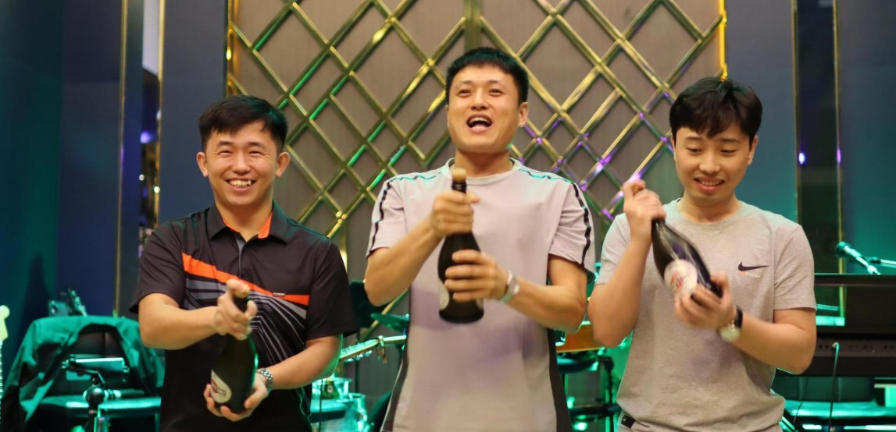
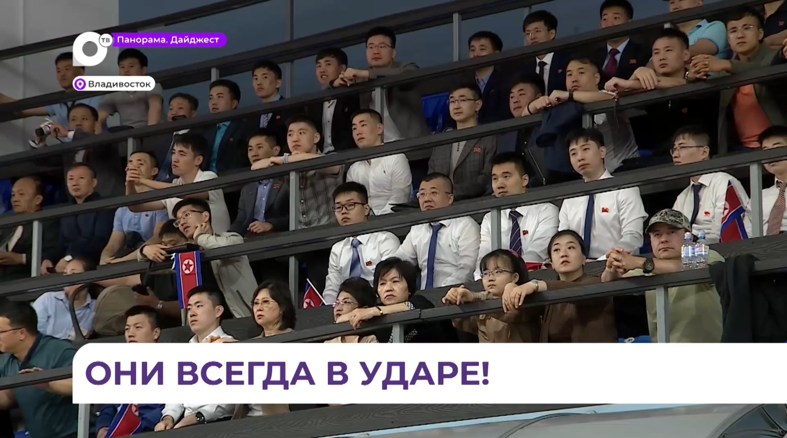
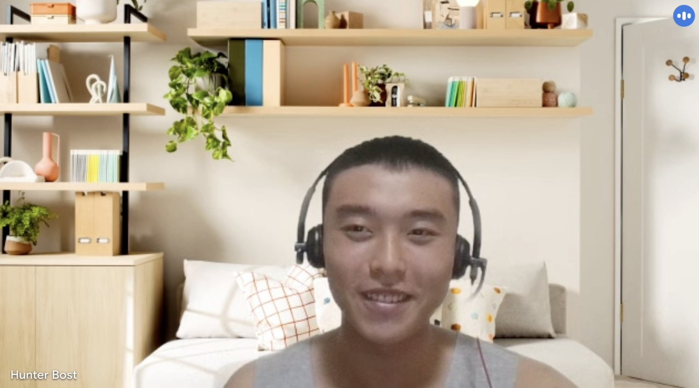
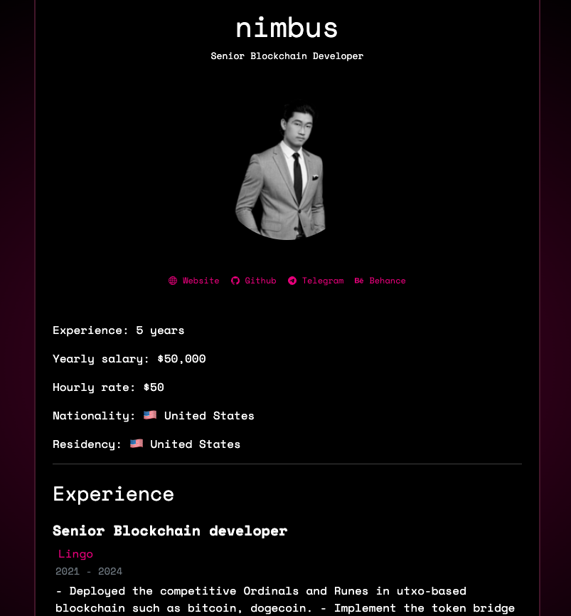

# DPRK IT Workers

### Background Literature

- https://reports.dtexsystems.com/DTEX-Exposing+DPRK+Cyber+Syndicate+and+Hidden+IT+Workforce.pdf

- https://www.ic3.gov/PSA/2023/PSA231018

- https://ofac.treasury.gov/media/923126/download?inline

- https://cloud.google.com/blog/topics/threat-intelligence/dprk-it-workers-expanding-scope-scale

- https://therecord.media/major-us-companies-unwittingly-hire-north-korean-remote-it-workers

- https://cloud.google.com/blog/topics/threat-intelligence/mitigating-dprk-it-worker-threat

- https://x.com/tayvano_/status/1777911893224808911

- https://x.com/zachxbt/status/1824047425822310580

- https://x.com/bax1337/status/1931484066970276121

---

# Workers

### Jenson Collins

- 2024, 2025

- nfbigjc

- nonfungiblejc.eth

- JCollinsX

- jenson.collins@hotmail.com

- github.com/JCollinsX

- https://dune.com/nfbigjc = Ender + TokenFi + Floki

- 0x44c2ab7db5299e008c586d52e9b6b193e4173471 (nonfungiblejc.eth)
- 0xaa166aa0b46fb42fdaafb7ac351a00186d684837
- 0xb1aa3027d1cbf578009bb3c09c84481b76ad43f1 (MAYBE!)
- 0xb402b45dde5e15ce93809404c104c2fc4918c88c (Probably)

- [Exposing DPRK's Cyber Syndicate and Hidden IT Workforce](https://reports.dtexsystems.com/DTEX-Exposing+DPRK+Cyber+Syndicate+and+Hidden+IT+Workforce.pdf)

- https://x.com/Narcass3/status/1913291280911921598

- 

- 

- 

- 

- 

- 

- 

### Kazune Takeda

- 2021-2025

- aka: Greg Takeo Joe Hisaishi mtfuji25 borrdd34 kazunetakeda25

- associates: David Adachi / David Lucas, Pham Trung, Sadao Eiichi Murano, Sadao Elichi, Charles Lee Gordon / David Tanaka, Eric Soh, John Wilhelmson, zhmolly zhmoly zzmoly jwtradera realhardworkingdeveloper davidtanaka3 ericsoh10

- 0xba4c58cf3f601ea8297bf9c08058bb1a4bd62921

- 0xdB600c22dfC1D59E5C2B515E8EB37895A6537B2C

- https://chollima-group.io/posts/tracking-a-north-korean-it-worker-cell/

- https://x.com/blackbigswan/status/1913312344760873365

- https://x.com/Narcass3/status/1913330812709200150

- https://x.com/bunzzdev/status/1636664986708725761

- 

- 

- 

- 

- 

- 

- 

- 

- 

- 

- 

- 

- 

- 

- 

- 

- 

## Kazune Takeda - mtfuji25

- mtfuji25

- borrdd34

- kazunetakeda25

- kazune.takeda@yahoo.com

- t.me/ETHFuji (ID: 5407827675)

- github.com/mtfuji25

- npmjs.com/~kazunetakeda25

- AKA Joe Hisaishi

- Tokyo, Japan

- Kazune Takeda Japan MM2947271

- Joe Hisaishi Japan TA3058411

- 0xba4c58cf3f601ea8297bf9c08058bb1a4bd62921

- 0xdB600c22dfC1D59E5C2B515E8EB37895A6537B2C

## David Adachi / zhmolly

- 2024, 2025, Zach's List zachxbt/status/1824047425822310580

- David Adachi

- davidadachi56@gmail.com

- gigazh

- dainmoly

- davidlucas0402

- jwtradera

- zhmolly@proton.me

- zhmolly@gigadao.io

- github.com/gigazh

- github.com/zhmolly archive.ph/80EYH

- github.com/dainmoly

- dainsm@proton.me

- jwtradera@outook.com

- t.me/jjmolIy (ID: 1968323567)

- 0x210888f2624d01f9cbc71de5bf4caf5b6dc9fa7f

- GUrBkpnjmxz6ZLBjkd8jMkkrShsYXKropKSes8UCWdqw

- AVXF5qTa937CZ9nuL2M9J2MieYRL5bw8DEXr5QnvwN9L

- LAcNUB7p2VYNA8gEkmPSTdsrDBSwBjzymw5Dbt7UMvB

## Pham Trung / jwtradera (zhmolly friend)

- 2024-2025 (jwtradera cluster)

- Referred by zhmolly so probably zhmolly alt

- pham0315

- pham.t.35

- pt.trung0315

- github.com/pham0315

- pham.t.35@outlook.com

- pt.trung0315@gmail.com

- ZW4HoVLVCc1m2y9ej7RTyCmXMCHDkdpotiB5ELF9fX2

## Sadao Elichi / zhmolly

- 2025 (jwtradera cluster)

- sadaorome

- zhmolly

- zhmoly

- zzmoly

- 0xmolly

- Moly

- github.com/sadaorome

- github.com/zhmolly

- github.com/zhmoly

- t.me/zzmoly

- t.me/zhmolly

- zhmolly@proton.me

- Fukuoka, Japan

- Sadao Elichi Japan MM6842521

- 2c5gD79Um49VmLCx54a89vVL84kFCiWmj82Zyg8QVVWi

- BrbAo3gtStKPxUbdomd14WUUAFv5QSBnFqp6NRD6TBGC

## Charles Lee Gordon (zhmolly friend)

- 2025 (jwtradera cluster)

- Charles Leonard Gordon

- Worked with Sadao Elichi/zhmolly

- charles8200

- charles08200

- Charles45812

- realhardworkingdeveloper

- github.com/charles08200

- github.com/Charles45812

- github.com/realhardworkingdeveloper

- medium.com/@charles.leonard.com

- charles.leonard.com@gmail.com

- David Tanaka / Ninja Dev

- realhardworkingdeveloper@gmail.com

- davidtanaka3

- trello.com/u/davidtanaka3

- medium.com/@realhardworkingdeveloper

- https://medium.com/coinmonks/unmasking-suspicious-github-activity-the-wagemole-campaign-and-its-links-to-dprk-threat-actors-248e7901de38

- https://www.dtexsystems.com/resources/i3-threat-advisory-inside-the-dprk/

- Onchain 5cGRQ connects to: Eric Soh 

- 5cGRQ3VRkGYtfuCWmgXnesrwbkn11cE9FFArzZ5iSeqV

## Alex Davis (Charles Gordon alt)

- 2025

- Shows up all over Charles Lee Gordon / charles8200 profiles

- alex-davis-ang

- alex.davis.ang@gmail.com

- dannyboy-820

- alexdavisgender@gmail.com 

## Eric Soh / zhmolly

- 2025

- Shows up on and offchain onnected to Charles Lee Gordon persona

- springdev216

- esoh0612

- ericsoh10

- esoh0612@gmail.com

- github.com/springdev216

- freelancer.com/u/esoh0612

- trello.com/u/ericsoh10

- medium.com/@esoh0612

## John Wilhelmson / zhmolly

- 2021

- Shows up all over zhmolly handles

- John Wilhelmsson

- JeyHop

- jwtradera

- zhmoly

- github.com/zhmoly

- Sadao Murano jwtradera@outlook.com (Naoki Cross Whoopsies)

- David Lucas github.com/davidlucas0402 davidlucas0402@outlook.com

- linkedin.com/in/john-wilhelmsson-17b3a0219

- Hello everyone! I'm new to this group. Introduce myself, I'm senior blockchain developer. https://www.linkedin.com/in/john-wilhelmsson-17b3a0219/ https://t.me/elvencoin/2139 8/19/2021

### Naoki Murano

- 2024, [Zach's List](https://x.com/zachxbt/status/1824047425822310580)

- naokimurano

- muranox.eth

- supermutecx

- 0xdpta

- naokimurano@outlook.com

- murano@outlook.com

- murano1996@gmail.com

- github.com/supermutecx (archive.ph/96QVA)

- github.com/0xdpta

- 0x85e0504fcd7981baa68774431099c5e2dcf074dd

- 0x6188a9e76794e7cb337b8e5a2b91808ce34fc6d1

- 0x44A33a4a822194d3C8402629932dd88B0FF49b09

- 0xe6c2d1d7f6ee9e4ee9f8b865d9b5931c06c9c7d1

- 0xca3b78831a101a6d6d0a153653483e3c9a90948f

- 0xc8ad881deb9c02039795c111f2e661894b026ab0 (maybe?)

- 0xf9b9e7209d7297ae58d1c87636957015e3259651 (maybe?)

- [Exposing DPRK's Cyber Syndicate and Hidden IT Workforce](https://reports.dtexsystems.com/DTEX-Exposing+DPRK+Cyber+Syndicate+and+Hidden+IT+Workforce.pdf)

- https://x.com/aptwhatnow/status/1913292580248314278

- https://x.com/Narcass3/status/1913362337089650798

- 

- 

- 

- 

- 

- 

- 

- 

- 

### Satoshi Naoki / Sano / 0xb10ckdev

- 2024, [Zach's List](https://x.com/zachxbt/status/1824047425822310580)

- Satoshi Naoki

- Sano

- 0xb10ckdev

- sether1009

- sano1009

- astermirac1e

- 0xdpta

- astermiracle1009

- SenWebDev1009

- x.com/sether1009

- t.me/sano1009 (ID: 5459321994)

- github.com/astermirac1e

- github.com/0xdpta

- github.com/Satoshi-Naoki

- github.com/0xb10ckdev [Archive](archive.ph/KMoXG)

- github.com/defi-wonderland/prophet-core/pull/2

- astermiracle1009@gmail.com

- SenWebDev1009@gmail.com

- 0xef2a0324cfaa0100db9def8ef31c6e23bc4f9258

- 

### Leon - Leon Lowden (0xl2)

- 2024, [Zach's List](https://x.com/zachxbt/status/1824047425822310580)

- 0xl2

- jigoat

- zeroxjoe

- x.com/zeroxjoe

- 0xl2@proton.me

- leon.lowden7@gmail.com

- github.com/0xl2 [Archive](archive.ph/KolKd)

- 0x0c0e8ef4b62a4a2a1b5031911e272362530c1a9a

- 0xfd1b05e51653339c850c8a18c9ac11aed9105f2a

- 

### Leon - Leon Lin (mmsys34, 0xhiler)

- 2025

- leonxdev1

- leonxdev1@gmail.com

- mmsys

- mmsys34

- 0xhiler

- moreleon

- t.me/moreleon (ID: 7071594535)

- 0x64d668978ddd6145d4f192eefb03691b75f65096

### Leon - Abe Sinjiro (prodigy205)

- 2024

- naruto0913

- prodigy205

- abe.sinjiro7

- abe.sinjiro7@gmail.com

- 0x90a8974ed484da8e209e6db7b2f84c1b5be345d0

### Kei Nakano / smartcoding51

- OneStake Finance, 2024, [Zach's List](https://x.com/zachxbt/status/1824047425822310580)

- aka: Jin Wang

- smartcoding51

- fantasticfullstackdev

- webdevninja

- Jinathin

- kei-tren

- github.com/smartcoding51 [Archive](archive.ph/mo0QZ)

- github.com/kei-tren [Archive](archive.ph/fhKTT)

- keinakano415@gmail.com

- x.com/kn_amm51

- t.me/kn_amm (ID: 1967508345)

- 0x21e5d5a6e40b32cff77cfe77dca034d6d410131d

- 0x452f205c6c3872691fbce7ce8438370466d55f76

- 0xff22be4f00b937dade564bd9659e265f92afa620

- https://cryptototem.com/onestake-finance-ost/

### Matias Diaz / Kei Nakano

- 2025

- mndiaz27

- 0xdefilover

- github.com/0xdefilover

- 0x9d66bea448eed9bdbb5f1acf032767b11fc78dcf

- 0x961194d781623ebf5ce43087d85d2731cf1e7d1c

### Russell Hieu / Shota Nakamura

- 2024, [Zach's List](https://x.com/zachxbt/status/1824047425822310580)

- Nakamura Shota

- John Patch

- Helme0315

- johnpatch0502

- 0xRUS38

- 0xdoccer

- russellhieu

- johnpatch0502@outlook.com

- russellhieu@outlook.com

- github.com/Helme0315 [Archive](archive.ph/vgsFX)

- 0x97467ea9BeF1c925E9D8e2E65932d066869b7f13

- 0xFf6d86807b3387e10dDE52697C3BD7f59b6A145f

### James Zook + Shota Nakamura

- 2025

- aka Russel Hieu

- 0x38037C0fafae5c97D411c0460c5f0Af40F82B7bd   

- 0x4480206854d67338c8b792a1db2a9189ee75d813   

- 0xB5BcB3935e0B3e6A581FBA37F40D0F472CCf378A   

- 0x1cF9a8fc7A5568B6Dca9f5F73200bC1De69e3ecE 

- BaHNYFQYsBKX541kjEB9sgoHCc7NQdwc16S5ZE9bmYYv

### Joshua Palmer

- 2024, [Zach's List](https://x.com/zachxbt/status/1824047425822310580)

- 0xjsmart

- call-by

- jp-smart

- wewecalibrate

- joshupgig

- github.com/call-by

- github.com/wewecalibrate

- github.com/jp-smart [Archive](archive.ph/grqjk)

- joshupgig@gmail.com

- smart.solidity@gmail.com

- 0x06f90983cd2215379e440fc525e441d6a5fc3fba

- 5Jfb3n8eW4JyQrKJktMNBFXnC1zx2YHjRSkzRrTT5QHh

- 0xa6afe0290fb6f2f7ced0a2753de57f9fa7c9c9dd

- 0xfa802d9b33ed74baff62b189875c2b2d192874eb

- 0x7654e18ff3495675606c008a39b6264da5d0e8a7

- https://www.justice.gov/usao-dc/media/1402691/dl

- 

- 

- 

- 

- 

---

### Lucas Wong

- 2025

- cox1118

- superlwclx

- LucasWongC

- github.com/superlwclx

- github.com/LucasWongC

- t.me/cox1118 (ID: 5034927805)

- lucas.wong.1118@gmail.com

- wm111898@gmail.com

- Discord: c__x__

- lucasw.net

- 0xee52717e6dA13499a3C4ba803e4D952CF052704E

- 0x94A8518B76A3c45F5387B521695024379d43d715

- 

### Jannik Villostas

- 2025

- 0xtomoon

- mrcontract17877

- melonman913@gmail.com

- github.com/0xtomoon

- x.com/mrcontract17877

- t.me/janbuidl (ID:7245484067)

- 0x1FEbc069606ABfbA5d021Ed3768cb5D90c9407D5

### Janul Azwan

- 2025

- Resume claims Lucidly, Shoebill, Moby, Dodo, LAToken

- 0xtomoon

- melonman913@gmail.com

- github.com/0xtomoon

- linkedin.com/in/janul-azwan-7b1612361/

- immunefi.com/profile/ethprotector/

- t.me/janbuidl (ID:7245484067)

### Peter Wang

- 2025

- petherwang@gmail.com

- github.com/hapetherw

- x.com/hapetherw

- linkedin.com/in/peter-wang-780259a3

- t.me/pethercap (ID: 2124964775, prev: @baymax586)

- 0x74bc47ea5201a61c7c9a366bb62ecae2713602a1

### Chai Somsri 

- 2024, 2025, Credbull

- ChaiSomsri96

- George Capraroiu

- george19871205

- x.com/chaisomsri96

- medium.com/@chaisomsri96

- linkedin.com/in/chai-somsri

- github.com/ChaiSomsri96

- t.me/chaisomsri (ID: 7022528006)

- chaisomsri96@gmail.com

- georgecapraroiu1205@gmail.com

- melonman913@gmail.com

- 0xE5a86c150ac44ab8F8B2661c9e8d8b13887360f0

- 0x9ce96e07c091662c2605eaae9180de22aad6e8db

- https://cryptototem.com/credbull-cbl/ https://www.linkedin.com/in/chai-somsri/

### Milan Zubic / Patrick Kishi

- 2025

- icetrust0212

- icebera

- github.com/icebera

- zaza.liveedu@gmail.com

- 0x35FcB352027cdDc632b7aE8a50A0410C5bf36248

### Unknown ITW 

- 2025

- Adjacent to Jannik Villostas and Chai Somsri

- 0x146ab113a6d69033cccdb4eaae61c496c2faaf05

---

### Scott Brown

- 2025 (Scott Brown Cluster)

- aka Kyle Larsen, Sean Day

- breavedev

- nevermindhim

- verytinydever

- scott.brown0629

- scott.brown0629@gmail.com

- what.a.fabulous1@gmail.com

- sct.brown0629@gmail.com

- github.com/breavedev

- github.com/nevermindhim

- github.com/verytinydever

- linkedin.com/in/scott-brown-b947ba29a

- linkedin.com/in/scott-brown-813445279

- dev.to/scott_brown_b611d05a865cf

- www.impaxrecruitment.com/wp-content/uploads/elementor/forms/6786f200b23aa.pdf

- 0x3b8cc82f5d3ec89d88c58504ecfefe4597020840

- 0xa8cb25ddf0a7195bdc3232ac6e1d812c8a4713fe

- 0x368a337dcdec5cf9849a7563538f03b1516a3f7d

- 0xb25a0580ddf68d4aea11d83f1655016e9520f51a

- 0x38a35ab4235ce7c8b5c4733cee7de9e28e348acb

- 0xce0113e71ce0273d0504a7ef1cd4f0e6e4d196bc

### Artur Dranhoi

- 2025 (Scott Brown Cluster)

- artur.dranhoi1025

- Prince Charming

- princecharming0915

- t.me/incredible823

- artur.dranhoi1025@gmail.com

- https://www.impaxrecruitment.com/candidates/candidate-name-artur-job-name-senior-blockchain-engineer/

- 0xc75bbfc0cef2b93c1965930632ceeda9f055f83e

- 0xa8cb25ddf0a7195bdc3232ac6e1d812c8a4713fe

### Joel Kursala

- 2025 (Scott Brown Cluster)

- Received payroll to same address as Scott Brown

- 0xa8cB25ddf0A7195BDc3232ac6e1D812c8a4713Fe

### Anderson Lee

- 2025 (Scott Brown Cluster)

- aleson092325

- good725

- andersonlee111

- smartdev0725

- github.com/good725

- github.com/andersonlee111

- github.com/smartdev0725

- linkedin.com/in/anderson-lee-9550381a5

- linkedin.com/in/anderson-lee-0130801a3

- cetbdb23@gmail.com

- firly.larly0430@gmail.com

- aleson092325@gmail.com

- 0x541fb82d870D6287A9553920A72EDeB0e9877d57

### Oleksandr Muravskyi (aka Artur Dranhoi)

- 2025 (Scott Brown Cluster)

- oleksandr-muravskyi

- PrinceCharming0115  

- artur.dranhoi@exiod.io

- coolprince0115@gmail.com

- ole.dev300@hotmail.com

- olek.muravskyi@outlook.com

                                             

---

### Solcrazy910

- 2025 - LND Hack

- 0x67AA2F9d362fda4395F53133929E9017b35BE0AE (Payroll)

- 0x5149A7696188F083297281D10293a20476252CDD (Hack)

- 0x82be4fe84c2790023906c1648e0836ada67714d9 (Hack)

- 0x8148c4243f8cb49fe80d9e23df0bafc1c6732f3e (Hack)

- 0x5a94a3a114cf01f6a703dd8b840cf0a97cdf1434 (Hack)

- 0x2446f9528fbf55ccf5b3e7a22fc058bda7a12131 (Hack)

- 0x4b82e3485d33544561cd9a48410a605aa8892fb1 (Hack)

- 0x140592a83052b3a432b6d70fb90764612ce41ab1 (Hack)

- 0x5A94a3a114cf01f6a703dD8b840CF0A97CDf1434 creates contract ETHSnowball in July 2022  - 0x37b9ba525921fb0dac2eca1dbf123e549c086ed8822a1a00b8a8f83d2e4a99d2

#### solcrazy910 aka Dan Mao

- cryptospaceboy00

- alexwork455

- ananphoon823

- andika.riyan

- billyrowan1980

- blockchainlover2019

- maodan466

- putnikdeveloperbg

- spaceboy00

- topstack2021a

- cryptospaceboy00@gmail.com

- alexwork455@gmail.com

- ananphoon823@gmail.com

- andika.riyan@gmail.com

- billyrowan1980@gmail.com

- blockchainlover2019@gmail.com

- maodan466@gmail.com

- putnikdeveloperbg@gmail.com

- spaceboy00@gmail.com

- topstack2021a@gmail.com

- 0xquantech

- t.me/MaoDan007 (ID: 5089966453)

#### alek806 aka Aleksandar Jovanovic

- alek806

- truecode112

- masterscent913

- bigforniture1126

- truecoder112

- dar_winpizza

- jaleksandar806

- putnikdeveloperbg

- github.com/truecode112

- github.com/masterscent913

- truecoder112@gmail.com

- dar_winpizza@hotmail.com

- jaleksandar806@gmail.com

- putnikdeveloperbg@gmail.com

- linkedin.com/aleksandar-jovanovic-28bb5023b

- t.me/bigforniture1126 (ID: 6251624532)

- rok.co/@alek806

---

### Hiroto Iwaki / Taku Yamamoto / Iwaki Hiroto

- mymiracle0118

- iwakihiroto

- noahsflood908

- noahsflood908@gmail.com

- linkedin.com/in/hiroto-iwaki-54b207306

- github.com/mymiracle0118

- iwakihiroto-portfolio.vercel.app

- t.me/iwakihiroto (ID: 7074147770)

- https://x.com/blackbigswan/status/1913290058670416183

- 

- 

### Motoki Masuo

- aka Hiroto Iwaki

- bestselection18

- noahsflood908

- noahsflood908@gmail.com

- https://x.com/blackbigswan/status/1912647965505736753

- 

---

### Andy Hoog

- 2024, [Zach's List](https://x.com/zachxbt/status/1824047425822310580)

- toparc077

- andyhoglet 

- andy-hoog

- andyhoogup

- T077

- andyhoogup@gmail.com

- github.com/toparc077 [Archive](archive.ph/7lbnH)

- linkedin.com/in/andy-hoog/

- x.com/andyhoglet

- 0x1043efee936903951b88db23551873bb67292e95

### Chris Yu / Bryan Cho / atroboj

- 2021, 2022, 2023, 2024, [Zach's List](https://x.com/zachxbt/status/1824047425822310580)

- Chris Yu

- Bryan Cho

- atroobj

- bugarnet

- t.me/atroobj

- atroboj@gmail.com

- github.com/atroboj [Archive](archive.ph/x0LMf)

- github.com/bugarnet (2021, Despace)

- 0x3b9a870c24905256de10863cb360f4b93c7cc60f

- 0xc2b2a9c05740eeb7ee7ba7eb3ab11ec8bebcb1d1

- 0x1043efee936903951b88db23551873bb67292e95

- ESSfP3aAcW6Z59ozut9Jkqy9btaX5YTHt25b3Vhs2hsf

- https://www.justice.gov/usao-dc/media/1402691/dl

- https://x.com/THORChain/status/1150675815924813824/photo/1

- https://www.npmjs.com/~atroboj

- https://cryptototem.com/despace-des/

- 

- 

- 

### Bong Chee Shen / Alex Shen

- 2024, [Zach's List](https://x.com/zachxbt/status/1824047425822310580), Obyte / Byteball

- devneser

- github.com/devneser

- alexzh.dev@gmail.com

- 0x164729e00e8d0f871189160f36dee4398cade1f2

- 0x2efe21f4fef7e737c0a3491c93be7d696038b6f5

- 0x65b4ba828f85ac429d6a02db1304065a819a53f4

- 0xd9054f484ed98a7dd632eb9c09644616db3dea8c

- GrXoxqM2a6QFKSBdZ9RLWJCBVTFvuuH8eCjjsLbjhpiR

- 0x06f90983cd2215379e440fc525e441d6a5fc3fba

- https://stack.money/asset/byteball

- 

### Bram Chan / Bram Chen

- Q12024, Plethori

- Bram Chan

- Bram Chen

- gejeduck

- github.com/gejeduck

- 0x91689cf1c6cb61aa3d6663ffc74c9f689809af91 (T)

- https://www.justice.gov/usao-dc/media/1402691/dl

- https://medium.com/plethori/plethori-quarterly-progress-update-2566d9e6c172

- 

### Eric Low

- Q12024

- Arkned 

- wooark

- wootark.soft

- https://www.linkedin.com/in/eric-low-a5795033b/

- 0x954f20665bcccf58587b49ffee2e593c19c79267 (T)

### Gabriel Yiu

- 2024, [Zach's List](https://x.com/zachxbt/status/1824047425822310580)

- Gabriel Yiu

- gabrielyiu

- github.com/gabrielyiu [Archive](archive.ph/oGlCc)

- 0xd80614feb54d49cf46cc861fc549fae0a05b3f7e

### Jack Li

- jackli16

- zeus16

- dream0239

- jacky864

- 0x605ca6fb59211d13b369e54a273a42538b087c36

### Jordan Lopez

- 2024, [Zach's List](https://x.com/zachxbt/status/1824047425822310580)

- fka Nemanja Djordjevic

- firstninja111

- github.com/firstninja111 [Archive](archive.ph/tFeQG)

- cloudrider.m92@gmail.com

- 0x92cd7363c5b1853bc8fe6b5ae269836fc508ca73

### Mike Willie Lee

- 2024, [Zach's List](https://x.com/zachxbt/status/1824047425822310580)

- keizir

- willie.lee226

- github.com/keizir [Archive](https://archive.ph/SjJfK)

- willie.lee226@gmail.com

- 0x97e36fAE76cD7ef7cC1213927A9A4E10a61CdD8d

### Pemba Gulu

- 2024, [Zach's List](https://x.com/zachxbt/status/1824047425822310580)

- paladin-120

- pemba.sherpa5232

- pemba.gelu5232

- pemba.sherpa5232@gmail.com

- pemba.gelu5232@gmail.com

- github.com/paladin-120 [Archive](archive.ph/nVIz9)

- 0xfb5d591e8216f5d0964286f09b1f61114c16aab0

### Peter Xiao

- 2024, [Zach's List](https://x.com/zachxbt/status/1824047425822310580)

- Brian Cho

- assasinooz77

- github.com/assasinooz77

- 0x5d8335834bfdf4c746e277e5100d7c778c807356

### Benjamin Nguyen

- 2024

- ponyjackal.eth

- github.com/ponyjackal

- x.com/ponyjackalx

- benguyen0214@gmail.com

- Has JP Morgan Chase account through Rippling in his name

- 0x5c411cb174c2e163f6465252ae895f3e3e5a8792

- 0xdfae024a22713ecd8049784ca0ba4c9e87753493

### Andy Bell

- 2024

- bbshark.eth

- github.com/bbshark99

- x.com/kevin83191687

- 0x241d2b20f2c26a2541a0f121d6a33c29cb4cfe69

### Danny Jin

- 2024

- dannyjin117@gmail.com

- 0xacb8ba726c04408aecacd6794b4c9dc59652203d

### Muhammad Abdullah

- 2024

- github.com/polartar

- x.com/m_polartar

- 0xf7f89251eaa664993893efea0e55d8ec3306d959

### Eric Andrade

- 2024

- gsofter.eth

- github.com/gsofter

- x.com/ggsofter

- 0xfff50b1b9154b0631591dab746c5fc8f41dc44bd

### Wubone

- 2024, [Zach's List](https://x.com/zachxbt/status/1824047425822310580)

- Wubone

- 0x0db9e27060b7f8258448aa31c36e7c0937fd5fd7

### Monkey

- 0x57b9f721411fabe61ac61cca8eaf926a726a70cc

### Jing Zhao

- 0xCf6E6021B8e519c0695CEa6B3541556dc798f0DC

---

# The OGs

### Alex Hong

- CreamFi, Decubate, DEPO, DeSpace, Gamerse, Jointer, Paid Network, Panther Protocol, Impermax

- https://www.justice.gov/usao-dc/media/1402691/dl

- https://decubate.medium.com/meet-the-decubate-team-1cc097cae24c

- https://blogtienao.com/depo-coin/

- https://cryptototem.com/despace-des/

- https://gamerse.gitbook.io/gamerse/team

- https://shinchanieoalerts.medium.com/gamerse-ama-summary-recap-with-shin-chan-community-8171e08ac22f

- https://stack.money/asset/paid-network

- https://cryptototem.com/panther-protocol-zkp/

- https://stack.money/asset/impermax-2

- https://x.com/musectech/status/1914020967275462667

- 

- 

- 

### Jason Kwon

- 2024, [Zach's List](https://x.com/zachxbt/status/1824047425822310580), DeSpace, Beanstalk, Blueberry, Spice Finance, 

- 0xMoon

- 0xm00n

- 0xm00n.eth

- 0xm00neth

- cryptonerd_

- 0xm00neth@gmail.com

- 0xlock

- github.com/0xm00neth [Archive](archive.ph/WIu3i)

- github.com/0xlock [Archive](archive.ph/J347l)

- x.com/0xm00neth

- https://cryptototem.com/despace-des/

- 0x1e5c29702b770d5519932367129973bd63740392

- 0x03e6adb71ec39af3d68733f1c3f5e54e6e55b7d2

- 0xa771609c5c56048f146d2c794c87db946bff27cf

- 0x1075e62bfacbb44e31d7a5719e55c7d16fe7d35d

- 0x4b94ba1528636a699dab486a217d39bb7ce21d75

- 0x72c70980acdde7a5c9437050e73e7d07fbf21d25

- 0x7969b188f7dc6bf80d68f224ac3454dafe6f6d5d

- 0x90cf352ddaf171d41a6ded1d54ceda4005047c93

- 0xcdee5da607ad96e966df82dbc3f004ce44859c6f

- 

- 

### Jason Lee

- Kira Network, Metadallion, Party Doge, Yam Finance

- 0xm00neth

- jasonlee9627

- 0xJason (Discord)

- jasonlee9627@gmail.com

- x.com/0xm00neth

- 0xm00neth@gmail.com

- github.com/0xm00neth

- https://cryptototem.com/kira-network-kex/

- https://medium.com/@partydogeinfo/who-is-jason-lee-did-he-steal-1m-from-various-nft-projects-975007241e09

- https://medium.com/yam-finance/on-november-3rd-2021-we-were-alerted-via-discord-about-potential-malicious-actions-toward-other-3f5f74af044d

- 

- 

- 

### Gary Lee / ChienHui Lee / Light Fury / Leech Developer

- Q12024, 2024, [Zach's List](https://x.com/zachxbt/status/1824047425822310580), Gamerse, DxDAO, Sushi/Miso, Chronos, DEFIS $XGM, Fantom, Preon Finance, Sperax

- Light Fury

- lightfury

- light-fury

- leech.developer

- leech_dev

- x.com/lee_chienhui

- github.com/light-fury [Archive](https://web.archive.org/web/20230513202311/https://github.com/light-fury)

- medium.com/@leech.developer

- linkedin.com/in/lee-chien-hui-50b157157/

- leech.developer@gmail.com

- ddpuppy42@yahoo.com

- 0xfcd4e8c84afd221d3b8c9c8c374a7784b314d230 (T)

- 0x390ed16a3e85758597db7452998d3ea66b65fd84

- 0x4ab0eac00d1a5b05e7a484f8678dce68b849545a

- 0xe8a06462628b49eb70dbf114ea510eb3bbbdf559

- https://web.archive.org/web/20220925210750/https://daotalk.org/t/developer-proposal-chienhui-lee/2649

- https://shinchanieoalerts.medium.com/gamerse-ama-summary-recap-with-shin-chan-community-8171e08ac22f

- https://gamerse.gitbook.io/gamerse/team

- https://x.com/zachxbt/status/1812856350151766209

- https://www.justice.gov/usao-dc/media/1402691/dl

- 

- 

- 

### Jikun Liao - The OG

- MetaPlay (Jan 11, 2022), Gameswap, Obytes, Iotex.io

- "We have filed cybercrime report in the US and working on private investigation to see if we can recover the money from the dev @altp! - Jikun Liao"

- "Our developer Jikun Liao claims that he shared his passwords in GitHub resulting in a hack. Only he, pk, Swapnil had access to this."

- "Ultimately, only one person had been logged in recently, Jikun Liao. Therefore, we will be filing a police report in Houston, Texas where he resides. From what we can see, his explanation is an attempted cover up. It's clearly internal rug by the developer."

- "This is the absolute worst nightmare. We believed that this Jikun Liao was trust worthy, but his story does not add up and it's clear that we require authorities to investigate this matter."

- altpl

- jikun

- jliao

- peezenut

- jikun@mygameswap.com

- jliao@mygameswap.com

- peezenut@gmail.com 

- t.me/altpl

- linkedin.com/in/jikun-liao-794b61162/

- https://vk.com/id578519076 [Archive](https://archive.ph/SWt2n)

- https://rocketreach.co/jikun-liao-email_233286867

- 0xC43B1f4E7E47bE5D5663C3B26E4FB3fE7e217f90 (Metaplay Theft)

- 

### Jikun Liao - "James Lee"

- Q12024, 2024, [Zach's List](https://x.com/zachxbt/status/1824047425822310580)

- james117lee@gmail.com 

- github.com/jnuon [Archive](archive.ph/rf3TU)

- 0xb9451049310053b29e5dd98c54bff37a5e38819c

- 

### Jikun Liao - "Justin Lim" / altbee

- 2025, Cook, Arable Protocol, WagyuSwap, GAMESWAP, StakeDAO, Obyte, Fantom, Lid Protocol

- altbee

- zerobit417

- @zerobit417

- github.com/altbee 

- zerobit417@gmail.com 

- linkedin.com/in/james-lee-0977a0217

- linkedin.com/in/justin-lim-14664a324/ 

- https://www.cake.me/me/james-lee-319683/

- https://stack.money/asset/byteball

- **/altbee:**

- Old Username: liaojikunwork

- 34900782+liaojikunwork@users.noreply.github.com: liaojikunwork

- liaoJikundever@gmail.com: Jikun Liao

- liaojikundever@gmail.com: Altbee, JL, Jikun Liao, Liao Jikun, altbee, liaojikunwork

### Quinn Lee

-  Q12024, 2024, [Zach's List](https://x.com/zachxbt/status/1824047425822310580), Arc Market?, Fastswap?, Grape Finance?

- QuinnDuck

- letteldream

- rustumatizon

- letteldream@gmail.com

- github.com/rustumatizon [Archive](archive.ph/KLBYw)

- t.me/QuinnDuck

- https://quinn-lee.netlify.app/

- https://laborx.com/freelancers/users/id126269

- 0xf9adac8658e08893fb4e91c1062e471eb11cb6c7 (T)

- 0x9de5d3158b0b83e9211c7444c94ce0c53763f574

### Ryuhei Matsuda

- Q12024, [Zach's List](https://x.com/zachxbt/status/1824047425822310580), Arcadia, DxDAO, Kira Network, Kylin Network, Loom Network, Naos Finance, Raze Network, Sandclock, Shardeum, Paid Network, Hyperionx

- ryuhei.eth

- ryuheimat

- ryuheimat3

- ryuheimat3@gmail.com

- linkedin.com/in/ryuhei-matsuda

- github.com/ryuheimat [Archive](archive.ph/V5GsZ)

- 0x36c67d5ce9e2e4a919f568fc33657fcad0030880 (T)

- 0x6fb678b2dd9d2ff50ee9ecf774251dcceb7a2da8 (Zach's List)

- 0xa71b641a498e33bb13548a01eca5e20e083e637b

- 0xd97729eef14c189144adb0591e4ddb1a66ce22af

- 0x86fce1a6cbaaf0d0d7cb727e9b9eac5ed4150a5b (akame.eth, maybe)

- https://crypton0ob.medium.com/5-questions-about-kira-network-you-should-know-98850b1323a8 

- https://icoholder.com/en/kira-1003837 

- https://kylinnetwork.medium.com/kylin-network-monthly-report-2-d9b6be5b8cdf

- https://medium.com/@ivan.shodanov/the-15-most-promising-small-cap-defi-projects-to-invest-in-2021-6e9d5aa5774c

- https://polkastarter.com/projects/naos-finance

- https://stack.money/asset/paid-network

- https://theorg.com/org/kira-core

- https://web.archive.org/web/20220818133854/https://daotalk.org/t/developer-proposal-ryuhei-for-2-weeks-trial-period/2650

- https://www.bydfi.com/en/crypto-price/raze 

- https://x.com/Kylin_Network/status/1344503704142143490 

### Mauro Liu

- Q12024, 2024, MagicCraft (2022), Ankr, Gamerse, Clover Network, DEPO, Sifu Vision, Oxytocin, Tomodachi

- 0xchamel

- 0xllaCh

- blueChamel

- chamel92

- daiki-iu

- Gornutz

- lmauro77

- mauroh.perk

- mauroliu77

- zhChamel

- zhChameleon

- blueChamel mauro@blueberry.garden

- 0xchamel pwongexcal@gmail.com

- zhChameleon zhaoa4317@gmail.com

- Overlaps with 0xm00neth, zhChameleon, Daiki Saito, Malkevych Bohdan bomalkevych@gmail.com, Jamshed Latipov jamshedlatipov@gmail.com

- t.me/chamel92 (ID: 6635242888)

- x.com/0xchamel

- linkedin.com/in/lmauro77

- github.com/0xchamel

- github.com/zhChameleon

- github.com/0xllaCh

- github.com/blueChamel

- 0xc9b46489567684aafbe85e8a783bb9bfb822807f (T)

- 0x6d8886e5e418571da0a6a1133555c663963b1ac5 (Oxytocin, Tomodachi)

- https://blogtienao.com/depo-coin/

- https://x.com/MagicCraftGame/status/1532587886234652673 

- https://x.com/MagicCraftGame/status/1527876841868087302

- https://cryptototem.com/glory-games-worlds-glory/

- https://medium.com/@CryptoSavingExpert/in-depth-review-of-five-new-play-to-earn-games-part-9-magic-craft-professionalism-df7bc9c4b2de

- https://gamerse.gitbook.io/gamerse/team 

- https://shinchanieoalerts.medium.com/gamerse-ama-summary-recap-with-shin-chan-community-8171e08ac22f

- https://medium.com/@CryptoSavingExpert/in-depth-review-of-five-new-play-to-earn-games-part-9-magic-craft-professionalism-df7bc9c4b2de 

- https://x.com/MagicCraftGame/status/1532587886234652673

- https://x.com/MagicCraftGame/status/1527876841868087302

- 

- 

- 

- 

### Mauro Liu aka Xu Liu

- Napier Finance (2023-2024), Blueberry, Pickle Finance, Harmony

- bitbaby888

- imyugioh

- chamel92

- zhExcal

- 0xlocker

- ethlocker

- raptor1001

- blueraptor1001@gmail.com: 0xlocker, Burndai, Derek Lee, Raptor, Raptor1001, burndai, ethlocker, unlocker

- choi.link227@gmail.com: Ryan Choi

- t.me/chamel92 (ID: 6635242888)

- bitbaby888@gmail.com

- github.com/imyugioh

- github.com/0xlocker (name: 0xlocker)

- github.com/ethlocker (name: Hack the Moon!)

- github.com/raptor1001 (name: raptor1001)

- 0x4BA8BDC825B03A83dF46cff59f18b41dEE84968E (Tweeted)

- 0x147ed0f4d0cc9f0cf4eff223aa79b2f837532d62 (Napier)

- 0x4d4da4ad60b35d1baa44951db99f3900ea008a73 (Napier Theft)

- https://x.com/zhExcal/status/1691805547614621801

- https://x.com/NapierFinance/status/1691754768383750308

- https://github.com/harmony-one/chrome-extension-wallet/graphs/contributors

### Eric Liu

- MagicCraft (2022), Humansdotai? Cosmos stuff?

- vigorousdeveloper

- top-dev-mania

- VigorousDevelopment524

- Vigorous Developer

- supervenus0725

- SuperDev 

- Jason07250000

- venus07250000

- VigorousDevelopment524@gmail.com

- dev.mania.639@gmail.com

- venus07250000@gmail.com

- github.com/vigorousdeveloper

- github.com/top-dev-mania

- github.com/SuperVenus0725

- github.com/Jason07250000

- https://medium.com/@CryptoSavingExpert/in-depth-review-of-five-new-play-to-earn-games-part-9-magic-craft-professionalism-df7bc9c4b2de 

- https://x.com/MagicCraftGame/status/1532587886234652673 

- https://x.com/MagicCraftGame/status/1527876841868087302

- 

- 

- 

### Anthony Keller / Daiki Saito

- Truflation, Hector Network, MagicCraft, Sushi/Miso, Yearn/Coordinape

- Anthony Keller

- Daiki Saito

- Also maybe James Ling / Smart Ninja / DevSCNinja

- coppn

- lcoppn

- 0x.bejaxer

- eratos1123

- eratos1122

- cobang

- bejaxer

- 0x.bejaxer@gmail.com

- eratos1123@gmail.com

- github.com/cobang

- github.com/bejaxer

- t.me/lcoppn (ID:749123222)

- linkedin.com/in/anthony-keller-022486183/

- 0x4717Af66032b1Dbc35d9b1182F9240994A11bf01

- 0x482C9f85644f1686C490D38291511657da767e61 ([Tweeted](https://web.archive.org/web/20210918033441/https://twitter.com/eratos1122/status/1367402518335094786))

- https://remote3.co/p/daiki-saito

- https://daiki-saito.herokuapp.com/

- https://stack.money/asset/hector-dao

- https://x.com/MagicCraftGame/status/1532587886234652673

- https://x.com/MagicCraftGame/status/1527876841868087302

- https://www.coindesk.com/tech/2024/10/02/how-north-korea-infiltrated-the-crypto-industry

- https://medium.com/@CryptoSavingExpert/in-depth-review-of-five-new-play-to-earn-games-part-9-magic-craft-professionalism-df7bc9c4b2de

- 

- 

- 

- 

---

### Sava Grujic

- Sushi (2021)

- Aristok3

- github.com/millicare

- github.com/DevWebMaster

- savagrujicinnov.wixsite.com/mysite

- t.me/SuperDevel0per

- topfirepassion@gmail.com

- Likely also Anthony Keller

- https://www.coindesk.com/tech/2024/10/02/how-north-korea-infiltrated-the-crypto-industry

### Sarawut Sanit

- IQ (2021), GuardRails, Luxcore, ThorChain, Vitae Token

- Devstar

- 0xdbkey

- 0xskydb

- ssdbkey

- 0xy0k 

- sarawut

- sanit.sa@outlook.com

- dbkey.one1@gmail.com

- 0x8218D63A1b22077C264Ef481E15c6483eA204649

- 0x4C83150FD1fbfa031F3cD8C416F57409DE98372F

- https://archive.ph/5pNLd

- https://www.coindesk.com/tech/2024/10/02/how-north-korea-infiltrated-the-crypto-industry

### Jun Kai

- 2024 [Zach's List](https://x.com/zachxbt/status/1824047425822310580), Kira Network (2020), IQ (2021), Sunrise Layer, Elys Network, Ferrum/Comdex

- junkai121

- jelysn

- jpine3528

- junkai121@outlook.com

- github.com/jelysn

- github.com/jpine3528 

- github.com/junkai121

- github.com/icafa

- linkedin.com/in/jun-kai-78911a156/

- 0x8aa07899eb940f40e514b8effdb3b6af5d1cf7bb

- https://crypton0ob.medium.com/5-questions-about-kira-network-you-should-know-98850b1323a8

- https://cryptototem.com/kira-network-kex/

- https://forum.comdex.one/t/multiswap-launch-on-comdex-enabling-crosschain-swaps-to-comdex/972

- https://icoholder.com/en/kira-1003837 

- https://medium.com/ferrumnetwork/monthly-development-report-june-2023-a439f54934e9

- https://theorg.com/org/kira-core 

- https://www.coindesk.com/tech/2024/10/02/how-north-korea-infiltrated-the-crypto-industry

- 

---

# Munchables

### References

- https://x.com/zachxbt/status/1772843238539325947

- https://x.com/zachxbt/status/1784938851603013724

- https://x.com/0x2Joy/status/1773353778294481025

- https://x.com/coderdannn/status/1772826478209822924

- https://x.com/drbrianramos/status/1745903189331701797

- 

- 

- 

### Nelson Murua / Alberto Mira / Jackson Bill

- Munchables (2024)

- NelsonMurua913 

- albertomira1114

- super1114dev

- sr.muruanelson@gmail.com

- albertomira1114@gmail.com

- super1114dev@gmail.com

- github.com/NelsonMurua913 [Archive](https://web.archive.org/web/20240327040031/https://github.com/nelsonmurua913)

- github.com/super1114 [Archive](https://web.archive.org/web/20220627223823/https://github.com/super1114)

- crypto.jobs/talent/profile/senior-smart-contracts-developer-solidity-1

- codementor.io/@super1114dev

- remote3.co/p/albertomira

- 0x6be96b68a46879305c905ccafff02b2519e78055

- 0x9976fe30dac6063666eea87133dfad1d5ec27c5e

- 

- 

- 

- 

### Kaiming Hong / Warren Sinclair

- devkitty803

- warrensinclair744

- t.me/devkitty803 (ID: 5102864895)

- 0xf69201AA19C540b74c170A545Fc6d8805e0EE9b1

### Paul Martin / Werewolves0493

- Munchables (2024)

- Werewolves0493

- github.com/Werewolves0493 [Archive](https://archive.ph/p8AIS)

- 0x4890e32a6a631ba451b7823dad39e88614f59c97

- 

- 

- 

### Paul Song / grudev325

- Pixelcraft (2022), Munchables (2024)

- grudev325 

- sr.paul.song@gmail.com

- seniordev1225@gmail.com

- t.me/grudev325

- seniordev

- remoteok.com/@seniordev

- linkedin.com/in/paul-song-225505224/

- paul-song-cv.herokuapp.com

### Paul Martin / cryptopunk / gru1125

- Pixelcraft (2022)

- cryptopunk

- paulmartin.io

- FeloniousGru-Super

- paulmartin-1125.web.app

- paulmartin.pm1125@gmail.com

- workingnotworking.com/180375-ivar

- gru1125

- github.com/FeloniousGru-Super/

- paulmartin-1125.web.app/

- xing.com/profile/Paul_Martin08403

- x.com/gru1125

- 0x19899a49704c7890febc139b4efa4de24d88d425

- 0x1caa50f7fc5c02925ad98624b12635d11f281a00

- 

### Pete Yama / cryptopunk

- Pixelcraft (2022), Munchables (2024)

- cryptopunk 

- cryptopunkclan

- x.com/cryptopunkclan

- github.com/bestsilvertiger

- brightdragon0719 [Archive](https://web.archive.org/save/https://github.com/brightdragon0719)

- 0x19899A49704c7890febc139b4EFA4dE24D88D425

- 

### Pete Yama / Abracadabra + Bill Tovitt

- 2024

- One dev, one "artist", scammed

- btcwhiz

- abcd_0621_

- hunter0409

- building_jk

- x.com/abcd_0621_

- github.com/btcwhiz

- t.me/hunter0409 (ID: 5031331438)

- 

---

# Face Pix

### 139.5.157.128 and 212.91.193.27

- https://x.com/Narcass3/status/1916191078631289200

- 

### AI Face

- https://x.com/kannthu1/status/1886835017818755170

- 

### James McClung

- https://x.com/browsercookies/status/1913298431738888490

- 

### Jason Rostro

- https://x.com/browsercookies/status/1913265469529985167

- 

### Benjamin and a Patrick / Michael Brown

- Successfully hired at AI orgs that wont return my calls. Staffing agent facilitated in West Palm Beach FL

- https://x.com/aptwhatnow/status/1913291827278414205

- 

- 

### Bryan Edward Irving / Steven Scott Jr

- 

- 

- 

### Daniel Everest

- https://x.com/browsercookies/status/1913269771560489367

- 

- 

### David Ye / David Rose

- He uses a US facilitator in Minnesota to host his laptops. He uses the identity of a college grad in Texas who also stands-in to complete identity checks on his behalf for money.

- https://x.com/browsercookies/status/1913268699445821538

- https://x.com/browsercookies/status/1913273419933823407

- 

- 

### Eugene Palla

- exppal

- d-themesdevelopment

- eugeneoptimize.com

- https://x.com/browsercookies/status/1913267013046423894

- 

### Faraz Q

- https://x.com/browsercookies/status/1913265115954319641

- 

### Harry Pham

- https://x.com/browsercookies/status/1913291378467258456

- 

### Hiroki Hara

- https://x.com/eastside_nci/status/1913309781952971187

- 

### Jacob Haigis

- jacob008015

- https://x.com/browsercookies/status/1913268425243459942

- 

### Katashi Fujino / Ronnie Karl / Joshua Fuso

- toptalented529

- kryptify

- SniperWovles

- katashi-fujino.herokuapp.com

- https://x.com/browsercookies/status/1913271095253516308

- 

### Kevin Chang

- kchang.prof@gmail.com

- kevin.zhang.soft@gmail.com

- github.com/kevinsoft81

- https://x.com/browsercookies/status/1913267818386305459

- 

### Logan Collins

- https://x.com/browsercookies/status/1913268057084170382

- 

### Lucas Lee

- interviewing at a biomed tech place. Pretty sure this dude was a defense org too.

- https://x.com/aptwhatnow/status/1913288546787504174

- 

### Luis Pena

- https://x.com/browsercookies/status/1913269065940189556

- 

### Marko Nicovic / Hua Min Fe / Tom Callaghan

- https://x.com/Narcass3/status/1913292910805516457

- 

### Ondriah Young

- x.com/browsercookies/status/1913267316378550519

- 

### Rami

- https://x.com/heihei5711/status/1913297923468574948

- 

- 

- 

### Ryan Hammonds / Ryan Stringfellow

- http://x.com/browsercookies/status/1913302277689057346

- 

- 

### Ryan Sims / Paul Jones / Joseph Jones

- Despite Ryan Sims "living in Wyoming" try getting him to agree to meet in person in Sheridan! Note the age of his LinkedIn profile is only 3 months old. Walmart is a fav (fake) historical job for DPRK. Singapore U is also a fav school to add.

- https://x.com/browsercookies/status/1913311847551549476

- https://x.com/browsercookies/status/1913312152393519372

- 

- 

### Thomas Peters / Bryce Hodges

- https://x.com/browsercookies/status/1913269301244793211

- 

- 

### Eugene Tan

- TalentKingPython

- Peter Brown

- Peter Araki

- Athene Faith

- https://x.com/browsercookies/status/1923552508875767829

- 

- 

### William Loy

- Jiro Yamamoto

- Jiro Ya

- DreamHigh

- Oleksandr 

- Oleinik

- DreamHigh0806

- ssguardheaker@gmail.com

- github.com/DreamHigh0806

- https://x.com/browsercookies/status/1923549354025234903

- 

- 

### Lovely Developer

- Josue Valdivia

- lovelydeveloper829@gmail.com

- github.com/LovelyDev829 

- https://x.com/browsercookies/status/1923539373959897397

- https://x.com/browsercookies/status/1923539768849436999

- 

- 

### Aldino Saputra

- Jakarta, Indonesia 

- 2025 (Stellar earnlumens.org)

- zerox-toml.vercel.app

- github.com/zerox-toml

- github.com/oracle071

- linkedin.com/in/aldinosaputra/

- smartpuck111@gmail.com

- +6285732172769

- freelancer.com/u/spectrecoder

- t.me/zerox_toml (ID: 8098234150 name: Zerox)

- t.me/whitecrow0109 (ID: 6735314353 name: Tensor)

- x.com/MentholMen47387 (https://x.com/MentholMen47387/status/1913560086431355042)

- x.com/SilkenCore59010 (https://x.com/SilkenCore59010/status/1919310534060785800)

### Eric Dickerson

- Kartos102

- HiveKeepers102

- eric-dickerson102

- https://x.com/browsercookies/status/1934283069101674814

- 

### Simon

- akira0502

- simon0502

- https://x.com/browsercookies/status/1934283069101674814

- 

### Joseph Anderson

- devlancer412

- devanderson0412

- in/joseph-anderson-01b421244/

- https://x.com/browsercookies/status/1934283069101674814

- 

### Kell Daniel

- x.com/CryptoFist

- github.com/CryptoFist

- t.me/CryptoFist1002 (ID: 5000783370)

- linkedin.com/in/kell-daniel-964a49245

- https://x.com/browsercookies/status/1934283069101674814

- 

### Hunter Bost

- North Carolina

- https://x.com/0xzozozo/status/1824117629214130436

- 

### Minato Tanaka

- t.me/cdevm

- github.com/WKingdom01

- https://x.com/browsercookies/status/1934285777699230194

- 

### BlueSoft

- t.me/bluesoft2100

-  github.com/CoffeeFam84 (404)

- https://x.com/browsercookies/status/1934285777699230194

- 

### Dennis DelRosario

- github.com/phoenixdevguru

- t.me/phoenixdevguru

- linkedin.com/in/dennis-delrosario-8ba062222/

- https://x.com/browsercookies/status/1934285777699230194

- 

### Hayato Suzuki

- t.me/WebTalent0123 (ID: 5131829846)

- github.com/FrontEndGod

- hayatosuzuki0123@gmail.com

- https://x.com/browsercookies/status/1934285777699230194

- 

### topcodebeast

- github.com/topcodebeast

- t.me/flashhypo

- maxb47163@gmail.com

- coronarider01@gmail.com

- neoprince1992@gmail.com

- judekinsley911@gmail.com

- icarodev1031@gmail.com

- cryptobyte3@gmail.com

- https://x.com/browsercookies/status/1934288397339877730

- 

### TechWizAI

- github.com/TopETH

- t.me/supernathanliu (ID: 1677260011)

- linkedin.com/in/techwhizai (404)

- https://x.com/browsercookies/status/1934290466054553751

- 

### Phillip Masaki

- github.com/bio1oo1

- t.me/Bio_1001

- https://x.com/browsercookies/status/1934290466054553751

- 

### Thomas Lin

- github.com/lin-crypto

- t.me/lin_crypto1012

- linkedin.com/thomaslindev (404)

- https://x.com/browsercookies/status/1934290466054553751

- 

### Kopp Anatoli

- x.com/KoppAnatoli

- github.com/cinderella941217

- t.me/sweet_heart1217

- linkedin.com/(404)

- https://x.com/browsercookies/status/1934290466054553751

- 

### Denis Rudink

- mykola1027

- Yang Da Hai

- webstar1027

- t.me/denis_rudink

- https://freelancermap.com/profile/denis-rudink

- https://x.com/browsercookies/status/1934280908103884850

- 

### Louise Egan

- x.com/PinnacleFTSO

- t.me/pacle002

- github.com/Brilliantwebdev1125 (404/down)

- linkedin.com/in/louis-egan/ (404/down)

- https://x.com/browsercookies/status/1934280908103884850

- 

### Lover Man

- github.com/itloverman (404)

- t.me/itloverman

- https://x.com/browsercookies/status/1933591202550723029

- 

### Ninja

- t.me/leonk0804

- https://x.com/browsercookies/status/1933591202550723029

- 

### 2401

- github.com/aimachieve

- t.me/BlueStar0805

- https://x.com/browsercookies/status/1933591202550723029

- 

### ChrisYon

- t.me/wdev733

- x.com/adchy2000

- t.me/dss2000

- https://x.com/browsercookies/status/1933591202550723029

- 

### MISC

- snowjaguar625

- https://x.com/browsercookies/status/1933591428082643076

- dreamcatcher

- harrypotter

- ishiiyuki0122

- https://x.com/browsercookies/status/1933592459621380282

### Ares

- github.com/elitegooddev

- t.me/bestdiamond9

- https://x.com/browsercookies/status/1933686204668784823

- 

### SolDev

- github.com/evgpan

- https://x.com/browsercookies/status/1933686204668784823

- 

### Grin

- github.com/Grin0502

- Grin0502@gmail.com

- t.me/NimbusDev

- https://x.com/browsercookies/status/1933686204668784823

- 

### BrySky

- github.com/develrocket

- IG: develrocket

- x.com/Brysky456

- https://x.com/browsercookies/status/1933686204668784823

- 

### Haruto Miura

- linked to TopDev707

- x.com/haruto918miura

- github.com/angeldev918

- github.com/h918m

- topdev707@gmail.com

- haruto918miura@gmail.com

- +16094590680

- https://x.com/browsercookies/status/1932932373609586853

- 

- 

- 

### Jin Bang, Primoz Bernard

- x.com/j7771122

- github.com/jbb1122

- IP: 223.165.6[.]13

- gombau1212@gmail.com

- jbangbang1122@gmail.com

- johnkalp1106@gmail.com

- fairyland0926@gmail.com

- talenteddolphin619@gmail.com

- https://x.com/browsercookies/status/1932956578090770818

- 

- 

- 

- 

### Xun Lee

- https://x.com/browsercookies/status/1934302099258716572

- 

### Vladivostok University

- https://x.com/browsercookies/status/1934313254383427772

- https://x.com/browsercookies/status/1934315777018257637

- 

- 

- 

- 

- 

---

#  US v. VIRTUAL CURRENCY ASSOCIATED WITH NORTH KOREAN IT WORKER MONEY LAUNDERING AND SANCTIONS EVASION CONSPIRACIES

- https://www.justice.gov/usao-dc/media/1402691/dl

- 0x511b9ed0b7ef9dfad519f398fdfbdf6af8356780 - Lu Huaying

- 0xb389b4b4a8a6e267ca0712321cdca5c856ef8a72 - Hyon Sop Sim

- 0x5707aa6944e357cea1a25ff991fb3a2e60268ab5 - Hyon Sop Sim

- 0x4F47Bc496083C727c5fbe3CE9CDf2B0f6496270c - Hyon Sop Sim

- 0x2ad9790b5116ce19b9cc59C7982A64dF0FeA84bc - OTC 2

- bc1qrzxvnl8lr4te4hgmz2e0nn97ypq2nyvvev2ges

- LKm8pewKd68MN9Rk6mAeNqSNFovvsLtCz8

- 0x7066D17C140a64e770c7286DeF08C611a9cC78d4

- 0xb41d7De2AF854C17965C277fEb5B55ECc596Ccd8

- 0xb6bb7BE73d453ed6D1141A08E444DaC1356F0766

- 0x0A9Afe0b6E04Fd212aD7547e9798E0A7Ca2EE370

- 0x6c90b98b8C5C41D615300b9ed774F85b29078CA2 - ifeel.eth

- 0xfCe7C3c7717F93389577972485142e928F231dad

- 0x294662cca316061A5942c7Be3191b96318606781

- 0xd4004F07D7b746103F2D9B4e5B5A540864526BEc

- 0xa7D2cF62487AA87dDba211D1e8DC7259BE2a9A70

- 0x5A297599c4bD1c3ef00b277f8a7369cb5b9Bd157

- 0xA6Ee3542b6ab3115Be7E6445268161E0293ed7cF

- 0xFe035df35C6fE5578EdE6267883638DB7634DE82 - zdao1.eth

- 0x95d179FB2f017FaadD0013F730d949ac0aC739B6

- 0x50e7f5d0f2bA91E002c7094d844D3A8fF187e204

- 0x1690c80F392a8ba83E2f755b1E53Dd4503738698 - dontsmile.eth

- 0x6A643519520b875BD9CE7E882c218A6E38d8Dc41

- 0x3269C4C05356E511BC447DA5C722e63f682243C9 - sl4rk.eth

- 0x67624c4C72B8989143510f9Ac09A58007bf79676

- 0xdd344126c52478E8e1e7aad583E2332567Afd730

- 0x53C64EC686F8235954d1dF08cD975C337A8f24B2

- 0xa09a934BA4440CFCbD0C2937a263351926919565

- 0xf3F2e9391b440526D538E904C0252421eeB4B61C - 0xninjadev.eth

- 0x44A9DaC239201DeF01B55dC8122cE1Dc8BD55C72 - injoker.eth

- 0x864C8ef839DD3859820BC6BcE450Aee43F938178

- 0x21A2CF2b1E84d9E9a38389F797F6087d94Ed3d86

- 0xf7bC1F442d436AFe5754b565bff030c281c9Aa90

- 0x3709d736F2615aE8e2f429e63aA3e1494b353D94

- 0xA184f953376A3c76A72A37849591ac6D8e148083

- 0xF17Cd87f477acE0BBb6Fe452bB50619c42AB4D97

- 0x7492FbBb52e58A0c3E1315f9b77a6b24e6414835

- 0x81c4d8816b29147c542dDE87485608204690Acf2

- 0x815F335f976301f496167bfeF237f0622F92ac38

- 0x15824de78A61a8B493CCd8A48e58463536B17028 - Consolidation

- 0x6E2F0deAB1C358547b353342524489e32640D530 - Consolidation

- 0x3E24F610639e105173003EF1c47dC4DbAa33f8D7 - Consolidation

- 0x1c097e02bCd6cD69946663ace4bc0B115e256bAc - Consolidation

- 

- 

- 

- 

- 

- 

- 

- 

- 

---

# Ice Skating

### February 2024

- Kevin Li / kevin.solution41@gmail.com

- Muhammad / Danny Jin / yunero

- Bryan Edward Irving / Steven Scott Jr

- https://news.myseldon.com/ru/news/index/308437863?requestId=4ef53e39-af00-4e6b-94a7-647f53d39e85

- https://x.com/Narcass3/status/1918116050832368050

- https://x.com/browsercookies/status/1931749750090694901

- 

- 

- 

- 

### May 2025

- https://x.com/nknewsorg/status/1926880938069213298

- https://x.com/aptwhatnow/status/1927064873344582074

- 

- 

- 

---

# Laos House: From Vientiane to Vladivostok

- https://chollima-group.io/posts/tracking-a-north-korean-it-worker-cell/

- Jenson Collins
    
    - github.com/JCollinsX

- Kazune Takeda
    
    - github.com/mtfuji25

- Kei Nakano

- Jason Kwon
    
    - 0xm00neth@gmail.com

- Joshua Charles Palmer
    
    - github.com/call-by
    
    - joshupgig@gmail.com
    
    - smart.solidity@gmail.com

- John Michael Millen
    
    - johnmichael0325@outlook.com
    
    - JohnMichaelMillen0325@outlook.com

- Naoki Murano
    
    - github.com/supermutexc
    
    - naokimurano@outlook.com

- Seo Sigoto
    
    - github.com/seosigoto
    
    - seo.shigoto.001@gmail.com
    
    - seo.sigoto@gmail.com

- Seo Kiwon
    
    - sunshineseo0614@gmail.com

- Steven Chen
    
    - stevechendragon@gmail.com
    
    - stevechendragon@outlook.com

- Ivan Dimov
    
    - ivan.dimov.work@gmail.com
    
    - ivandimov921016@outlook.com

- Yamamoto Zirou
    
    - yamamotoziro.0113@gmail.com
    
    - yamamotoziro.0113
    
    - blockchaindeveloper777@gmail.com

- Lucas Steve Moore

- Misc
    
    - never08mind25@gmail.com
    
    - github.com/neverm25
    
    - denisleedragon@outlook.com
    
    - densyaou@gmail.com
    
    - eliteknightgold@outlook.com
    
    - github.com/Hiccup19940325
    
    - jamescharlie94@outlook.com
    
    - lainhong1205@gmail.com
    
    - sunmoonlee.19900113@outlook.com
    
    - sunmoonstar0319@outlook.com
    
    - superdev0292@gmail.com
    
    - zombie.eye.dev@gmail.com

- 

- 

- 

- 

- 

- 

- 

#### Onchain Addresses Cluster 1 - Receives from GMO Japan

- 0x9149C1552e663AF9f1b6584857715a39a520a889

- 0xeC5a810E589A42b2Ce9FCAaf07829fD72c0EE96E

- 0xE4d368c7Ee0F20F9Ac4a8DD4e51912F97f24d3d5

- 0x1C42DF20F9dE0A9b1493ba49bAf4Eef2eD617864 (unused)

- 0x0540dacCfDA70374aDdfcAaCa6D21C35811F8A71 (unused)

#### Onchain Addresses Cluster 2

- 0xb0e5e8c2E7C89aCB19525234a025D3c27faa6519

- receives from Scott Brown 0x368a337dcdec5cf9849a7563538f03b1516a3f7d

#### Onchain Addresses Other

- 0x29bDfbf7D27462a2d115748ace2bd71A2646946c - Binance

- 0xBD612a3f30dcA67bF60a39Fd0D35e39B7aB80774 - Binance

- 0xA88800CD213dA5Ae406ce248380802BD53b47647 - 1inch Protocol

- 0x52b4567c37b48d51198b25caa6e79e4fda6d9734 - GMO Japan Hot Wallet

- 0xA0b86991c6218b36c1d19D4a2e9Eb0cE3606eB48 - USDC Token Contract

- 0xdAC17F958D2ee523a2206206994597C13D831ec7 - USDT Token Contract

---

# Insights from Internal DPRK Chat Logs

- https://chollima-group.io/posts/insights-from-internal-dprk-chat-logs/

- 4899432

- babakwethr

- batmanst

- bigbossphch

- Blue630

- Chenyin1g992

- dotmaker619

- EliteDev619

- evilhanse

- goldenpig951204

- green25dev

- incredigroup

- jupiter.softdev

- larastar721

- laravguru

- light.oa17

- mhcatty

- mhcrocky

- mmarjs22

- naruhitokaide

- partneremail

- Redmon540

- sp0t

- sp0t.s3

- spot.jk7

- teacheraccount

- thinkd.developer

- TOP-DEVELOPER

- twizard410

- webstar1014

- weiyang.jin1202

- ychmdev

- zuhalvalmerikh

- 4899432@qq.com

- babakwethr@gmail.com

- Chenyin1g992@gmail.com

- elitedev619@gmail.com

- jupiter.softdev@gmail.com

- larastar721@gmail.com

- laravguru@gmail.com

- light.oa17@gmail.com

- mmarjs22@gmail.com

- partneremail@gmail.com

- sp0t.s3@outlook.com

- spot.jk7@gmail.com

- mhcrocky@gmail.com

- teacheraccount@gmail.com

- thinkd.developer@gmail.com

- weiyang.jin1202@gmail.com

- zuhalvalmerikh@gmail.com

- github.com/batmanst

- github.com/bigbossphch

- github.com/Blue630

- github.com/dotmaker619

- github.com/EliteDev619

- github.com/goldenpig951204

- github.com/green25dev

- github.com/incredigroup

- github.com/mhcatty

- github.com/mhcrocky

- github.com/naruhitokaide

- github.com/Redmon540

- github.com/sp0t

- github.com/TOP-DEVELOPER

- github.com/twizard410

- github.com/webstar1014

- github.com/ychmdev

- github.com/evilhanse

---

# Analysis of DPRK IT Worker Logs

- https://chollima-group.io/posts/analysis-of-it-worker-logs/

- anydev1103

- boriszhang1021

- cleanlake412

- codeknight0707

- fulldev114

- fulldev317

- hasan.musaj312

- helios9116

- hellovlady

- masterdev1027

- seniordev9726

- slark0704

- smartfox1203

- topdev1228

- toshyodev

- Zhang-777

- smartfox1203@gmail.com

- codeknight0707@gmail.com

- seniordev9726@outlook.com

- anydev1103@gmail.com

- fulldev114@outlook.com

- boriszhang1021@gmail.com

- topdev1228@protonmail.com

- hasan.musaj312@protonmail.com

- toshyodev@outlook.com

- slark0704@gmail.com

- helios9116@outlook.com

- cleanlake412@hotmail.com

- masterdev1027@gmail.com

- github.com/smartfox1203

- github.com/hellovlady

- github.com/fulldev317

- github.com/Zhang-777

