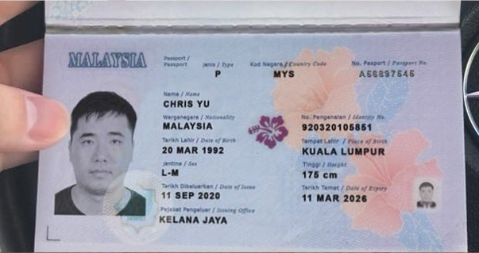
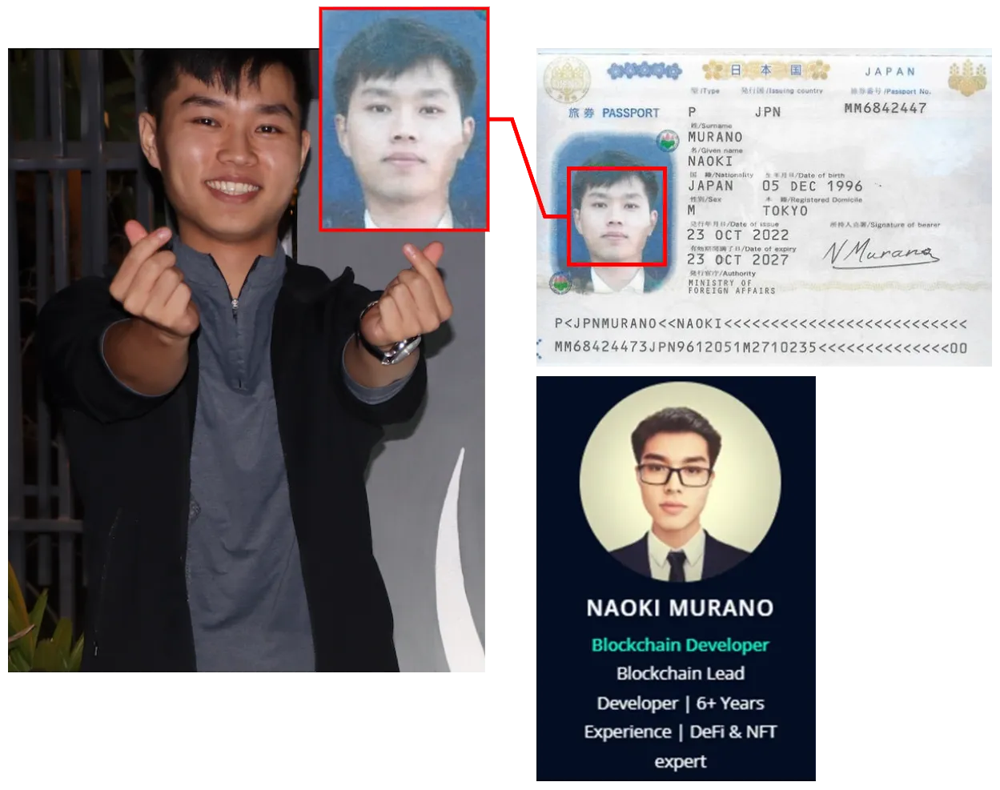

# DPRK IT Workers

#### Background Literature

- https://reports.dtexsystems.com/DTEX-Exposing+DPRK+Cyber+Syndicate+and+Hidden+IT+Workforce.pdf

- https://www.ic3.gov/PSA/2023/PSA231018

- https://ofac.treasury.gov/media/923126/download?inline

- https://cloud.google.com/blog/topics/threat-intelligence/dprk-it-workers-expanding-scope-scale

- https://therecord.media/major-us-companies-unwittingly-hire-north-korean-remote-it-workers

- https://cloud.google.com/blog/topics/threat-intelligence/mitigating-dprk-it-worker-threat

- https://x.com/tayvano_/status/1777911893224808911

- https://x.com/zachxbt/status/1824047425822310580

- https://x.com/bax1337/status/1931484066970276121

#### OSINT Interview Videos

- https://x.com/blackbigswan/status/1912647965505736753

- https://x.com/browsercookies/status/1938289068980506721

- https://x.com/browsercookies/status/1938348126756344321

---

## PONYJACKAL CLUSTER

- 

#### Benjamin Nguyen

- ponyjackal.eth

- github.com/ponyjackal • [Archive](https://archive.ph/OV5Yd)

- x.com/ponyjackalx

- benguyen0214@gmail.com

- Has JP Morgan Chase account through Rippling in his name

- 0x5c411cb174c2e163f6465252ae895f3e3e5a8792

- 0xdfae024a22713ecd8049784ca0ba4c9e87753493

- 0x8bb3cb9f93fba6ce149ed32a02d8f2664f58cafb

- 

- https://x.com/zachxbt/status/1940388827392344261

#### Andy Bell

- bbshark.eth

- github.com/bbshark99 • [Archive](https://archive.ph/X4l1l)

- x.com/kevin83191687

- 0x241d2b20f2c26a2541a0f121d6a33c29cb4cfe69

- 

- https://x.com/zachxbt/status/1940388827392344261

- 

#### Danny Jin

- dannyjin117@gmail.com

- 0xacb8ba726c04408aecacd6794b4c9dc59652203d

- 

- https://x.com/zachxbt/status/1940388827392344261

#### Muhammad Abdullah

- github.com/polartar • [Archive](https://archive.ph/z1ghl)

- x.com/m_polartar

- 0xf7f89251eaa664993893efea0e55d8ec3306d959

- 

- https://x.com/zachxbt/status/1940388827392344261

- 

#### Eric Andrade aka Josh Thomas

- gsofter.eth

- github.com/gsofter • [Archive](https://archive.ph/Z4SBi)

- x.com/ggsofter

- 0xfff50b1b9154b0631591dab746c5fc8f41dc44bd

- 0xe2becede47e8cba800b42323117a15399a6b5334

- 0x3f35550c2366b1a9bfc3e838b3fdb54c3267e084

- 0x899ab9015b440c1dbe4a7fe8860e4ca8a2b22272

- 

- 

- https://x.com/zachxbt/status/1940388827392344261

- 

#### Sandy Nguyen

- xgracias

- smarterdegen.eth

- bullishgopher

- x.com/bullishgopher

- github.com/bullishgopher • [Archive](https://web.archive.org/web/20231205224337/https://github.com/bullishgopher)

- https://linkedin.com/in/tkcong/ (https://x.com/bullishgopher/status/1272680031681155074)

- https://web3.career/@bullishgopher

- https://x.com/browsercookies/status/1937972789497168329

- 0xe1157497de4d4b0780474da85990ece6ccb0ad36

- 0x2a8f7065eccfa6d8ee49ea9a256315fb6374ee2e

- 0x7af7a8e4a0190bf3e48f3a021fb9251ea915e4d8

- 0x5fdd9679b656e48c7f899c65a47503ec8732fc6c

- 0xb2c681b80ca1f35bf379a3fd44b0eaed032c982a

- EW8oTqNfWi2eQZPqDSG6YqJJnGb6rL4DvDukW421Fzc

- 79Jqz5La12SVDZKJD9YRiP9s39W3NEtki7PUdF3CPWzJ

- 

- 

- https://x.com/zachxbt/status/1940388827392344261

#### Austin Lee / nextidearly

- nextidearly

- 0x2A12d779E06CAc14E7336B9F854f53f250f66eC4

- 0xc2c71c5a9393241b94b8be414c4fdc3db6d8d2e3

#### Adjancent

- 0x4Cd0dCD8EB96E8F02273e9Ca02F2D937A3b48418 lfgdegen smarterdegen.crypto

- 0x51C4463eFfCef15F161a0324Cb43c87BA8118F37 maymax777

- 0xe14aBb8585A2904A2C06c2A76F6402E9B3a8F48A cryptomuh

- 0xde49340DB099c2157F29Dd1ee9Ac27188Ac16fD4 devil1117

- 0xcF2001A16B69543fD4BFb54f1d4528b6c5307a3b TheNextHype

- 0x9FF251fD3363632626E96CE5ccC82CEe6C80A732 let-it-go, thunderspeed.eth

- 0xe3301806924da6e15b30ef9089c1db6faa052880 talentdev2020

---

## BRYAN + BONG + JOSHUA + PEMBA CLUSTER

- 

- 

- 

- https://www.wsbtv.com/news/local/north-korea-agents-steal-nearly-1-million-cryptocurrency-buckhead-business/XGEVBB7Z4JHPLPPP5XMNMDZ7DA/

- https://www.justice.gov/opa/media/1406396/dl?inline

#### Joshua Palmer

- 2024, [Zach's List](https://x.com/zachxbt/status/1824047425822310580)

- Wong Shao Onn

- 0xjsmart

- call-by

- jp-smart

- wewecalibrate

- joshupgig

- github.com/call-by

- github.com/wewecalibrate

- github.com/jp-smart • [Archive](https://archive.ph/grqjk)

- joshupgig@gmail.com

- smart.solidity@gmail.com

- 0x06f90983cd2215379e440fc525e441d6a5fc3fba

- 5Jfb3n8eW4JyQrKJktMNBFXnC1zx2YHjRSkzRrTT5QHh

- 0xa6afe0290fb6f2f7ced0a2753de57f9fa7c9c9dd

- 0xfa802d9b33ed74baff62b189875c2b2d192874eb

- 0x7654e18ff3495675606c008a39b6264da5d0e8a7

- 0x14455e9616522b3d55e84e46fdf5819430e94a84

- https://www.justice.gov/usao-dc/media/1402691/dl

- 

- 

- 

- 

- 

- 

- 

#### Bryan Cho / Chris Yu / atroboj

- 2021, 2022, 2023, 2024, [Zach's List](https://x.com/zachxbt/status/1824047425822310580)

- Chris Yu

- Bryan Cho

- atroobj

- bugarnet

- t.me/atroobj

- atroboj@gmail.com

- github.com/atroboj • [Archive](https://archive.ph/x0LMf)

- github.com/bugarnet (2021, Despace)

- 0x3b9a870c24905256de10863cb360f4b93c7cc60f

- 0xc2b2a9c05740eeb7ee7ba7eb3ab11ec8bebcb1d1

- 0x1043efee936903951b88db23551873bb67292e95

- ESSfP3aAcW6Z59ozut9Jkqy9btaX5YTHt25b3Vhs2hsf

- https://www.justice.gov/usao-dc/media/1402691/dl

- https://www.npmjs.com/~atroboj

- https://cryptototem.com/despace-des/

- https://x.com/bestvideosofct/status/1824786325834432776

- 

- 

- 

- 

- 

- 

#### Bong Chee Shen / Alex Shen

- 2024, [Zach's List](https://x.com/zachxbt/status/1824047425822310580), Obyte / Byteball

- devneser

- github.com/devneser • [Archive](https://web.archive.org/web/20211011124121/https://github.com/devneser)

- alexzh.dev@gmail.com

- 0x164729e00e8d0f871189160f36dee4398cade1f2

- 0x2efe21f4fef7e737c0a3491c93be7d696038b6f5

- 0x65b4ba828f85ac429d6a02db1304065a819a53f4

- 0xd9054f484ed98a7dd632eb9c09644616db3dea8c

- GrXoxqM2a6QFKSBdZ9RLWJCBVTFvuuH8eCjjsLbjhpiR

- 0x06f90983cd2215379e440fc525e441d6a5fc3fba

- https://stack.money/asset/byteball

- 

- 

- 

#### Pemba Sherpa / Pemba Gulu

- 2024, [Zach's List](https://x.com/zachxbt/status/1824047425822310580)

- paladin-120

- pemba.sherpa5232

- pemba.gelu5232

- pemba.sherpa5232@gmail.com

- pemba.gelu5232@gmail.com

- github.com/paladin-120 • [Archive](https://archive.ph/nVIz9)

- 0xfb5d591e8216f5d0964286f09b1f61114c16aab0

- https://archive.ph/EM0z1

- 

---

#### LAOS -> VLAD BOYS

#### Jenson Collins

- 2024, 2025

- nfbigjc

- nonfungiblejc.eth

- JCollinsX

- x.com/nonfungiblejc

- jenson.collins@hotmail.com

- github.com/JCollinsX

- https://dune.com/nfbigjc = Ender + TokenFi + Floki

- 0x44c2ab7db5299e008c586d52e9b6b193e4173471 (nonfungiblejc.eth)

- 0xaa166aa0b46fb42fdaafb7ac351a00186d684837

- 0xb402b45dde5e15ce93809404c104c2fc4918c88c 

- 0xb1aa3027d1cbf578009bb3c09c84481b76ad43f1 (MAYBE!)

- [Exposing DPRK's Cyber Syndicate and Hidden IT Workforce](https://reports.dtexsystems.com/DTEX-Exposing+DPRK+Cyber+Syndicate+and+Hidden+IT+Workforce.pdf)

- https://x.com/Narcass3/status/1913291280911921598

- 

- 

- 

- 

- 

- 

- 

- 

- 

- 

#### Kazune Takeda

- 2021-2025

- aka: Greg Takeo Joe Hisaishi mtfuji25 borrdd34 kazunetakeda25

- associates: David Adachi / David Lucas, Pham Trung, Sadao Eiichi Murano, Sadao Elichi, Charles Lee Gordon / David Tanaka, Eric Soh, John Wilhelmson, zhmolly zhmoly zzmoly jwtradera realhardworkingdeveloper davidtanaka3 ericsoh10

- 0xf9b9e7209d7297ae58d1c87636957015e3259651 os:kazunetakeda25

- 0xba4c58cf3f601ea8297bf9c08058bb1a4bd62921

- 0xdB600c22dfC1D59E5C2B515E8EB37895A6537B2C

- https://chollima-group.io/posts/tracking-a-north-korean-it-worker-cell/

- https://x.com/blackbigswan/status/1913312344760873365

- https://x.com/Narcass3/status/1913330812709200150

- https://x.com/bunzzdev/status/1636664986708725761

- 

- 

- 

- 

- 

- 

- 

- 

- 

- 

- 

- 

- 

- 

- 

- 

- 

- 

- 

#### Kazune Takeda - mtfuji25

- mtfuji25

- borrdd34

- kazunetakeda25

- kazune.takeda@yahoo.com

- t.me/ETHFuji (ID: 5407827675) • ([Messages](./user-5407827675-@ETHFuji.txt))

- github.com/mtfuji25

- npmjs.com/~kazunetakeda25

- AKA Joe Hisaishi

- Tokyo, Japan

- Kazune Takeda Japan MM2947271

- Joe Hisaishi Japan TA3058411

- 0xba4c58cf3f601ea8297bf9c08058bb1a4bd62921

- 0xdB600c22dfC1D59E5C2B515E8EB37895A6537B2C

#### David Adachi / zhmolly

- 2024, 2025, Zach's List zachxbt/status/1824047425822310580

- David Adachi

- davidadachi56@gmail.com

- gigazh

- dainmoly

- davidlucas0402

- jwtradera

- zhmolly@proton.me

- zhmolly@gigadao.io

- github.com/gigazh • [Archive](https://archive.ph/snjV5)

- github.com/zhmolly • [Archive](https://archive.ph/80EYH)

- github.com/dainmoly

- dainsm@proton.me

- jwtradera@outook.com

- t.me/jjmolIy (ID: 1968323567) • ([Messages](./user-1968323567-@zzmoly.txt))

- 0x210888f2624d01f9cbc71de5bf4caf5b6dc9fa7f

- GUrBkpnjmxz6ZLBjkd8jMkkrShsYXKropKSes8UCWdqw

- AVXF5qTa937CZ9nuL2M9J2MieYRL5bw8DEXr5QnvwN9L

- LAcNUB7p2VYNA8gEkmPSTdsrDBSwBjzymw5Dbt7UMvB

- 

#### Pham Trung / jwtradera (zhmolly friend)

- 2024-2025 (jwtradera cluster)

- Referred by zhmolly so probably zhmolly alt

- pham0315

- pham.t.35

- pt.trung0315

- github.com/pham0315

- pham.t.35@outlook.com

- pt.trung0315@gmail.com

- ZW4HoVLVCc1m2y9ej7RTyCmXMCHDkdpotiB5ELF9fX2

#### Sadao Elichi / David Adachi / zhmolly

- 2025 (jwtradera cluster)

- sadaorome

- zhmolly

- zhmoly

- zzmoly

- 0xmolly

- Moly

- github.com/sadaorome

- github.com/zhmolly • [Archive](https://archive.ph/80EYH)

- github.com/zhmoly • [Archive](https://archive.ph/7XiAc)

- t.me/zzmoly (ID: 1968323567) • ([Messages](./user-1968323567-@zzmoly.txt))

- t.me/zhmolly

- zhmolly@proton.me

- Fukuoka, Japan

- Sadao Elichi Japan MM6842521

- 2c5gD79Um49VmLCx54a89vVL84kFCiWmj82Zyg8QVVWi

- BrbAo3gtStKPxUbdomd14WUUAFv5QSBnFqp6NRD6TBGC

#### Charles Lee Gordon (zhmolly friend)

- 2025 (jwtradera cluster)

- Charles Leonard Gordon

- Worked with Sadao Elichi/zhmolly

- charles8200

- charles08200

- Charles45812

- realhardworkingdeveloper

- github.com/charles08200

- github.com/Charles45812

- github.com/realhardworkingdeveloper • [Archive](https://web.archive.org/web/20241001144921/https://github.com/realhardworkingdeveloper)

- medium.com/@charles.leonard.com

- charles.leonard.com@gmail.com

- David Tanaka / Ninja Dev

- realhardworkingdeveloper@gmail.com

- davidtanaka3

- trello.com/u/davidtanaka3

- medium.com/@realhardworkingdeveloper

- https://medium.com/coinmonks/unmasking-suspicious-github-activity-the-wagemole-campaign-and-its-links-to-dprk-threat-actors-248e7901de38

- https://www.dtexsystems.com/resources/i3-threat-advisory-inside-the-dprk/

- Onchain 5cGRQ connects to: Eric Soh 

- 5cGRQ3VRkGYtfuCWmgXnesrwbkn11cE9FFArzZ5iSeqV

#### Alex Davis (Charles Gordon alt)

- 2025

- Shows up all over Charles Lee Gordon / charles8200 profiles

- alex-davis-ang

- alex.davis.ang@gmail.com

- dannyboy-820

- alexdavisgender@gmail.com 

#### Eric Soh / zhmolly

- 2025

- Shows up on and offchain onnected to Charles Lee Gordon persona

- springdev216

- esoh0612

- ericsoh10

- esoh0612@gmail.com

- github.com/springdev216

- freelancer.com/u/esoh0612

- trello.com/u/ericsoh10

- medium.com/@esoh0612

#### John Wilhelmson / zhmolly

- 2021

- Shows up all over zhmolly handles

- John Wilhelmsson

- JeyHop

- jwtradera

- zhmoly

- github.com/zhmoly • [Archive](https://archive.ph/7XiAc)

- Sadao Murano jwtradera@outlook.com (Naoki Cross Whoopsies)

- David Lucas github.com/davidlucas0402 davidlucas0402@outlook.com

- linkedin.com/in/john-wilhelmsson-17b3a0219

- Hello everyone! I'm new to this group. Introduce myself, I'm senior blockchain developer. https://www.linkedin.com/in/john-wilhelmsson-17b3a0219/ https://t.me/elvencoin/2139 8/19/2021

#### Naoki Murano

- 2024, [Zach's List](https://x.com/zachxbt/status/1824047425822310580)

- Umnal IT worker, Choe Il-kuk (the Russia-based delegation subordinate to DPRK Chinyong Information Technology Cooperation Company)

- naokimurano

- muranox.eth

- supermutecx

- 0xdpta

- naokimurano@outlook.com

- murano@outlook.com

- murano1996@gmail.com

- github.com/supermutecx • [Archive](https://archive.ph/96QVA)

- github.com/0xdpta

- 0x85e0504fcd7981baa68774431099c5e2dcf074dd

- 0x6188a9e76794e7cb337b8e5a2b91808ce34fc6d1

- 0x44A33a4a822194d3C8402629932dd88B0FF49b09 CryptoUnity Deployer

- 0xe6c2d1d7f6ee9e4ee9f8b865d9b5931c06c9c7d1 os:murano1205

- 0xca3b78831a101a6d6d0a153653483e3c9a90948f

- 0xc8ad881deb9c02039795c111f2e661894b026ab0 (maybe?)

- [Exposing DPRK's Cyber Syndicate and Hidden IT Workforce](https://reports.dtexsystems.com/DTEX-Exposing+DPRK+Cyber+Syndicate+and+Hidden+IT+Workforce.pdf)

- https://x.com/aptwhatnow/status/1913292580248314278

- https://x.com/Narcass3/status/1913362337089650798

- 

- 

- 

- 

- 

- 

- 

- 

- 

- 

#### Satoshi Naoki / Sano / 0xb10ckdev

- 2024, [Zach's List](https://x.com/zachxbt/status/1824047425822310580)

- Satoshi Naoki

- Sano

- 0xb10ckdev

- sether1009

- sano1009

- astermirac1e

- 0xdpta

- astermiracle1009

- SenWebDev1009

- x.com/sether1009

- t.me/sether1009 (ID: 1385798680) • ([Messages](./user-1385798680-@sether1009.txt))

- t.me/sano1009 (ID: 5459321994) • ([Messages](./user-5459321994-@sano1009.txt))

- github.com/astermirac1e • [Archive](https://web.archive.org/web/20250827054513/https://github.com/astermirac1e)

- github.com/0xdpta

- github.com/Satoshi-Naoki

- github.com/0xb10ckdev • [Archive](https://archive.ph/KMoXG)

- github.com/defi-wonderland/prophet-core/pull/2

- astermiracle1009@gmail.com

- SenWebDev1009@gmail.com

- 0xef2a0324cfaa0100db9def8ef31c6e23bc4f9258

- 

#### Leon - Leon Lowden (0xl2)

- 2024, [Zach's List](https://x.com/zachxbt/status/1824047425822310580)

- 0xl2

- jigoat

- zeroxjoe

- x.com/zeroxjoe

- 0xl2@proton.me

- leon.lowden7@gmail.com

- github.com/0xl2 • [Archive](https://archive.ph/KolKd)

- 0x0c0e8ef4b62a4a2a1b5031911e272362530c1a9a

- 0xfd1b05e51653339c850c8a18c9ac11aed9105f2a

#### Leon - Leon Lin (mmsys34, 0xhiler)

- 2025

- leonxdev1

- leonxdev1@gmail.com

- mmsys

- mmsys34

- 0xhiler

- moreleon

- t.me/moreleon (ID: 7071594535)

- 0x64d668978ddd6145d4f192eefb03691b75f65096

#### Leon - Abe Sinjiro (prodigy205)

- 2024

- naruto0913

- prodigy205

- abe.sinjiro7

- abe.sinjiro7@gmail.com

- 0x90a8974ed484da8e209e6db7b2f84c1b5be345d0

- 

- 

---

## Keisuke & Co

#### Keisuke Watanabe / kAsky53

- 2021-2025, Divvy, Stabble, ElementalFi, Player2, Marinade Finance, Everway, OneRing, Parasol Finance, ORAO Network, Kamino, KingSamo NFT, Stryke, Beraborrow

- kAsky53

- kdevdivvy

- dev4all.sol / dev4alldotsol

- keisukew53

- 0xWoo (minor username)

- hirayama1534 (2021)

- watanabeatari@gmail.com

- t.me/kAsky53 (ID: 1914451016) • ([Messages](./user-1914451016-@kAsky53.txt))

- dev4all.sol = JBxidGWnhtPTGg8xw7sFT9tF4cfGtHnjYNp5GDJvGveh

- 8mdfRML7z3s8gqDYd72bywcEgQtcvkoJCw2bukv8X71R

- 4Cz7ZhYnEKtXVs6tivDFo3z6g3KuVct9J6wigg2xZ6Qv

- 5rKfEpABCmbKuVHRfEMFThYFBxU7DW43fScJCSPLdw7D

- 66maPCk7WqQyx7w97K7uZqVkdDbprtmvQdpjXSaAoarE

- BjGhtq5Vh9Lv1xxBJ6pZKx3ZCmsEHPVoWNZZGdHkVQ4p

- CfFk1V1LQ6b1DeijRP5qFQwHeJwXdYLepTxqCS1yVQFy

- DybGDChJMvX9Jnza4XTQVDyUGZ6jYrRg9Q3CdLiEJeh2

- GjCTY7n5ogPBT8A2HnYQQho4TGN6EznMQJgJBcYrgdoc

- JBxidGWnhtPTGg8xw7sFT9tF4cfGtHnjYNp5GDJvGveh

- 0x161dea4d7ac627f2bc4358dfece386c0e9f4cc8f

- 0x1b89aecc0f8c128150db67d7d0c4b1daeb43eda4

- 0x83b5fbcae0f80697130ef8479622a1cac9a2a9b9

- 0xe45d08520274bcd177aed9406e80db23d231e82a

- 0xe54dbf16db507a2dacfece7997125b90c7e2e9a5

- https://x.com/kAsky53/status/1726298239530614808    

- https://x.com/kAsky53/status/1726298540786466997

- https://x.com/kAsky53/status/1726299174227059164 

- https://x.com/kingsamocoin/status/1464602708887818240/photo/1

- https://x.com/solplay_jonas/status/1786388979123642818

- 

- 

- 

- 

- 

- 

#### Mario Suparat fka Chris Jin

- devbamboo

- devbamboo15

- super-vic114

- chris-jin114

- mdevdivvy

- github.com/devbamboo15 • [Archive](https://web.archive.org/web/20250604132757/https://github.com/devbamboo15)

- github.com/chris-jin114

- AezJBekqBoMWPcCVByn78mucdKVXdc99ugiRjJArWgYR

- 5AvpMGYy2WxCMoaswmLfFdKPSMDxwZomPVDAdzE3A6vE

#### Holmes Ming

- 2025 - friends w Keisuke

- Holmes

- Holmes Ming

- h0lme3

- HaoqingMing

- haodev007

- stabble-dev

- haodev007@gmail.com

- h0lmes

- stabbledev

- x.com/haodev007

- github.com/h0lme3 • [Archive](https://web.archive.org/web/20240926190449/https://github.com/h0lme3)

- github.com/stabble-dev • [Archive](https://web.archive.org/web/20250827054724/https://github.com/stabble-dev)

- socket.dev/npm/user/stabbledev

- t.me/haodev007 (ID: 5312921424) • ([Messages](./user-5312921424-@haodev007.txt))

- 

#### Ming Tai

- Igor Babe

- github.com/vikigstar (codebear)

#### Thành Hao Vo

- Kunkka0822

- github.com/Kunkka0822 • [Archive](https://web.archive.org/web/20250827054829/https://github.com/Kunkka0822)

#### David Lee

- solandrust

- github.com/solandrust

---

## Mauro & Co

#### SIFU VISION / catanet.eth / Sifu Vision Deployer

- Mauro Liu

- 0xe5edbabd5115740fff9c4c0ce0d5aae2891947a4 - Company paying payroll (Gnosis Safe)

- 0xcb69535abbc95a042914507f963bdd74ad0025ff - Company paying payroll (catanet.eth)

- 0x6674bc65df8bd4f5b495c1dad35543eb6c4eb674 - Company paying payroll (Sifu Vision Delployer)

- 0x147ed0f4d0cc9f0cf4eff223aa79b2f837532d62 - ITW Mauro Liu 0xchamel
    
    - 2023-12-11 $24

- 0x682d0c303a1619b274e2d337828293986b195896 - ITW Unknown 1
    
    - 2023-07-17 $200
    
    - 2023-07-19 $1,631
    
    - 2024-07-31 $4,018

- 0x39143cc85d4cf0e31849987aa9f68c621282820c - ITW Unknown 2
    
    - 2023-07-14 $330
    
    - 2023-07-19 $2,310
    
    - 2024-07-01 $4,018

- 0x43ca2e9d6bccc15b5c722220e7724ca64d5ee422 - ITW Unknown 3
    
    - 2023-12-25 $177

#### Mauro Liu - UNKNOWN COMPANY

- Adjacent to Mauro Liu

- 0xd77d919fd407e373730b5ba287ed94b6cddb23ff - Company Paying Payroll

- 0x8bd5d72e5874f45a1204e486938d8c271e953e5e - ITW 1
    
    - 2023-07-21 $2,000
    
    - 2023-12-18 $4,027

- 0xb2ef5c1af6b2b43bfc834fe114b5cf3a3abc919b - ITW 2

---

# The OGs

#### Alex Hong

- CreamFi, Decubate, DEPO, DeSpace, Gamerse, Jointer, Paid Network, Panther Protocol, Impermax

- ivanche90705289

- x.com/ivanche90705289

- https://www.justice.gov/usao-dc/media/1402691/dl

- https://decubate.medium.com/meet-the-decubate-team-1cc097cae24c

- https://blogtienao.com/depo-coin/

- https://cryptototem.com/despace-des/

- https://gamerse.gitbook.io/gamerse/team

- https://shinchanieoalerts.medium.com/gamerse-ama-summary-recap-with-shin-chan-community-8171e08ac22f

- https://stack.money/asset/paid-network

- https://cryptototem.com/panther-protocol-zkp/

- https://stack.money/asset/impermax-2

- https://x.com/musectech/status/1914020967275462667

- 

- 

- 

- 

#### Jason Kwon

- 2024, [Zach's List](https://x.com/zachxbt/status/1824047425822310580), DeSpace, Beanstalk, Blueberry, Spice Finance, 

- 0xMoon

- 0xm00n

- 0xm00n.eth

- 0xm00neth

- cryptonerd_

- 0xm00neth@gmail.com

- 0xlock

- github.com/0xm00neth • [Archive](https://archive.ph/WIu3i)

- github.com/0xlock • [Archive](https://archive.ph/J347l)

- x.com/0xm00neth

- https://cryptototem.com/despace-des/

- 0x1e5c29702b770d5519932367129973bd63740392

- 0x03e6adb71ec39af3d68733f1c3f5e54e6e55b7d2

- 0xa771609c5c56048f146d2c794c87db946bff27cf

- 0x1075e62bfacbb44e31d7a5719e55c7d16fe7d35d

- 0x4b94ba1528636a699dab486a217d39bb7ce21d75

- 0x72c70980acdde7a5c9437050e73e7d07fbf21d25

- 0x7969b188f7dc6bf80d68f224ac3454dafe6f6d5d

- 0x90cf352ddaf171d41a6ded1d54ceda4005047c93

- 0xcdee5da607ad96e966df82dbc3f004ce44859c6f

- 

- 

#### Jason Lee

- Kira Network, Metadallion, Party Doge, Yam Finance

- jasonlee9627

- 0xJason (Discord)

- Punk1004.eth

- jasonlee9627@gmail.com

- github.com/pudgePenguin 

- 0xd71cfaa9051e88fa282ae78c165d1788fab0f2cb (punk1004.eth)

- 0x099336af1b84fe02f1fe695820024f46cb27b1af

- 0x86fce1a6cbaaf0d0d7cb727e9b9eac5ed4150a5b - akame.eth, overlaps with

- https://cryptototem.com/kira-network-kex/

- https://medium.com/@partydogeinfo/who-is-jason-lee-did-he-steal-1m-from-various-nft-projects-975007241e09

- https://medium.com/yam-finance/on-november-3rd-2021-we-were-alerted-via-discord-about-potential-malicious-actions-toward-other-3f5f74af044d

- 

- 

- 

#### Gary Lee / ChienHui Lee / Light Fury / Leech Developer

- Q12024, 2024, [Zach's List](https://x.com/zachxbt/status/1824047425822310580), Gamerse, DxDAO, Sushi/Miso, Chronos, DEFIS $XGM, Fantom, Preon Finance, Sperax

- Light Fury

- lightfury

- light-fury

- leech.developer

- leech_dev

- x.com/lee_chienhui

- github.com/light-fury • [Archive](https://web.archive.org/web/20230513202311/https://github.com/light-fury)

- medium.com/@leech.developer

- linkedin.com/in/lee-chien-hui-50b157157/

- leech.developer@gmail.com

- ddpuppy42@yahoo.com

- 0xfcd4e8c84afd221d3b8c9c8c374a7784b314d230 (T)

- 0x390ed16a3e85758597db7452998d3ea66b65fd84

- 0x4ab0eac00d1a5b05e7a484f8678dce68b849545a

- 0xe8a06462628b49eb70dbf114ea510eb3bbbdf559

- https://web.archive.org/web/20220925210750/https://daotalk.org/t/developer-proposal-chienhui-lee/2649

- https://shinchanieoalerts.medium.com/gamerse-ama-summary-recap-with-shin-chan-community-8171e08ac22f

- https://gamerse.gitbook.io/gamerse/team

- https://x.com/zachxbt/status/1812856350151766209

- https://www.justice.gov/usao-dc/media/1402691/dl

- 

- 

- 

- 

#### Jikun Liao - The OG

- MetaPlay (Jan 11, 2022), Gameswap, Obytes, Iotex.io

- "We have filed cybercrime report in the US and working on private investigation to see if we can recover the money from the dev @altp! - Jikun Liao"

- "Our developer Jikun Liao claims that he shared his passwords in GitHub resulting in a hack. Only he, pk, Swapnil had access to this."

- "Ultimately, only one person had been logged in recently, Jikun Liao. Therefore, we will be filing a police report in Houston, Texas where he resides. From what we can see, his explanation is an attempted cover up. It's clearly internal rug by the developer."

- "This is the absolute worst nightmare. We believed that this Jikun Liao was trust worthy, but his story does not add up and it's clear that we require authorities to investigate this matter."

- altpl

- jikun

- jliao

- peezenut

- jikun@mygameswap.com

- jliao@mygameswap.com

- peezenut@gmail.com 

- t.me/altpl

- linkedin.com/in/jikun-liao-794b61162/

- https://vk.com/id578519076 [Archive](https://archive.ph/SWt2n)

- https://rocketreach.co/jikun-liao-email_233286867

- 0xC43B1f4E7E47bE5D5663C3B26E4FB3fE7e217f90 - See More: [Metaplay Theft](../hacks-and-thefts/metaplay.md)

- 

#### Jikun Liao - "James Lee"

- Q12024, 2024, [Zach's List](https://x.com/zachxbt/status/1824047425822310580)

- james117lee@gmail.com 

- github.com/jnuon • [Archive](https://archive.ph/rf3TU)

- 0xb9451049310053b29e5dd98c54bff37a5e38819c

- 

#### Jikun Liao - "Justin Lim" / altbee

- 2025, Cook, Arable Protocol, WagyuSwap, GAMESWAP, StakeDAO, Obyte, Fantom, Lid Protocol

- altbee

- zerobit417

- @zerobit417

- github.com/altbee • [Archive](https://web.archive.org/web/20220625174754/https://github.com/altbee)

- zerobit417@gmail.com 

- linkedin.com/in/james-lee-0977a0217

- linkedin.com/in/justin-lim-14664a324/ 

- https://www.cake.me/me/james-lee-319683/

- https://stack.money/asset/byteball

- **/altbee:**

- Old Username: liaojikunwork

- 34900782+liaojikunwork@users.noreply.github.com: liaojikunwork

- liaoJikundever@gmail.com: Jikun Liao

- liaojikundever@gmail.com: Altbee, JL, Jikun Liao, Liao Jikun, altbee, liaojikunwork

#### Quinn Lee

-  Q12024, 2024, [Zach's List](https://x.com/zachxbt/status/1824047425822310580), Arc Market?, Fastswap?, Grape Finance?

- QuinnDuck

- letteldream

- rustumatizon

- letteldream@gmail.com

- github.com/rustumatizon • [Archive](https://archive.ph/KLBYw)

- t.me/QuinnDuck

- https://quinn-lee.netlify.app/

- https://laborx.com/freelancers/users/id126269

- 0xf9adac8658e08893fb4e91c1062e471eb11cb6c7 (T)

- 0x9de5d3158b0b83e9211c7444c94ce0c53763f574

#### Ryuhei Matsuda

- Q12024, [Zach's List](https://x.com/zachxbt/status/1824047425822310580), Arcadia, DxDAO, Kira Network, Kylin Network, Loom Network, Naos Finance, Raze Network, Sandclock, Shardeum, Paid Network, Hyperionx

- ryuhei.eth

- ryuheimat

- ryuheimat3

- ryuheimat3@gmail.com

- linkedin.com/in/ryuhei-matsuda

- github.com/ryuheimat • [Archive](https://archive.ph/V5GsZ)

- github.com/mono300genuine • [Archive](https://archive.ph/wip/Am9Cr)

- 0x36c67d5ce9e2e4a919f568fc33657fcad0030880 (T)

- 0x6fb678b2dd9d2ff50ee9ecf774251dcceb7a2da8 (Zach's List)

- 0xa71b641a498e33bb13548a01eca5e20e083e637b

- 0xd97729eef14c189144adb0591e4ddb1a66ce22af - 0xmimi.eth, overlaps with

- 0x86fce1a6cbaaf0d0d7cb727e9b9eac5ed4150a5b - akame.eth, overlaps with

- https://crypton0ob.medium.com/5-questions-about-kira-network-you-should-know-98850b1323a8 

- https://icoholder.com/en/kira-1003837 

- https://kylinnetwork.medium.com/kylin-network-monthly-report-2-d9b6be5b8cdf

- https://medium.com/@ivan.shodanov/the-15-most-promising-small-cap-defi-projects-to-invest-in-2021-6e9d5aa5774c

- https://polkastarter.com/projects/naos-finance

- https://stack.money/asset/paid-network

- https://theorg.com/org/kira-core

- https://web.archive.org/web/20220818133854/https://daotalk.org/t/developer-proposal-ryuhei-for-2-weeks-trial-period/2650

- https://www.bydfi.com/en/crypto-price/raze 

- https://x.com/Kylin_Network/status/1344503704142143490 

#### Mauro Liu

- Q12024, 2024, MagicCraft (2022), Ankr, Gamerse, Clover Network, DEPO, Sifu Vision, Oxytocin, Tomodachi

- 0xchamel

- 0xllaCh

- blueChamel

- chamel92

- daiki-iu

- Gornutz

- lmauro77

- mauroh.perk

- mauroliu77

- zhChamel

- zhChameleon

- blueChamel mauro@blueberry.garden

- 0xchamel pwongexcal@gmail.com

- zhChameleon zhaoa4317@gmail.com

- Overlaps with 0xm00neth, zhChameleon, Daiki Saito, Malkevych Bohdan bomalkevych@gmail.com, Jamshed Latipov jamshedlatipov@gmail.com

- t.me/chamel92 (ID: 6635242888) • ([Messages](./user-6635242888-@chamel92.txt))

- x.com/0xchamel

- linkedin.com/in/lmauro77

- github.com/0xchamel

- github.com/zhChameleon

- github.com/0xllaCh • [Archive](https://web.archive.org/web/20250827054938/https://github.com/0xllaCh)

- github.com/blueChamel • [Archive](https://web.archive.org/web/20250827055005/https://github.com/blueChamel)

- 0xc9b46489567684aafbe85e8a783bb9bfb822807f (T)

- 0x6d8886e5e418571da0a6a1133555c663963b1ac5 (Oxytocin, Tomodachi)

- https://blogtienao.com/depo-coin/

- https://x.com/MagicCraftGame/status/1532587886234652673 

- https://x.com/MagicCraftGame/status/1527876841868087302

- https://cryptototem.com/glory-games-worlds-glory/

- https://medium.com/@CryptoSavingExpert/in-depth-review-of-five-new-play-to-earn-games-part-9-magic-craft-professionalism-df7bc9c4b2de

- https://gamerse.gitbook.io/gamerse/team 

- https://shinchanieoalerts.medium.com/gamerse-ama-summary-recap-with-shin-chan-community-8171e08ac22f

- https://medium.com/@CryptoSavingExpert/in-depth-review-of-five-new-play-to-earn-games-part-9-magic-craft-professionalism-df7bc9c4b2de 

- https://x.com/MagicCraftGame/status/1532587886234652673

- https://x.com/MagicCraftGame/status/1527876841868087302

- 

- 

- 

- 

- 

#### Mauro Liu aka Xu Liu

- Napier Finance (2023-2024), Blueberry, Pickle Finance, Harmony

- bitbaby888

- imyugioh

- chamel92

- zhExcal

- 0xlocker

- ethlocker

- raptor1001

- blueraptor1001@gmail.com: 0xlocker, Burndai, Derek Lee, Raptor, Raptor1001, burndai, ethlocker, unlocker

- choi.link227@gmail.com: Ryan Choi

- t.me/chamel92 (ID: 6635242888) • ([Messages](./user-6635242888-@chamel92.txt))

- bitbaby888@gmail.com

- github.com/imyugioh • [Archive](https://web.archive.org/web/20250827055032/https://github.com/imyugioh)

- github.com/0xlocker • [Archive](https://web.archive.org/web/20210309195053/https://github.com/0xlocker)

- github.com/ethlocker (name: Hack the Moon!) • [Archive](https://web.archive.org/web/20230214213422/https://github.com/ethlocker)

- github.com/raptor1001 (name: raptor1001)

- 0x4BA8BDC825B03A83dF46cff59f18b41dEE84968E (Tweeted)

- 0x147ed0f4d0cc9f0cf4eff223aa79b2f837532d62 (Napier)

- 0x4d4da4ad60b35d1baa44951db99f3900ea008a73 (Napier Theft)

- https://x.com/zhExcal/status/1691805547614621801

- https://x.com/NapierFinance/status/1691754768383750308

- https://github.com/harmony-one/chrome-extension-wallet/graphs/contributors

#### Eric Liu

- MagicCraft (2022), Humansdotai? Cosmos stuff?

- vigorousdeveloper

- top-dev-mania

- VigorousDevelopment524

- Vigorous Developer

- supervenus0725

- SuperDev 

- Jason07250000

- venus07250000

- VigorousDevelopment524@gmail.com

- dev.mania.639@gmail.com

- venus07250000@gmail.com

- github.com/vigorousdeveloper • [Archive](https://web.archive.org/web/20241207220408/https://github.com/vigorousdeveloper)

- github.com/top-dev-mania

- github.com/SuperVenus0725 • [Archive](https://web.archive.org/web/20250827055204/https://github.com/SuperVenus0725)

- github.com/Jason07250000

- https://x.com/MagicCraftGame/status/1532587886234652673 

- https://x.com/MagicCraftGame/status/1527876841868087302

- 

- 

- 

#### Anthony Keller / Daiki Saito

- Truflation, Hector Network, MagicCraft, Sushi/Miso, Yearn/Coordinape

- Anthony Keller

- Daiki Saito

- Also maybe James Ling / Smart Ninja / DevSCNinja

- coppn

- lcoppn

- 0x.bejaxer

- eratos1123

- eratos1122

- cobang

- bejaxer

- 0x.bejaxer@gmail.com

- eratos1123@gmail.com

- github.com/cobang

- github.com/bejaxer (Name: 0x A.K.) • [Archive](https://web.archive.org/web/20221130173129/https://github.com/bejaxer)

- t.me/lcoppn (ID:749123222)

- linkedin.com/in/anthony-keller-022486183/

- 0x4717Af66032b1Dbc35d9b1182F9240994A11bf01

- 0x482C9f85644f1686C490D38291511657da767e61 ([Tweeted](https://web.archive.org/web/20210918033441/https://twitter.com/eratos1122/status/1367402518335094786))

- https://remote3.co/p/daiki-saito

- https://daiki-saito.herokuapp.com/

- https://stack.money/asset/hector-dao

- https://x.com/MagicCraftGame/status/1532587886234652673

- https://x.com/MagicCraftGame/status/1527876841868087302

- https://www.coindesk.com/tech/2024/10/02/how-north-korea-infiltrated-the-crypto-industry

- https://medium.com/@CryptoSavingExpert/in-depth-review-of-five-new-play-to-earn-games-part-9-magic-craft-professionalism-df7bc9c4b2de

- 

- 

- 

- 

#### Sava Grujic

- Sushi (2021)

- Aristok3

- github.com/millicare • [Archive](https://web.archive.org/web/20221021153917/https://github.com/millicare)

- github.com/DevWebMaster • [Archive](https://web.archive.org/web/20250827055457/https://github.com/DevWebMaster)

- savagrujicinnov.wixsite.com/mysite

- t.me/SuperDevel0per

- topfirepassion@gmail.com

- Likely also Anthony Keller

- https://www.coindesk.com/tech/2024/10/02/how-north-korea-infiltrated-the-crypto-industry

#### Sarawut Sanit

- IQ (2021), GuardRails, Luxcore, ThorChain, Vitae Token

- Devstar

- 0xdbkey

- 0xskydb

- ssdbkey

- 0xy0k 

- sarawut

- sanit.sa@outlook.com

- dbkey.one1@gmail.com

- 0x8218D63A1b22077C264Ef481E15c6483eA204649

- 0x4C83150FD1fbfa031F3cD8C416F57409DE98372F

- https://archive.ph/5pNLd

- https://www.coindesk.com/tech/2024/10/02/how-north-korea-infiltrated-the-crypto-industry

#### Jun Kai

- 2024 [Zach's List](https://x.com/zachxbt/status/1824047425822310580), Kira Network (2020), IQ (2021), Sunrise Layer, Elys Network, Ferrum/Comdex (2023)

- junkai121

- jelysn

- jpine3528

- jgo121

- junkai121@outlook.com

- github.com/jelysn

- github.com/jpine3528 • [Archive](https://web.archive.org/web/20250827055600/https://github.com/jpine3528)

- github.com/junkai121 • [Archive](https://web.archive.org/web/20220410220220/https://github.com/junkai121)

- github.com/icafa

- linkedin.com/in/jun-kai-78911a156/

- 0x8aa07899eb940f40e514b8effdb3b6af5d1cf7bb

- 0x434b9d5f65302a296e6e2ede5fcf1f8dd6cde139

- 0x6231dbaed7f7d7836b2b1971cbf6315bf6768546

- 0x9d4a82041dc5a5fd9ba890ea6fff07648c7c938e

- 0x583e8dd54b7c3f5ea23862e0e852f0e6914475d5

- 0xc6804601db0b679efb7d46923c42cca179ce698b

- 0xadeb946919ddd957eb2f09a77804131e5acd7602

- https://crypton0ob.medium.com/5-questions-about-kira-network-you-should-know-98850b1323a8

- https://cryptototem.com/kira-network-kex/

- https://forum.comdex.one/t/multiswap-launch-on-comdex-enabling-crosschain-swaps-to-comdex/972

- https://icoholder.com/en/kira-1003837 

- https://medium.com/ferrumnetwork/monthly-development-report-june-2023-a439f54934e9

- https://theorg.com/org/kira-core 

- https://github.com/KiraCore/sekai/commits/master/?after=9f10902b12b8b55552d7f33fabe25a446d6c6df6+524

- https://www.coindesk.com/tech/2024/10/02/how-north-korea-infiltrated-the-crypto-industry

- 

---

## Hector Network Cluster

- https://x.com/lilbagscientist/status/1984385125212438885
- https://x.com/lilbagscientist/status/1980294857022394400
- https://x.com/lilbagscientist/status/1986571963238875498
- https://x.com/lilbagscientist/status/1988604220099150001

#### Alex Lu

- Alexlu0917

- codemaestro11

- works with `cooldev900` / `silversoft0707` and `oldhand7`

- github.com/alexlu0917

- github.com/CodeMaestro11/

- alexlu0917.dev@gmail.com

- codeMaestro11@outlook.com

- https://opensea.io/Alexlu0917

- https://web3.career/@alexlu0917

- 

#### CodeMaestro11

- CodeMaestro

- CodeMaestro11

- alexlu0917

- mikhaylovqweasdzxc

- alexlu0917.dev@gmail.com

- mikhaylovqweasdzxc@gmail.com

#### itsmooncity

- itsmooncity

- 0xmooncity

- 0x483adFD3409abEEc7d500312d81eFa21E740632a

- https://x.com/lilbagscientist/status/1986571969408446676

- https://x.com/blackbigswan/status/1987891292899303598/photo/1

#### David Park

- Cooldev_900

- cooldev900

- davdpark1026

- t.me/Cooldev_900 (ID: 8369486870)

- x.com/davdpark1026

- github.com/cooldev900

- 0xF7A3Eb4418F5f186060A9fB8ee85d7362C632a6d

- 

- 

- 

- 

#### Hector Network / MEXC

- 0x66b37234b9Cf5a7fBBDA45076e70164962dc7c8D

- 0xA3CEcF021Cd17681aD33A7Fc2F387F1cde8e0b61

- 0x8E7b405be517EC23d13f756D0cBA201176a25B04

- 0x95558655C7Eb9C174c5D7B3C73F2FA64a510E2f1

- 0xDA11680fc06D4a2ADFAe220936dE2a922dcdD9fC

- 0xb2628b78FD46D43a9A69F87d890874B91DB5aaa2

- 0x7534DD9676BCb6ffca1dF9a386079a5aA706D8F3

- 0x16ba6a5B0B5a37664Ea2A595f21e368DC61c6FF7

#### Wolf on Sol Hack

- https://x.com/lilbagscientist/status/1988604226457776428

- 6w3Aydzf1eZ4ZUa6gQrujpjKq47yMovZvFRHcc7K8izG

- 0x2A0C3Cd720397d58137ddA6eF2f96D7a9a920F59

- 0xfc6bf75dbe839ca7f9fcd8490d5be4ffac735df8

- 0x9e6bbd2204ef8df16b5e6db01d13f8a339f82d55

- 0xaacdEDda80d2d645a353841D46e749F3F8a2304C

- 0x78beD44F9Fcd224B61eed9eE59A1A772a169cb7c

- 0x0b237965D3A4288F06620277daAc1f113AdDbA00

- 0xB0CA489DDdA9C11C3F6AC58A4437eFe04C0A2490

- 0x698B66D21851a64dfB30C2dbe58603a6A9D94f26

- 0x47a326dc038c6e6a49f6e14697b26C543b4d2F63

- 0xc6Cd086030a7A2FD634215cC6216e57E5D7921c0

- 0x21Cbb5187050D0B20eb1F858F6Ef07D6DFfA3653

- 0x139Ce0B76B4BBBB392112cc23152A4688bf651c5

#### Jova (Wolf on Sol)

- besmart

- Milos D

- t.me/ai_crypto_guru

- github.com/relforce/

---

#### MORE WORKERS

#### Kei Nakano / smartcoding51

- OneStake Finance, 2024, [Zach's List](https://x.com/zachxbt/status/1824047425822310580)

- aka: Jin Wang

- smartcoding51

- fantasticfullstackdev

- webdevninja

- Jinathin

- kei-tren

- github.com/smartcoding51 • [Archive](https://archive.ph/mo0QZ)

- github.com/kei-tren • [Archive](https://archive.ph/fhKTT)

- keinakano415@gmail.com

- x.com/kn_amm51

- t.me/kn_amm (ID: 1967508345)

- 0x21e5d5a6e40b32cff77cfe77dca034d6d410131d

- 0x452f205c6c3872691fbce7ce8438370466d55f76

- 0xff22be4f00b937dade564bd9659e265f92afa620

- https://cryptototem.com/onestake-finance-ost/

#### Matias Diaz / Kei Nakano

- 2025

- mndiaz27

- 0xdefilover

- github.com/0xdefilover • [Archive](https://web.archive.org/web/20250827055628/https://github.com/0xdefilover)

- 0x9d66bea448eed9bdbb5f1acf032767b11fc78dcf

- 0x961194d781623ebf5ce43087d85d2731cf1e7d1c

#### Russell Hieu / Shota Nakamura

- 2024, [Zach's List](https://x.com/zachxbt/status/1824047425822310580)

- Nakamura Shota

- John Patch

- Helme0315

- johnpatch0502

- 0xRUS38

- 0xdoccer

- russellhieu

- johnpatch0502@outlook.com

- russellhieu@outlook.com

- github.com/Helme0315 • [Archive](https://archive.ph/vgsFX)

- 0x97467ea9BeF1c925E9D8e2E65932d066869b7f13

- 0xFf6d86807b3387e10dDE52697C3BD7f59b6A145f

#### James Zook + Shota Nakamura

- 2025

- aka Russel Hieu

- 0x38037C0fafae5c97D411c0460c5f0Af40F82B7bd   

- 0x4480206854d67338c8b792a1db2a9189ee75d813   

- 0xB5BcB3935e0B3e6A581FBA37F40D0F472CCf378A   

- 0x1cF9a8fc7A5568B6Dca9f5F73200bC1De69e3ecE 

- BaHNYFQYsBKX541kjEB9sgoHCc7NQdwc16S5ZE9bmYYv

#### Lucas Wong

- 2025

- cox1118

- superlwclx

- LucasWongC

- github.com/superlwclx

- github.com/LucasWongC • [Archive](https://web.archive.org/web/20250108192702/https://github.com/LucasWongC)

- t.me/cox1118 (ID: 5034927805) • ([Messages](./user-5034927805-@cox1118-Lucas-Wong.txt))

- lucas.wong.1118@gmail.com

- wm111898@gmail.com

- Discord: c__x__

- lucasw.net

- 0xee52717e6dA13499a3C4ba803e4D952CF052704E

- 0x94A8518B76A3c45F5387B521695024379d43d715

- 

#### Jannik Villostas

- 2025

- 0xtomoon

- mrcontract17877

- melonman913@gmail.com

- github.com/0xtomoon • [Archive](https://web.archive.org/web/20250516070156/https://github.com/0xtomoon)

- x.com/mrcontract17877

- t.me/janbuidl (ID:7245484067) • ([Messages](./user-7245484067-@janbuidl-@mrcontract17877-@0xtomoon-Jannik-Villostas.txt))

- 0x1FEbc069606ABfbA5d021Ed3768cb5D90c9407D5

- 

#### Janul Azwan

- 2025

- Resume claims Lucidly, Shoebill, Moby, Dodo, LAToken

- 0xtomoon

- melonman913@gmail.com

- github.com/0xtomoon • [Archive](https://web.archive.org/web/20250516070156/https://github.com/0xtomoon)

- linkedin.com/in/janul-azwan-7b1612361/

- immunefi.com/profile/ethprotector/

- t.me/janbuidl (ID:7245484067) • ([Messages](./user-7245484067-@janbuidl-@mrcontract17877-@0xtomoon-Jannik-Villostas.txt))

#### Peter Wang

- 2025

- petherwang@gmail.com

- github.com/hapetherw

- x.com/hapetherw

- linkedin.com/in/peter-wang-780259a3

- t.me/pethercap (ID: 2124964775, prev: @baymax586)

- 0x74bc47ea5201a61c7c9a366bb62ecae2713602a1

#### Chai Somsri 

- 2024, 2025, Credbull

- ChaiSomsri96

- George Capraroiu

- george19871205

- x.com/chaisomsri96

- x.com/TickyCrypto

- medium.com/@chaisomsri96

- linkedin.com/in/chai-somsri

- github.com/ChaiSomsri96 • [Archive](https://archive.ph/eRFnu)

- t.me/chaisomsri (ID: 7022528006)

- chaisomsri96@gmail.com

- georgecapraroiu1205@gmail.com

- melonman913@gmail.com

- 0xE5a86c150ac44ab8F8B2661c9e8d8b13887360f0

- 0x9ce96e07c091662c2605eaae9180de22aad6e8db

- https://cryptototem.com/credbull-cbl/ 

- https://www.linkedin.com/in/chai-somsri/

- 

! 

#### Milan Zubic / Patrick Kishi

- 2025

- icetrust0212

- icebera

- github.com/icebera • [Archive](https://web.archive.org/web/20250827055910/https://github.com/icebera)

- zaza.liveedu@gmail.com

- t.me/trust0212 (ID: 5419192978) • ([Messages](./user-5419192978-@trust0212.txt))

- 0x35FcB352027cdDc632b7aE8a50A0410C5bf36248

#### Unknown ITW 

- 2025

- Adjacent to Jannik Villostas and Chai Somsri

- 0x146ab113a6d69033cccdb4eaae61c496c2faaf05

---

## Scott Brown & Co

#### Scott Brown

- aka Kyle Larsen, Sean Day

- breavedev

- nevermindhim

- verytinydever

- scott.brown0629

- scott.brown0629@gmail.com

- what.a.fabulous1@gmail.com

- sct.brown0629@gmail.com

- github.com/breavedev

- github.com/nevermindhim

- github.com/verytinydever

- linkedin.com/in/scott-brown-b947ba29a

- linkedin.com/in/scott-brown-813445279

- dev.to/scott_brown_b611d05a865cf

- www.impaxrecruitment.com/wp-content/uploads/elementor/forms/6786f200b23aa.pdf

- 0x3b8cc82f5d3ec89d88c58504ecfefe4597020840

- 0x368a337dcdec5cf9849a7563538f03b1516a3f7d

- 0xb25a0580ddf68d4aea11d83f1655016e9520f51a

- 0x38a35ab4235ce7c8b5c4733cee7de9e28e348acb

- 0xce0113e71ce0273d0504a7ef1cd4f0e6e4d196bc

- 0xa8cb25ddf0a7195bdc3232ac6e1d812c8a4713fe Gnosis Safe

- 0x836fd838cefc1b4d41566e7d3703abe6d0ea1af8 Signer on Gnosis Safe 0xa8c
- 0x03493cc1392266ce4cdacce2addeeb94a963eb9f Signer on Gnosis Safe 0xa8c
- 0x34ed7bef992a1f22d769960b893736f6cb21b942 Signer on Gnosis Safe 0xa8c
- 0xcbc7ee066d513f0a63f4b29292446d082b49f2da Signer on Gnosis Safe 0xa8c
- 0xe6c793cfda46033411c824a0ca2daa915fb33c30 Signer on Gnosis Safe 0xa8c
- 0x7fbecfae37fbc485d4b55dbe25896fe1bc1e969f Signer on Gnosis Safe 0xa8c
- 0xa1175cfb2fff902272e4c999163466390949b2e1 Signer on Gnosis Safe 0xa8c
- 0xaf80e1c287cb78d51c127036eb88f87a22157687 Signer on Gnosis Safe 0xa8c
- 0x0be43093ea6696e580d19fa54945814f9ab1dc31 Signer on Gnosis Safe 0xa8c
- 0x863e553df3f3b9827e9fe9e9c0ec0434c86d7237 Signer on Gnosis Safe 0xa8c
- 0x251fce7ed5c5d5eef2156c9c7d05ae018af1e26d Signer on Gnosis Safe 0xa8c
- 0xda974c15d4eff9d91b2ab37b212335d4fe3e6c1a Signer on Gnosis Safe 0xa8c

#### Artur Dranhoi

- artur.dranhoi1025

- Prince Charming

- princecharming0915

- t.me/incredible823

- artur.dranhoi1025@gmail.com

- https://www.impaxrecruitment.com/candidates/candidate-name-artur-job-name-senior-blockchain-engineer/

- 0xc75bbfc0cef2b93c1965930632ceeda9f055f83e

- 0xa8cb25ddf0a7195bdc3232ac6e1d812c8a4713fe

#### Oleksandr Muravskyi (aka Artur Dranhoi)

- oleksandr-muravskyi

- PrinceCharming0115  

- artur.dranhoi@exiod.io

- coolprince0115@gmail.com

- ole.dev300@hotmail.com

- olek.muravskyi@outlook.com

#### Joel Kursala

- 0xa8cB25ddf0A7195BDc3232ac6e1D812c8a4713Fe

#### Daniel Klein / Richard Loan

- richardloan0221@gmail.com

- akioyamadera46@gmail.com

- 0xbd8d23384376f21045b4851630021d5e653678a4

- 0x0f4f036bdedfec48499d348693377b716f20c28e Gnosis Safe

- 0x5663c93c182f7f62f9113b2c491fee935a4dd79c Signer on Safe 0x0f4
- 0x50deea7c1510e7692f56c80cf1f7ccc2bcb084d7 Signer on Safe 0x0f4
- 0x6a73f170089dc637a682ae0eb768670e9ca8fc55 Signer on Safe 0x0f4
- 0xc984d2b0387f680f35d1bbb18f87ee2df4531e69 Signer on Safe 0x0f4
- 0xbd8d23384376f21045b4851630021d5e653678a4 Signer on Safe 0x0f4
- 0xd4ebdf955f0235e6fd3e2d09c807223cdb0813cf Signer on Safe 0x0f4
- 0x48f64eb919f72a8ea6b8b86f7a54a3761e53d5dc Signer on Safe 0x0f4

#### Victor Hazard

- vihazard430@gmail.com

- hazardvictor@hotmail.com

- linkedin.com/in/victor-hazard-77ba40305

- github.com/black02430horse

- github.com/hazardvictor

- happy3guy@gmail.com

- victordev67@gmail.com 

- 0xefcb06b5ea58fb451c64ec278d957f4ebfd26df7 

- 0xfba526813d70be714032c7e2554a4fc239627d75 Gnosis Safe
- 0x0be43093ea6696e580d19fa54945814f9ab1dc31 Signer on Safe 0xfba
- 0x7fbecfae37fbc485d4b55dbe25896fe1bc1e969f Signer on Safe 0xfba
- 0xcf5a516b234b958f332dd3c0409c5fda0bd9d1fa Signer on Safe 0xfba
- 0xf519ff3c6a471141b296509bd7191a10379eadca Signer on Safe 0xfba
- 0xdf33346b2a3c2b872e578fce43ae41a6aa18b94c Signer on Safe 0xfba
- 0xb81a856ed8f21e530e3d050dfa07eb682493daba Signer on Safe 0xfba
- 0xcbc7ee066d513f0a63f4b29292446d082b49f2da Signer on Safe 0xfba
- 0xe6c793cfda46033411c824a0ca2daa915fb33c30 Signer on Safe 0xfba
- 0xfdd0f832b44ee76109603bf41a271f87d21adc54 Signer on Safe 0xfba

#### Kaiden Araki / Derrick Lewis

- derrick.d.lewis.312@gmail.com

- snoopy5473cool@gmail.com

- 0x73dab48c8a022a576131525ce4ee46e1a22922eb

- 0xb338F56cA13EB44D94bD01cf9eE0FDB9968ABA36

- 0x48f64eb919f72a8ea6b8b86f7a54a3761e53d5dc

#### James Bello 

- aka Shiro Masumi?

- aka Takao Kamio?

- MightyDevKnight

- Bighero0122

- github.com/MightyDevKnight

- james.mario.bello1209@gmail.com

- james@ecf.network

- ali.jonsson1800@gmail.com

- bighero0122@gmail.com: 

- danylo.lee316@gmail.com

- keithnelson0426@gmail.com

- legendary0118dev@gmail.com

- strongdragon036@gmail.com

- takao.kamio@brandcode.dev

- takao.kamio@hyma.io

- ucas0holm@gmail.com

- 0xbde74c526ba2523b729b2f2a20676e58e189d745 

- 0x0a8946a37b1e971e70b4ffa5852a1d6e3cdbb597

- 0xaf80e1c287cb78d51c127036eb88f87a22157687 Gnosis Safe
- 0xb81a856ed8f21e530e3d050dfa07eb682493daba Signer on Safe 0xaf8
- 0xe227fe88e22d5cd9de1699941329c05087122065 Signer on Safe 0xaf8
- 0x3e8137648af2fcae07996e0dd7d7be1d48640084 Signer on Safe 0xaf8
- 0x0a8946a37b1e971e70b4ffa5852a1d6e3cdbb597 Signer on Safe 0xaf8
- 0xbcf0d08c214db254d20d6de9791d86efa7b4656f Signer on Safe 0xaf8
- 0xa5e6f13aa6715dd949791a5e3b60eb810c5deb18 Signer on Safe 0xaf8
- 0x915d9f9c261ce2672afdc7c7d92412e55c805279 Signer on Safe 0xaf8
- 0x676d7db9c81d531094002f1b033cc3b30d5b2918 Signer on Safe 0xaf8
- 0x711dbfa45f36dc88c000b11150a6707cb23117f9 Signer on Safe 0xaf8
- 0x245a094ccb1896d699adb03e7aed9a31db9f84ef Signer on Safe 0xaf8
- 0x51ece7ca80d834170d0863d55ce649e8e099756c Signer on Safe 0xaf8
- 0x348ea5f2f56a483551e7c1365431c5307a28a356 Signer on Safe 0xaf8
- 0x025aba1457b657dc47d9a43c7ce4b881a83bdedc Signer on Safe 0xaf8
- 0xcf5a516b234b958f332dd3c0409c5fda0bd9d1fa Signer on Safe 0xaf8

#### Shiro Masumi

- monstar911

- monstar911001@gmail.com

- github.com/monstar911

#### Chiko Nakamura 

Chiko Nakamura

- chikonakamura05@gmail.com

- chikonakamura613@gmail.com

- 0xc75bbfc0cef2b93c1965930632ceeda9f055f83e

- 0x557e1758962e6d2e8bea5aa727039843e618256d

- 0x3edec14a826538044a535ad4ac2e54de54da7698 Gnosis Safe
- 0x557e1758962e6d2e8bea5aa727039843e618256d Signer on Safe 0x3ed
- 0xf519ff3c6a471141b296509bd7191a10379eadca Signer on Safe 0x3ed
- 0x79df0940195e41ed149d1df13c709a55438439a2 Signer on Safe 0x3ed
- 0x432bf0f5fe1ce8a13694364bb992b71d35590447 Signer on Safe 0x3ed

#### Hendry Eyong

- 0xe6c793cfda46033411c824a0ca2daa915fb33c30

#### Lin Xu

- 0x432bf0f5fe1ce8a13694364bb992b71d35590447

#### Boss

- 0xf519ff3c6a471141b296509Bd7191a10379EaDcA

#### Phoenix

- 0x79dF0940195e41ED149d1df13C709A55438439a2

---

## Security ITW

#### Anderson Lee

- aleson092325

- good725

- andersonlee111

- smartdev0725

- github.com/good725 • [Archive](https://web.archive.org/web/20250827055950/https://github.com/good725)

- github.com/andersonlee111

- github.com/smartdev0725

- linkedin.com/in/anderson-lee-9550381a5

- linkedin.com/in/anderson-lee-0130801a3

- cetbdb23@gmail.com

- firly.larly0430@gmail.com

- aleson092325@gmail.com

- 0x541fb82d870D6287A9553920A72EDeB0e9877d57

- 

#### Andy Cho / Anderson Lee

- eweubr3289

- hashbirdcho

- rango527

- eweubr3289@gmail.com

- https://www.linkedin.com/in/andy-cho-6ba380309/

- https://t.me/hashbirdcho

- https://t.me/rango527

- 0xD85e7eB377635517eBA5310591F68F4771Da9523 - Payroll

- 0x2fa1789b009a05921eb64f10b8f0d30684661d2d - Stolen Funds

- 

#### Jack Lin / Andy Cho / Anderson Lee

- Claimed Chinese, Hong Kong

- fullstack412

- jaclindev99

- MEMELOVE112

- jacklin

- github.com/fullstack412 

- x.com/jaclindev99 

- t.me/MEMELOVE112

- jaclindev99@gmail.com

- https://x.com/jaclindev99/status/1930340527645597981

- 0x2175e091176F43eD55313e4Bc31FE4E94051A6fE

- 0x882f637755D7A46289913b834Ab918493ef51Ad4

- 0x369dA59aF648C6C571FCB04b7739CFc7046A58E2

- https://weedoverse.gitbook.io/weedoverse-rolling-paper-v3.0/team

- 

- 

- 

#### Chris Yon

- wdev733

- wdev733@gmail.com

- devstar.sky20@gmail.com

- github.com/cydn95

- 204.44.106[.]96

- t.me/micry 1012606692

- x.com/adchy2000

- t.me/wdev733

- t.me/dss2000

- 0x8260C20b4CE2014d760bE6dE7CDD98c4f12b68F8

- 0x574eC5a661c3eaA610438C4a249BCFC066c4a579

- 0x8f321287817c3ce034b8Ea9711238F3e1A0DbDa3

- 0x1Ca43437430d1845F5Ff43bf73d36568d00740C7

- 0xe3Dc9d9226C4Ce32ca0741e75ab58Bf612D0D9ed

- 0xA6431D80240C3a3FeF54Dd2179b2BDC13fEec467

- https://x.com/browsercookies/status/1933591202550723029

- 

- 

- 

#### Steven Jung 

- Claimed Hong Kong

- Has First Century Bank + Community Federal Savings Bank

- webelf101

- stevenjung

- steven.jung86000

- github.com/webelf101 

- t.me/stevenjung

- steven.jung86000@gmail.com

- +1 845 809 1168

- 0x6513cb2f5E59c768a28958FBBDa6e06B9B29B8Eb

- 0x770819c83FE074e51c2c7030dc6fcCFFc8943699

- 0x2D8EAC24e31e260Ced8e2A115FFFE5542584Ee47

- https://x.com/StevenJ12156614/status/1529351611847708672

- 

- 

- 

#### Jack Lu

- Claimed Hong Kong

- Has Bank of America + Community Federal Savings Bank

- wdev733

- jack.lu955

- johnston.john542789

- smartonefire88888

- devstar.sky20

- github.com/wdev733

- jack.lu955@gmail.com

- johnston.john542789@gmail.com

- smartonefire88888@outlook.com

- wdev733@gmail.com

- devstar.sky20@gmail.com 

- 

- 

#### James Lee 

- Claimed Hong Kong

- Has Citibank

- jamie088

- brchwork

- jameslee

- https://github.com/jamie088 

- brchwork@gmail.com

- t.me/jamie088

- 0x8F5eBDdcf2bae86D3A4E3C4De427E705d2eBF432

- 0x642F68586E0DeBe358B0C65feF81B1A9498d6477

- 

#### Nathan Cao / James Lee

- Claimed Singapore

- rango527

- ncao9127

- github.com/rango527

- github.com/ncao9127 

- +65 9073 3165

- https://rango527.github.io/

- https://weedoverse.gitbook.io/weedoverse-rolling-paper-v3.0/team

- 

- 

#### William Chang 

- Claimed Hong Kong

- https://github.com/wc117 

- williamchang89117@gmail.com

- t.me/wc117

- https://pythonweekly.substack.com/p/python-weekly-12

- 0x5fE70D0C41a204839c88503261bbFBd59F72a2E3

- 

- 

#### Solcrazy910

- 2025 - LND Hack

- 0x67AA2F9d362fda4395F53133929E9017b35BE0AE (Payroll)

- 0x5149A7696188F083297281D10293a20476252CDD (Hack)

- 0x82be4fe84c2790023906c1648e0836ada67714d9 (Hack)

- 0x8148c4243f8cb49fe80d9e23df0bafc1c6732f3e (Hack)

- 0x5a94a3a114cf01f6a703dd8b840cf0a97cdf1434 (Hack)

- 0x2446f9528fbf55ccf5b3e7a22fc058bda7a12131 (Hack)

- 0x4b82e3485d33544561cd9a48410a605aa8892fb1 (Hack)

- 0x140592a83052b3a432b6d70fb90764612ce41ab1 (Hack)

- 0x5A94a3a114cf01f6a703dD8b840CF0A97CDf1434 creates contract ETHSnowball in July 2022  - 0x37b9ba525921fb0dac2eca1dbf123e549c086ed8822a1a00b8a8f83d2e4a99d2

#### solcrazy910 aka Dan Mao

- cryptospaceboy00

- alexwork455

- ananphoon823

- andika.riyan

- billyrowan1980

- blockchainlover2019

- maodan466

- putnikdeveloperbg

- spaceboy00

- topstack2021a

- cryptospaceboy00@gmail.com

- alexwork455@gmail.com

- ananphoon823@gmail.com

- andika.riyan@gmail.com

- billyrowan1980@gmail.com

- blockchainlover2019@gmail.com

- maodan466@gmail.com

- putnikdeveloperbg@gmail.com

- spaceboy00@gmail.com

- topstack2021a@gmail.com

- 0xquantech

- t.me/MaoDan007 (ID: 5089966453) • ([Messages](./user-5089966453-@MaoDan007-Sol Crazy.txt))

#### alek806 aka Aleksandar Jovanovic

- alek806

- truecode112

- masterscent913

- bigforniture1126

- truecoder112

- dar_winpizza

- jaleksandar806

- putnikdeveloperbg

- github.com/truecode112

- github.com/masterscent913 • [Archive](https://archive.ph/E9Thn)

- truecoder112@gmail.com

- dar_winpizza@hotmail.com

- jaleksandar806@gmail.com

- putnikdeveloperbg@gmail.com

- linkedin.com/aleksandar-jovanovic-28bb5023b

- t.me/bigforniture1126 (ID: 6251624532)

- rok.co/@alek806

---

#### Hiroto Iwaki / Taku Yamamoto / Iwaki Hiroto

- mymiracle0118

- iwakihiroto

- noahsflood908

- noahsflood908@gmail.com

- linkedin.com/in/hiroto-iwaki-54b207306

- github.com/mymiracle0118 • [Archive](https://web.archive.org/web/20240115053832/https://github.com/mymiracle0118)

- iwakihiroto-portfolio.vercel.app

- t.me/iwakihiroto (ID: 7074147770) • ([Messages](./user-7074147770-@iwakihiroto.txt))

- https://x.com/blackbigswan/status/1913290058670416183

- 

- 

#### Motoki Masuo

- aka Hiroto Iwaki

- bestselection18

- noahsflood908

- noahsflood908@gmail.com

- https://x.com/blackbigswan/status/1912647965505736753

- 

---

#### Andy Hoog

- 2024, [Zach's List](https://x.com/zachxbt/status/1824047425822310580)

- toparc077

- andyhoglet 

- andy-hoog

- andyhoogup

- T077

- andyhoogup@gmail.com

- github.com/toparc077 • [Archive](https://archive.ph/7lbnH)

- linkedin.com/in/andy-hoog/

- x.com/andyhoglet

- 0x1043efee936903951b88db23551873bb67292e95

- 

#### Bram Chan / Bram Chen

- Q12024, Plethori, AXA, Cook, OZR, Zuniswap, Chain Guardians, Alvara Protocol,

- Bram Chan

- Bram Chen

- gejeduck

- github.com/gejeduck

- github.com/0xhiros (2025)

- 0x91689cf1c6cb61aa3d6663ffc74c9f689809af91 (T)

- https://www.justice.gov/usao-dc/media/1402691/dl

- https://medium.com/plethori/plethori-quarterly-progress-update-2566d9e6c172

- 

- 

#### Eric Low

- Q12024

- Arkned 

- wooark

- wootark.soft

- https://www.linkedin.com/in/eric-low-a5795033b/

- 0x954f20665bcccf58587b49ffee2e593c19c79267 (T)

#### Gabriel Yiu

- 2024, [Zach's List](https://x.com/zachxbt/status/1824047425822310580)

- Gabriel Yiu

- gabrielyiu

- github.com/gabrielyiu • [Archive](https://archive.ph/oGlCc)

- 0xd80614feb54d49cf46cc861fc549fae0a05b3f7e

#### Jack Li

- jackli16

- zeus16

- dream0239

- jacky864

- 0x605ca6fb59211d13b369e54a273a42538b087c36

#### Jordan Lopez

- 2024, [Zach's List](https://x.com/zachxbt/status/1824047425822310580)

- fka Nemanja Djordjevic

- firstninja111

- github.com/firstninja111 • [Archive](https://archive.ph/tFeQG)

- cloudrider.m92@gmail.com

- 0x92cd7363c5b1853bc8fe6b5ae269836fc508ca73

#### Mike Willie Lee

- 2024, [Zach's List](https://x.com/zachxbt/status/1824047425822310580)

- keizir

- willie.lee226

- github.com/keizir • [Archive](https://archive.ph/SjJfK)

- willie.lee226@gmail.com

- 0x97e36fAE76cD7ef7cC1213927A9A4E10a61CdD8d

#### Peter Xiao

- 2024, [Zach's List](https://x.com/zachxbt/status/1824047425822310580)

- Brian Cho

- assasinooz77

- github.com/assasinooz77

- 0x5d8335834bfdf4c746e277e5100d7c778c807356

#### Wubone

- 2024, [Zach's List](https://x.com/zachxbt/status/1824047425822310580)

- Wubone

- 0x0db9e27060b7f8258448aa31c36e7c0937fd5fd7

#### Monkey

- 0x57b9f721411fabe61ac61cca8eaf926a726a70cc

#### Jing Zhao

- 0xCf6E6021B8e519c0695CEa6B3541556dc798f0DC

### devmad119

- 0x93d5785d759563b5b8eb98eaff9196dddf7179f3

- 0xd93587B0fcAb0D9324cCF378d44cb985a96b5B36

### sujitb2114

- 0x6c88dd91de053fca915baece6868f6c32d20adea

### Ikeda Okura (Shiba Inu)

- ikeda.okura@gmail.com

- okura.ikeda0325@gmail.com

- github.com/chainlito • [Archive](https://archive.ph/wmnFn)

- woof_decentra

- horaciogar

- chainreactorik

- teddybran

- x.com/woof_decentra/

- github.com/fantasy2345 (2025) • [Archive](https://archive.ph/wip/xsWNh)

- https://x.com/blackbigswan/status/1940455109114118199

- 0xA221af4a429b734Abb1CC53Fbd0c1D0Fa47e1494

- 0xeabeb8D76E27248eC35333bAdaad9219D8f57973

- 

### Victor Lee

- 2024

- victor3290lee@gmail.com

- github.com/blue32captain

- x.com/blue32captain

- 0x50d6b6cf0066a0d3ebf321493da2e77cc40ddd8c

- 

### Santokh Veenasenan

- 2022

- santokh.veenasenan@gmail.com

- Malaysia

- t.me/saveen_master

- t.me/whatis12354

- github.com/savvy-bit

- 0x17087F92D16049E9097413B4964663B754C1E43d

### Nicolas Chi

- 2024

- Hong Kong

- nic92047@gmail.com

- 0x641279133F6F560c3f512b8E2D286Ae2C53c31EE

- 0xCC8020bed135ba9eCf9312Ea0c36234A0BcEC05F

### Alex Hong

- 2022

- USA

- alexhong950503@gmail.com

- alexh.engineering@gmail.com 

- alex@favrr.com 

- x.com/AlexHong953

- eyespyrecruitment.com

- 0x69EACe431fEC9E6b1535DaFA3873BB23C995Be93 

- 0xdC43B90db03B575B760Ef7B401AA647881f15081

- 0x3c2D3aF542D742e48Eb0454133BE4DE9eF524e10

- 

- 

#### Alexandru-Gabriel Dumitras

- Has Indian facilitators 

- +7 906 832 7335 

- blockchain41673

- blockchainstar18@gmail.com

- x.com/blockchain41673/

- t.me/bcstar18 (ID: 5915387318) • [Messages](./user-5915387318-@bcstar18.txt)

- 188.43.235[.]177 Mar 2022

- 188.43.33[.]249 Sept 2024

- 83.234.227[.]52 Dec 2024

- 0x73Fd6C969514Cb6bE9BB9620Eaf79Cbda5887fb4

- 0xabbcbd048bc3f54f7bca806bc23beafded7e944c

- 0xef3F7c3f274d9867bB80c8A60B5d2Fdf70FB50D2

- 

#### Julian Valentino Montero / Eugene Tan / TalentKingDev

- Madrid

- dove123_

- eugenetan0105

- expertvetted7

- TalentKingDev

- codewarrier3000

- codewarrier3000@gmail.com

- github.com/TalentKingDev

- linkedin.com/in/jvmontero-35/

- lucky.godness.tan@gmail.com

- t.me/expertvetted7 (ID: 7030416097) • [Messages](./user-7030416097-@expertvetted7-codewarrier3000.txt)

- +380 97 432 9217

- 188.43.14[.]13

- 0x19b2efE206685c479D8adcE084Ad9f4aC8f8f434

- 0x57B9f721411fABe61aC61CCA8eaf926A726A70cc

- https://x.com/browsercookies/status/1923880400398795089

- 

---

#### SHEZMU

- 0x601936c35fb4c6d8b472de6764c9f09ebf17711c Shezmu Safe
    
    - 0x50cBF451A8AC7A570d239dBdA9f7547E29FF4bD8 Signer
    
    - 0x710C3bCe25B5818C135bd053c62e1d6CBB5A365c Signer
    
    - 0xDa3311F7dD2e6c5fC149C42e7c0741eACf63Ab32 Signer

- 0x5d0c3f3428ce9a45167dd6ad66e80551e0ba85b8 Shezmu Safe
    
    - 0x941a54EC7F0b36cd3A47af603610340C1940AE22 Signer
    
    - 0x7daE6e6DdaD86D0a03d92f3EcB0A166820BA54BA Signer
    
    - 0x538576113eF66DB1Fc0889c96622f31Cc105F650 Signer
    
    - 0xBea82f2Db748904510E55B26783f9c8B29aF28A4 Signer

- 0x6c7137b2af2515e57677267062bd53c12c15a410 Shezmu Safe
    
    - 0x454cD1e89df17cDB61D868C6D3dBC02bC2c38a17 Signer

- 0x847a992c0317c6a69b3dbaca494c6ec5a0842317 Shezmu Safe
    
    - 0x9e66CC61d79bAb676C761024850De05a397Fc69e Signer
    
    - 0xCdFe7F0C70A59FC3c67500b16E8E6b4c2a6A6dE3 Signer
    
    - 0xC026609D721C65CDd4EB10F93518f738F52d9e16 Signer + DPRK ITW

- 0x601936c35fb4c6d8b472de6764c9f09ebf17711c - Company Paying Payroll

- 0x68d283c978f08544ce9fa9e563186945663de7b1 - Company Paying Payroll

- 0x5d0c3f3428ce9a45167dd6ad66e80551e0ba85b8 - Company Paying Payroll

- 0x6c7137b2af2515e57677267062bd53c12c15a410 - Company Paying Payroll

- 0x6138a5055759c29b249ea1189a4dd68a1eeb8705 - Unknown ITW
    
    - 2024-05-16 $636

- 0x69dcc326d21dce8344a3191c99f2ca8faa9b9e6e - Unknown ITW 1
    
    - 2023-06-09 $2,186
    
    - 2023-08-16 $4,331

- 0x3ec401b47bd10341c24ca971b28d8b3f2ea77d37 - Unknown ITW 2
    
    - 2023-06-09 $2,518
    
    - 2023-08-17 $2,499

- 0x92a2139599b48ffe29ceae12ccf4e988fa458105 - Unknown ITW 3
    
    - 2023-06-09 $2,018
    
    - 2023-10-18 $3,999

- 0xae36f8d197d2dec2612f1e55b0b959833fcf81d2 - Unknown ITW 4
    
    - 2023-06-09 $2,774
    
    - 2023-09-07 $5,498

#### Peculiar Joseph

- Joseph D Alchemist

- josephpeculiar

- bizmindx

- josephpeculiar.com

- bizmindx@gmail.com

- github.com/bizmindx

#### Sam Ayorinde

- TheBlockOfChain

- ayorindesam2

- Sam-Devs

- _SamAyorinde

- ayorindesam2@gmail.com

- linkedin.com/in/sam-ayorinde-3b1b9a151/

- github.com/Sam-Devs • [Archive](https://web.archive.org/web/20250406052701/https://github.com/bizmindx)

- x.com/_SamAyorinde

- 

- 

---

## Munchables

- https://x.com/zachxbt/status/1772843238539325947

- https://x.com/zachxbt/status/1784938851603013724

- https://x.com/0x2Joy/status/1773353778294481025

- https://x.com/coderdannn/status/1772826478209822924

- https://x.com/drbrianramos/status/1745903189331701797

- 

- 

- 

#### Nelson Murua / Alberto Mira / Jackson Bill

- Munchables (2024)

- NelsonMurua913 

- albertomira1114

- super1114dev

- sr.muruanelson@gmail.com

- albertomira1114@gmail.com

- super1114dev@gmail.com

- github.com/NelsonMurua913 • [Archive](https://web.archive.org/web/20240327040031/https://github.com/nelsonmurua913)

- github.com/super1114 • [Archive](https://web.archive.org/web/20220627223823/https://github.com/super1114)

- crypto.jobs/talent/profile/senior-smart-contracts-developer-solidity-1

- codementor.io/@super1114dev

- remote3.co/p/albertomira

- 0x6be96b68a46879305c905ccafff02b2519e78055

- 0x9976fe30dac6063666eea87133dfad1d5ec27c5e

- 

- 

- 

- 

#### Kaiming Hong / Warren Sinclair

- devkitty803

- warrensinclair744

- t.me/devkitty803 (ID: 5102864895)

- 0xf69201AA19C540b74c170A545Fc6d8805e0EE9b1

#### Paul Martin / Werewolves0493

- Munchables (2024)

- Werewolves0493

- github.com/Werewolves0493 • [Archive](https://archive.ph/p8AIS)

- 0x4890e32a6a631ba451b7823dad39e88614f59c97

- 

- 

- 

#### Paul Song / grudev325

- Pixelcraft (2022), Munchables (2024)

- grudev325 

- sr.paul.song@gmail.com

- seniordev1225@gmail.com

- t.me/grudev325

- seniordev

- remoteok.com/@seniordev

- linkedin.com/in/paul-song-225505224/

- paul-song-cv.herokuapp.com

#### Paul Martin / cryptopunk / gru1125

- Pixelcraft (2022)

- cryptopunk

- paulmartin.io

- FeloniousGru-Super

- paulmartin-1125.web.app

- paulmartin.pm1125@gmail.com

- workingnotworking.com/180375-ivar

- gru1125

- github.com/FeloniousGru-Super • [Archive](https://web.archive.org/web/20240331015740/https://github.com/FeloniousGru-Super)

- paulmartin-1125.web.app/

- xing.com/profile/Paul_Martin08403

- x.com/gru1125

- 0x19899a49704c7890febc139b4efa4de24d88d425

- 0x1caa50f7fc5c02925ad98624b12635d11f281a00

- https://x.com/coderdannn/status/1772826672083153076

- https://x.com/coderdannn/status/1772826478209822924

- https://x.com/coderdannn/status/1772823949791068243

- https://x.com/coderdannn/status/1772826999427682744

- 

#### Pete Yama / cryptopunk

- Pixelcraft (2022), Munchables (2024)

- cryptopunk 

- cryptopunkclan

- x.com/cryptopunkclan

- github.com/bestsilvertiger

- github.com/brightdragon0719 • [Archive](https://web.archive.org/save/https://github.com/brightdragon0719)

- 

#### Pete Yama / Abracadabra + Bill Tovitt

- 2024

- One dev, one "artist", scammed

- btcwhiz

- abcd_0621_

- hunter0409

- building_jk

- x.com/abcd_0621_

- github.com/btcwhiz

- t.me/hunter0409 (ID: 5031331438) • ([Messages](./user-5031331438-@hunter0409-munchables-pete-yama.txt))

- 

---

## Pine Protocol Worker

- 2022-11-15 thru 2023-08-21

- 0x46909cc13432dcad42d4bc7aa68103522cb4e81a

- 0x55154f106ec645cf2c7615fe60dc2962c615b9d6

---

## Merlin Dex

### pos-ninja

- Haruto Y.

- https://github.com/pos-ninja

- posninja1008@gmail.com

- https://www.upwork.com/freelancers/~018609ed7cb64e85f8

- https://github.com/devlord0114

- "BlockChain Engineer" and "Certified Blockchain Developer". 

- As of the last time his profile was online, he had made "1,366 contributions in the last year"[5]. It appears that at some point prior to May 14th, his Github profile was deleted[6].

### OneDev0411

- OneDev0411

- https://github.com/OneDev0411

- cryptoapple1109@gmail.com

- 104505361+OneDev0411@users.noreply.github.com

- describes himself as a "Full Stack Web Engineer"[7]. He put together an impressive 7,116 contributions through Github in 2022[8].

- https://web.archive.org/web/20230516203033/https://github.com/OneDev0411?tab=overview&from=2022-12-01&to=2022-12-31

### DotNetStar82

- tgr.revbright@gmail.com

- degencryptodev

- dotnetstar82

- tgr.superlight@gmail.com

- jacksondong0310

- https://github.com/dotnetstar82

- describes himself as "A Full-stack .Net & Blockchain Developer". He is "ready to start your project anytime" with an extensive list of skills advertised on his Github[9].

- Like to make a development document with developing content to use that in the future.

- Delivering perfect results at any time.

- Keeping good communication and work on the client's time zone.

- Ability for working with any team and prefer to share much knowledge with many developers.

- Looking for an opportunity to build a long-term relationship with great clients all over the world.

### sallamy2580

- Superpol@ris

- Akimoto Akira

- Richard Steward

- Richard Stewart

- Superpol@irs

- 104654833+sallamy2580@users.noreply.github.com: 

- sallamy2580

- sallamy2580@gmail.com

- https://github.com/sallamy2580

- 

- 

---

## Face Pix

#### 139.5.157.128 and 212.91.193.27

- https://x.com/Narcass3/status/1916191078631289200

- 

#### AI Face

- https://x.com/kannthu1/status/1886835017818755170

- 

#### James McClung

- https://x.com/browsercookies/status/1913298431738888490

- 

#### Jason Rostro

- https://x.com/browsercookies/status/1913265469529985167

- 

#### Benjamin and a Patrick / Michael Brown

- Successfully hired at AI orgs that wont return my calls. Staffing agent facilitated in West Palm Beach FL

- https://x.com/aptwhatnow/status/1913291827278414205

- 

- 

#### Bryan Edward Irving / Steven Scott Jr

- 

- 

- 

#### Daniel Everest

- https://x.com/browsercookies/status/1913269771560489367

- 

- 

#### David Ye / David Rose

- He uses a US facilitator in Minnesota to host his laptops. He uses the identity of a college grad in Texas who also stands-in to complete identity checks on his behalf for money.

- https://x.com/browsercookies/status/1913268699445821538

- https://x.com/browsercookies/status/1913273419933823407

- 

- 

#### Eugene Palla

- exppal

- d-themesdevelopment

- eugeneoptimize.com

- https://x.com/browsercookies/status/1913267013046423894

- 

#### Faraz Q

- https://x.com/browsercookies/status/1913265115954319641

- 

#### Harry Pham

- https://x.com/browsercookies/status/1913291378467258456

- 

#### Hiroki Hara

- https://x.com/eastside_nci/status/1913309781952971187

- 

#### Jacob Haigis

- jacob008015

- https://x.com/browsercookies/status/1913268425243459942

- 

#### Katashi Fujino / Ronnie Karl / Joshua Fuso

- toptalented529

- kryptify

- SniperWovles

- katashi-fujino.herokuapp.com

- https://x.com/browsercookies/status/1913271095253516308

- 

#### Kevin Chang

- kchang.prof@gmail.com

- kevin.zhang.soft@gmail.com

- github.com/kevinsoft81

- https://x.com/browsercookies/status/1913267818386305459

- 

#### Logan Collins

- https://x.com/browsercookies/status/1913268057084170382

- 

#### Lucas Lee

- interviewing at a biomed tech place. Pretty sure this dude was a defense org too.

- https://x.com/aptwhatnow/status/1913288546787504174

- 

#### Luis Pena

- https://x.com/browsercookies/status/1913269065940189556

- 

#### Marko Nicovic / Hua Min Fe / Tom Callaghan

- https://x.com/Narcass3/status/1913292910805516457

- 

#### Ondriah Young

- x.com/browsercookies/status/1913267316378550519

- 

#### Rami

- https://x.com/heihei5711/status/1913297923468574948

- 

- 

- 

#### Ryan Hammonds / Ryan Stringfellow

- http://x.com/browsercookies/status/1913302277689057346

- 

- 

#### Ryan Sims / Paul Jones / Joseph Jones

- Despite Ryan Sims "living in Wyoming" try getting him to agree to meet in person in Sheridan! Note the age of his LinkedIn profile is only 3 months old. Walmart is a fav (fake) historical job for DPRK. Singapore U is also a fav school to add.

- https://x.com/browsercookies/status/1913311847551549476

- https://x.com/browsercookies/status/1913312152393519372

- 

- 

#### Thomas Peters / Bryce Hodges

- https://x.com/browsercookies/status/1913269301244793211

- 

- 

#### Eugene Tan

- TalentKingPython

- Peter Brown

- Peter Araki

- Athene Faith

- https://x.com/browsercookies/status/1923552508875767829

- 

- 

#### William Loy

- Jiro Yamamoto

- Jiro Ya

- DreamHigh

- Oleksandr 

- Oleinik

- DreamHigh0806

- ssguardheaker@gmail.com

- github.com/DreamHigh0806 • [Archive](https://web.archive.org/web/20250827061107/https://github.com/DreamHigh0806)

- https://x.com/browsercookies/status/1923549354025234903

- 

- 

#### Lovely Developer

- Josue Valdivia

- lovelydeveloper829@gmail.com

- github.com/LovelyDev829 

- https://x.com/browsercookies/status/1923539373959897397

- https://x.com/browsercookies/status/1923539768849436999

- 

- 

#### Aldino Saputra

- Jakarta, Indonesia 

- 2025 (Stellar earnlumens.org)

- zerox-toml.vercel.app

- github.com/zerox-toml • [Archive](https://web.archive.org/web/20250827061237/https://github.com/zerox-toml)

- github.com/oracle071 • [Archive](https://web.archive.org/web/20250827061313/https://github.com/oracle071)

- linkedin.com/in/aldinosaputra/

- smartpuck111@gmail.com

- +6285732172769

- freelancer.com/u/spectrecoder

- t.me/zerox_toml (ID: 8098234150 name: Zerox)

- t.me/whitecrow0109 (ID: 6735314353 name: Tensor) • ([Messages](./user-6735314353-@whitecrow0109-@zerox_toml-@spectre_coder.txt))

- x.com/MentholMen47387 (https://x.com/MentholMen47387/status/1913560086431355042)

- x.com/SilkenCore59010 (https://x.com/SilkenCore59010/status/1919310534060785800)

- 

- 

#### Eric Dickerson

- Kartos102

- HiveKeepers102

- eric-dickerson102

- https://x.com/browsercookies/status/1934283069101674814

- 

#### Simon

- akira0502

- simon0502

- https://x.com/browsercookies/status/1934283069101674814

- 

#### Joseph Anderson

- devlancer412

- devanderson0412

- linkedin.com/in/joseph-anderson-01b421244/

- https://x.com/browsercookies/status/1934283069101674814

- 

#### Kell Daniel

- x.com/CryptoFist

- github.com/CryptoFist • [Archive](https://web.archive.org/web/20250420114428/https://github.com/CryptoFist)

- t.me/CryptoFist1002 (ID: 5000783370) • ([Messages](./user-5000783370-@CryptoFist1002.txt))

- linkedin.com/in/kell-daniel-964a49245

- https://x.com/browsercookies/status/1934283069101674814

- 

- 

#### Hunter Bost

- North Carolina

- https://x.com/0xzozozo/status/1824117629214130436

- 

#### Minato Tanaka

- t.me/cdevm

- github.com/WKingdom01

- https://x.com/browsercookies/status/1934285777699230194

- 

#### BlueSoft

- t.me/bluesoft2100

- github.com/CoffeeFam84 • [Archive](https://web.archive.org/web/20241105123158/https://github.com/CoffeeFam84)

- https://x.com/browsercookies/status/1934285777699230194

- 

#### Dennis DelRosario

- github.com/phoenixdevguru

- t.me/phoenixdevguru

- linkedin.com/in/dennis-delrosario-8ba062222/

- https://x.com/browsercookies/status/1934285777699230194

- 

#### Hayato Suzuki

- t.me/WebTalent0123 (ID: 5131829846)

- github.com/FrontEndGod

- hayatosuzuki0123@gmail.com

- https://x.com/browsercookies/status/1934285777699230194

- 

#### topcodebeast

- github.com/topcodebeast • [Archive](https://web.archive.org/web/20250722051253/https://github.com/TopCodeBeast)

- t.me/flashhypo

- maxb47163@gmail.com

- coronarider01@gmail.com

- neoprince1992@gmail.com

- judekinsley911@gmail.com

- icarodev1031@gmail.com

- cryptobyte3@gmail.com

- https://x.com/browsercookies/status/1934288397339877730

- 

#### TechWizAI

- github.com/TopETH

- t.me/supernathanliu (ID: 1677260011)

- linkedin.com/in/techwhizai (404)

- https://x.com/browsercookies/status/1934290466054553751

- 

#### Phillip Masaki

- github.com/bio1oo1

- t.me/Bio_1001

- https://x.com/browsercookies/status/1934290466054553751

- 

#### Thomas Lin

- github.com/lin-crypto

- t.me/lin_crypto1012

- linkedin.com/thomaslindev (404)

- https://x.com/browsercookies/status/1934290466054553751

- 

#### Kopp Anatoli

- x.com/KoppAnatoli

- github.com/cinderella941217

- t.me/sweet_heart1217

- linkedin.com/(404)

- https://x.com/browsercookies/status/1934290466054553751

- 

- 

#### Denis Rudink

- mykola1027

- Yang Da Hai

- webstar1027

- t.me/denis_rudink

- https://freelancermap.com/profile/denis-rudink

- https://x.com/browsercookies/status/1934280908103884850

- 

#### Louise Egan

- x.com/PinnacleFTSO

- t.me/pacle002

- github.com/Brilliantwebdev1125 (404/down)

- linkedin.com/in/louis-egan/ (404/down)

- https://x.com/browsercookies/status/1934280908103884850

- 

- 

#### Lover Man

- github.com/itloverman (404)

- t.me/itloverman (ID: 6093085915) • ([Messages](./user-6093085915-@itloverman.txt))

- https://x.com/browsercookies/status/1933591202550723029

- 

#### Ninja

- t.me/leonk0804

- https://x.com/browsercookies/status/1933591202550723029

- 

#### 2401

- github.com/aimachieve

- t.me/BlueStar0805

- https://x.com/browsercookies/status/1933591202550723029

- 

#### MISC

- snowjaguar625

- https://x.com/browsercookies/status/1933591428082643076

- dreamcatcher

- harrypotter

- ishiiyuki0122

- https://x.com/browsercookies/status/1933592459621380282

#### Ares

- github.com/elitegooddev • [Archive](https://web.archive.org/web/20250827062106/https://github.com/EliteGoodDev?tab=following)

- t.me/bestdiamond9 (ID: 7220566650) • ([Messages](./user-7220566650-@bestdiamond9.txt))

- Note: TG claims to be Dusan Radoѕvⅼjeviс. Was asking around in Bitgert/BRISE for jobs in April 2025.

- https://x.com/browsercookies/status/1933686204668784823

- 

#### SolDev

- github.com/evgpan

- https://x.com/browsercookies/status/1933686204668784823

- 

#### Grin

- github.com/Grin0502 • [Archive](https://web.archive.org/web/20250626063659/https://github.com/Grin0502)

- Grin0502@gmail.com

- t.me/NimbusDev

- https://x.com/browsercookies/status/1933686204668784823

- 

#### BrySky

- github.com/develrocket

- IG: develrocket

- x.com/Brysky456

- https://x.com/browsercookies/status/1933686204668784823

- 

- 

#### Haruto Miura

- linked to TopDev707

- x.com/haruto918miura

- github.com/angeldev918

- github.com/h918m

- topdev707@gmail.com

- haruto918miura@gmail.com

- +16094590680

- https://x.com/browsercookies/status/1932932373609586853

- 

- 

- 

- 

#### Jin Bang, Primoz Bernard

- x.com/j7771122

- github.com/jbb1122

- IP: 223.165.6[.]13

- gombau1212@gmail.com

- jbangbang1122@gmail.com

- johnkalp1106@gmail.com

- fairyland0926@gmail.com

- talenteddolphin619@gmail.com

- https://x.com/browsercookies/status/1932956578090770818

- 

- 

- 

- 

- 

#### Xun Lee

- https://x.com/browsercookies/status/1934302099258716572

- 

#### 0xapp123

#### codeninja819

- 

####  krippsat

- 

#### Vladivostok University

- https://x.com/browsercookies/status/1934313254383427772

- https://x.com/browsercookies/status/1934315777018257637

- 

- 

- 

- 

- 

#### microgift88

- 

#### Soljestydev

- 

---

#  US v. VIRTUAL CURRENCY ASSOCIATED WITH NORTH KOREAN IT WORKER MONEY LAUNDERING AND SANCTIONS EVASION CONSPIRACIES

- https://www.justice.gov/usao-dc/media/1402691/dl

- 1:25-cv-01769

#### Addresses in the Forfeiture Action

- 0x21a2cf2b1e84d9e9a38389f797f6087d94ed3d86 - Seized Jun 08 2022 (22-sz-13) halfmooneye.eth  

- 0xa184f953376a3c76a72a37849591ac6d8e148083 - Seized Jun 08 2022 (22-sz-13)  

- 0xf7bc1f442d436afe5754b565bff030c281c9aa90 - Seized Jun 08 2022 (22-sz-13) vhurryharry.eth  

- 0x7492fbbb52e58a0c3e1315f9b77a6b24e6414835 - Seized Jun 08 2022 (22-sz-13)  

- 0x44a9dac239201def01b55dc8122ce1dc8bd55c72 - Seized Jun 08 2022 (22-sz-13) injoker.eth  

- 0x864c8ef839dd3859820bc6bce450aee43f938178 - Seized Jun 08 2022 (22-sz-13)  

- 0xf17cd87f477ace0bbb6fe452bb50619c42ab4d97 - Seized Jun 08 2022 (22-sz-13) arthlino  

- 0x3709d736f2615ae8e2f429e63aa3e1494b353d94 - Seized Jun 08 2022 (22-sz-13) animealine  

- 0xa7d2cf62487aa87ddba211d1e8dc7259be2a9a70 - Seized Mar 28 2022 (22-sz-6)  

- 0x95d179fb2f017faadd0013f730d949ac0ac739b6 - Seized Mar 28 2022 (22-sz-6)  

- 0xfce7c3c7717f93389577972485142e928f231dad - Seized Mar 28 2022 (22-sz-6) 

- 0xf3F2e9391b440526D538E904C0252421eeB4B61C - Seized Mar 28 2022 (22-sz-6) 0xninjadev.eth   

- 0x7066d17c140a64e770c7286def08c611a9cc78d4 - Seized Mar 28 2022 (22-sz-6)  

- 0x50e7f5d0f2ba91e002c7094d844d3a8ff187e204 - Seized Mar 28 2022 (22-sz-6) elonamusk  

- 0x3269c4c05356e511bc447da5c722e63f682243c9 - Seized Mar 28 2022 (22-sz-6) sl4rk.eth  

- 0x53c64ec686f8235954d1df08cd975c337a8f24b2 - Seized Mar 28 2022 (22-sz-6)  

- 0xfe035df35c6fe5578ede6267883638db7634de82 - Seized Mar 28 2022 (22-sz-6) zdao1.eth  

- 0x67624c4c72b8989143510f9ac09a58007bf79676 - Seized Mar 28 2022 (22-sz-6)  

- 0xdd344126c52478e8e1e7aad583e2332567afd730 - Seized Mar 28 2022 (22-sz-6)  

- 0x6c90b98b8c5c41d615300b9ed774f85b29078ca2 - Seized Mar 28 2022 (22-sz-6) ifeel.eth, Kuma Inu Airdrop Receiver 

- 0xa6ee3542b6ab3115be7e6445268161e0293ed7cf - Seized Mar 28 2022 (22-sz-6) Kuma Inu Airdrop Receiver 

- 0xb6bb7be73d453ed6d1141a08e444dac1356f0766 - Seized Mar 28 2022 (22-sz-6) Kuma Inu Airdrop Receiver 

- 0xb41d7de2af854c17965c277feb5b55ecc596ccd8 - Seized Mar 28 2022 (22-sz-6) Kuma Inu Airdrop Receiver, Sends to Gate 0x90ba7da18600639e5ef6ac9679eb824bb2f73782

- 0x0a9afe0b6e04fd212ad7547e9798e0a7ca2ee370 - Seized Mar 28 2022 (22-sz-6) Kuma Inu Airdrop Receiver   

- 0x1690c80f392a8ba83e2f755b1e53dd4503738698 - Seized Mar 28 2022 (22-sz-6) dontsmile.eth, Kuma Inu Airdrop Receiver   

- 0x5a297599c4bd1c3ef00b277f8a7369cb5b9bd157 - Seized Mar 28 2022 (22-sz-6) Kuma, Bone

- 0x6a643519520b875bd9ce7e882c218a6e38d8dc41 - Seized Mar 28 2022 (22-sz-6) 0xJun, jun.eth  

- 0x294662cca316061a5942c7be3191b96318606781 - Seized Mar 28 2022 (22-sz-6)  

- 0xd4004f07d7b746103f2d9b4e5b5a540864526bec - Seized Mar 28 2022 (22-sz-6) 0xcno.eth, Kuma Inu Airdrop Receiver 

- 0xa09a934BA4440CFCbD0C2937a263351926919565 - Seized Mar 28 2022 (22-sz-6) 

- bc1qrzxvnl8lr4te4hgmz2e0nn97ypq2nyvvev2ges - Seized Mar 28 2022 (22-sz-6) 

- LKm8pewKd68MN9Rk6mAeNqSNFovvsLtCz8 - Seized Mar 28 2022 (22-sz-6) 

- 0x81c4d8816b29147c542dDE87485608204690Acf2 - Frozen Tether Aug 30 2022 (22-sz-19) 

- 0x815F335f976301f496167bfeF237f0622F92ac38 - Frozen Tether Aug 30 2022 Seized (22-sz-19) 

- 0x511b9ed0b7ef9dfad519f398fdfbdf6af8356780 - Lu Huaying (OTC 1) 

- 0x2ad9790b5116ce19b9cc59C7982A64dF0FeA84bc - OTC 2  

- 0x4F47Bc496083C727c5fbe3CE9CDf2B0f6496270c - Hyon Sop Sim, Frozen Tether Mar 6 2023  

- 0xb389b4b4a8a6e267ca0712321cdca5c856ef8a72 - Hyon Sop Sim, Frozen Tether Mar 6 2023 

- 0x5707aa6944e357cea1a25ff991fb3a2e60268ab5 - Hyon Sop Sim, Frozen Tether Mar 6 2023 

- 0x15824de78A61a8B493CCd8A48e58463536B17028 - Frozen Tether Mar 31 2023, Consolidation  

- 0x6E2F0deAB1C358547b353342524489e32640D530 - Frozen Tether Mar 31 2023, Consolidation  

- 0x3E24F610639e105173003EF1c47dC4DbAa33f8D7 - Frozen Tether Mar 31 2023, Consolidation  

- 0x1c097e02bCd6cD69946663ace4bc0B115e256bAc - Frozen Tether Mar 31 2023, Consolidation  

## Additional Information / Research

- 0xdc421b1ee121dd8cc7f3a4fab9d1a4d000a5d67c - Govt Controlled Mar 28 2022

- 0x8e21b2bdcf4e6ac7fc5a3679b27fe6903b8dca04 - Govt Controlled Jun 08 2022

- 0xeabeb8d76e27248ec35333badaad9219d8f57973 - Ikeda Okura Payroll Address (FAVRR)

- 0xA221af4a429b734Abb1CC53Fbd0c1D0Fa47e1494 - Shiba Inu: Deployer 1, Safe 0xeb8 Signer 1/2, Safe 0x4de1 Signer 4/4, Safe 0x40ae Signer 4/5

- 0xcBDDD5Ce20450931Fca5e57B2d66ecAb07AcD7c6 - Kuma Inu Deployer, Safe 0x4de1 Signer 3/4

- 0x78e4a0c307fc2c979fa65dcf8bf4d376f30c3b8e - Doont Buy: Deployer

- 0x40ae99c76f257cebdaadc3923f476636711fbeaa - Safe 0x40ae (3/5), 2025 LEASH "Whitehat" Funds Holder (Note: not a whitehat)

- 0x5c27906e98240ca6134a292b18dd58f849192175 - Shibarium Payroll Receiver "Henry"

- 0x07f4098636270e197533987c4c283f5fec1c559e - MEXC of Shibarium Payroll Receiver "Henry", Also receives from [Blockbusters](../hacks-and-thefts/blockbusters.md) Hacker

- See also [../hacks-and-thefts/dp-it-dust-collector-ae69.md]

- See also [../hacks-and-thefts/shibarium.md]

- 

- 

- 

- 

- 

- 

- 

- 

- 

---

# Ice Skating

#### February 2024

- Kevin Li / kevin.solution41@gmail.com

- Muhammad / Danny Jin / yunero

- Bryan Edward Irving / Steven Scott Jr

- https://news.myseldon.com/ru/news/index/308437863?requestId=4ef53e39-af00-4e6b-94a7-647f53d39e85

- https://x.com/Narcass3/status/1918116050832368050

- https://x.com/browsercookies/status/1931749750090694901

- 

- 

- 

- 

#### May 2025

- https://x.com/nknewsorg/status/1926880938069213298

- https://x.com/aptwhatnow/status/1927064873344582074

- 

- 

- 

---

# Laos House: From Vientiane to Vladivostok

- https://chollima-group.io/posts/tracking-a-north-korean-it-worker-cell/

#### Jenson Collins

- github.com/JCollinsX

#### Kazune Takeda

- github.com/mtfuji25

#### Kei Nakano

#### Jason Kwon

- 0xm00neth@gmail.com

#### Joshua Charles Palmer

- github.com/call-by

- joshupgig@gmail.com

- smart.solidity@gmail.com

#### John Michael Millen

- johnmichael0325@outlook.com

- JohnMichaelMillen0325@outlook.com

#### Naoki Murano

- github.com/supermutexc

- naokimurano@outlook.com

#### Seo Sigoto

- github.com/seosigoto

- seo.shigoto.001@gmail.com

- seo.sigoto@gmail.com

#### Seo Kiwon

- sunshineseo0614@gmail.com

#### Steven Chen

- stevechendragon@gmail.com

- stevechendragon@outlook.com

#### Ivan Dimov

- ivan.dimov.work@gmail.com

- ivandimov921016@outlook.com

#### Yamamoto Zirou

- yamamotoziro.0113@gmail.com

- yamamotoziro.0113

- blockchaindeveloper777@gmail.com

#### Lucas Steve Moore

#### Misc

- never08mind25@gmail.com

- github.com/neverm25

- denisleedragon@outlook.com

- densyaou@gmail.com

- eliteknightgold@outlook.com

- github.com/Hiccup19940325

- jamescharlie94@outlook.com

- lainhong1205@gmail.com

- sunmoonlee.19900113@outlook.com

- sunmoonstar0319@outlook.com

- superdev0292@gmail.com

- zombie.eye.dev@gmail.com

- 

- 

- 

- 

- 

- 

- 

- 

#### Onchain Addresses Cluster 1 - Receives from GMO Japan

- 0x9149C1552e663AF9f1b6584857715a39a520a889

- 0xeC5a810E589A42b2Ce9FCAaf07829fD72c0EE96E

- 0xE4d368c7Ee0F20F9Ac4a8DD4e51912F97f24d3d5

- 0x1C42DF20F9dE0A9b1493ba49bAf4Eef2eD617864 (unused)

- 0x0540dacCfDA70374aDdfcAaCa6D21C35811F8A71 (unused)

#### Onchain Addresses Cluster 2

- 0xb0e5e8c2E7C89aCB19525234a025D3c27faa6519

- receives from Scott Brown 0x368a337dcdec5cf9849a7563538f03b1516a3f7d

#### Onchain Addresses Other

- 0x29bDfbf7D27462a2d115748ace2bd71A2646946c - Binance

- 0xBD612a3f30dcA67bF60a39Fd0D35e39B7aB80774 - Binance

- 0xA88800CD213dA5Ae406ce248380802BD53b47647 - 1inch Protocol

- 0x52b4567c37b48d51198b25caa6e79e4fda6d9734 - GMO Japan Hot Wallet

- 0xA0b86991c6218b36c1d19D4a2e9Eb0cE3606eB48 - USDC Token Contract

- 0xdAC17F958D2ee523a2206206994597C13D831ec7 - USDT Token Contract

---

# August 27 2025 Sanctions

https://home.treasury.gov/news/press-releases/sb0230

https://ofac.treasury.gov/recent-actions/20250827#:~:text=The%20Department%20of%20the%20Treasury's,Prohibited%20by%20Executive%20Order%2014068.%22

Vitaliy Sergeyevich Andreyev is a Russian national facilitating payments to U.S.-designated [Chinyong Information Technology Cooperation Company (Chinyong), an entity associated with the DPRK defense ministry](https://home.treasury.gov/news/press-releases/jy1498) that employs delegations of IT workers in Russia and Laos.  

Since at least December 2024, Andreyev has worked with **Kim Ung Sun,** a Russia-based DPRK economic and trade consular official, to facilitate multiple financial transfers worth a total of nearly $600,000, by converting cryptocurrency to cash in U.S. dollars. 

Andreyev is being designated pursuant to Executive Order (E.O.) 13687 for having materially assisted, sponsored, or provided financial, material, or technological support for, or goods or services to or in support of, Chinyong, a person whose property and interests in property are blocked pursuant to E.O. 13687.  

OFAC is designating Kim Ung Sun pursuant to E.O. 13687 for having acted or purporting to act for or on behalf of, directly or indirectly, the Government of North Korea.

## 1HmqvgSXUVES1jn4TQPzk9dxo1NE8wim2T                - Vitaliy Sergeyevich Andreyev's HTX Deposit Address

14WvJZtmWfqdKQMxkfmEzk5rQBESvg63qR                 - 1 Hop from Vitaliy - $30k - Dec 2024

- 5AvpMGYy2WxCMoaswmLfFdKPSMDxwZomPVDAdzE3A6vE       - Mario Suparat / Chris Jin / devbamboo15

- DybGDChJMvX9Jnza4XTQVDyUGZ6jYrRg9Q3CdLiEJeh2       - Keisuke Wantanabe / kAsky53

- 0xb402b45dde5e15ce93809404c104c2fc4918c88c         - Actually Jenson Collins

- 0xb1aa3027d1cbf578009bb3c09c84481b76ad43f1         - Maybe Jenson Collins, Payroll Receiver from Flokitars

- 0x1d4625a2ed54ccbd1fd4792de3b308232f1ae2d5         - Payroll Receiver from Coinbase

- 0x652bbddfecf23deefa7995804d5b7ac53fde97ab         - Payroll Receiver from Coinbase

- - 0xd1d3228f9f03d4b41f1deff2614ffbe3cbc25cee       - Consolidaton

- - bc1q908zke3nzgqtkq46ahx64u3kz9a6qnrrhljmkw       - Consolidaton

- - bc1q7k57nq2f6hak7ptn35qjw8xathtp7d59fk6znn       - Consolidaton

- - 1NWdsCiMhTmykoQyBHKn6T1d6qpwe9xCRa               - Consolidaton

bc1qz4lmd7hnnz3ccpf5pj6vq6vhe680fgn2xgt06t         - 1 Hop from Vitaliy - $205k - Dec 2024 + May 2025 - Also sends to Bybit 1JXjYFeYUvckFeofq2ysj8DxqnK8KPpaVb

- 0x961194d781623ebf5ce43087d85d2731cf1e7d1c         - Kei Nakano (smartcoding51) / Matias (0xdefilover)

- 0x9d66bea448eed9bdbb5f1acf032767b11fc78dcf         - Kei Nakano (smartcoding51) / Matias (0xdefilover)

- bc1q7wfc740n80u66wckezme954g5z9x97day2ph98         - Kei Nakano (smartcoding51) / Matias (0xdefilover)

- 0x64d668978ddd6145d4f192eefb03691b75f65096         - 0xl2 / Leon Lowden / Leon Lin / leonxdev1

- 1AAitGq8Qi6sC7Uo5dxgTK1gvtJnA9cv3w                 - 0xl2 / Leon Lowden / Leon Lin / leonxdev1

- - 13DjGT8rQqfSrTQ9u8T7LXHFQEoiFxEewh               - Consolidaton

- - 17NtMaXTaN8JV4doHewx4qpJ7ZxcfbE14f               - Consolidaton

- - 16JW3bVMu8RXPdf3p9iBeosK8q3ZUKe3H8               - Consolidaton

- - 1FZU86w5G2yhgk8Vt2pyRZEkd24zeh8sh5               - Consolidaton

1Gfswj3FL4E5MWWkYzR2fc7pa1uRimgayq                 - 1 Hop from Vitaliy - $70k Dec 2024

- 0xe42e3086910496606e0f43916c7725bb47ddbcee         - Bunzz's DPRK IT Worker (2025)

- 0x146ab113a6d69033cccdb4eaae61c496c2faaf05         - Bunzz's DPRK IT Worker (2025)

- 0xcdd3429318a51b0094db7a172ea356cfd2ae06b3         - Bunzz's DPRK IT Worker (2025)

- 0x1febc069606abfba5d021ed3768cb5d90c9407d5         - Jannik Villostas / 0xtomoon / janbuidls

- 0x6f24bebcbfa23b7ee32894355ecbdbc24b520d9e         - Jannik Villostas / 0xtomoon / janbuidls

- 0xfb446394f4b55ffcfe1867cdbdbfe306c03b7dbb         - melonman913

- 0x6b31ada73da66bb0b889d60ad5ae968a0e7fa1a9         - melonman913

- bc1q6vkncljcldz9pdxdn9g3qkc4hct3gn2edx6wct         - melonman913

- 0xe5a86c150ac44ab8f8b2661c9e8d8b13887360f0         - Chai Somsri / TickyCrypto / ChaiSomsri96

- 0x9ce96e07c091662c2605eaae9180de22aad6e8db         - Chai Somsri / ChaiSomsri96

- 0x32a381b9c0fcc9bb8cc9f458b204bcdba5649432         - Unknown Payroll Receiver from Kraken

- 0x04a11fad86bf5e52956ef93ecd15ebb8b6e5c868         - Unknown Payroll Receiver

- 0xbdbd306e19925c50cda69e0157faacaf8eaad609         - Boba Network IT Worker

- 8mdfRML7z3s8gqDYd72bywcEgQtcvkoJCw2bukv8X71R       - Keisuke Wantanabe / kAsky53

- - bc1q9930haxqk58e3npj2uanapl8x9z57z5u7y6qrn       - Consolidaton

- - bc1qjvms07m5cgd643eaymtx3ycjaa82degu5lledy       - Consolidaton

- - 0x83b5fbcae0f80697130ef8479622a1cac9a2a9b9       - Consolidaton

- - bc1qd4jfd33nm323q6s4enzgv4vf86eljylnls4wzl       - Consolidaton

- - bc1qhg24uaa5p528s2wdx9nualu3gn99s65kep8853       - Consolidaton

bc1qzrck2j2kaszcemwkae84hah2s8ye3mwy8uwghy         - 1 Hop from Vitaliy - $6k - Nov 2024 - Also sends to Bybit 1JXjYFeYUvckFeofq2ysj8DxqnK8KPpaVb

- 0x90cf352ddaf171d41a6ded1d54ceda4005047c93         - Jason Kwon / 0xm00neth

- 0x7969b188f7dc6bf80d68f224ac3454dafe6f6d5d         - Jason Kwon / 0xm00neth

- 0x72c70980acdde7a5c9437050e73e7d07fbf21d25         - Jason Kwon / 0xm00neth

- 0x14455e9616522b3d55e84e46fdf5819430e94a84         - Joshua Palmer

- 0xa71b641a498e33bb13548a01eca5e20e083e637b         - Ryuhei Matsuda / ryuheimat3

- 0xa771609c5c56048f146d2c794c87db946bff27cf         - Consolidation

- bc1qypu86xl2d9nred5dxsvvsl2ke2cm8aqsv2n672         - Consolidation

- - bc1q8a265fj6q3cpetvp8x77ueywkfttcql8mnhyjl       - Consolidaton

- - bc1qjnm4877g6y5klwrzqzgq5fzgrwsvckqmek04nd       - Consolidaton

- - bc1qh6v56l7hzsf4h63ywse42jdjv406tdw5gy8a2z       - Consolidaton

- - bc1qntjk0f2e0jgheauahdw5dwn0t67cepxxjyp0ap       - Consolidaton

- - bc1q3perhsh627tvyh50cxexld7cvyxl6dmqylv8fw       - Consolidaton

- - bc1qq2lj54mxp4llm37nmed427yz6648h6veduexdr       - Consolidaton        

1M3AVbH3fmYgKfNGMqNftV4md56GsbX8cS                 - 1 Hop from Vitaliy - $162k - May 2025 - Also sends to Bybit 1JXjYFeYUvckFeofq2ysj8DxqnK8KPpaVb

- - 15CgyAqoU4TszLYStaxq42nCSuskfaW5X4               - Consolidaton

bc1qc5kuxettlfnm3yhtt0ll8wkr6uf86dqq7j9qas         - 1 Hop from Vitaliy - $17k - November 2025 

- - bc1quwnrtz6d9z28q7tn4qgnluhn9snxa0ptwlscas       - Consolidaton    

- - bc1q7wjm7xypqxr37n9a0fdeluf40pmakkxfxm7lut       - Consolidaton

bc1qsad5na8wj7q7jjw8zujt7ml7jev9fcdk3elkqm         - 1 Hop from Vitaliy - $96k - December 2024

- - bc1qh4x4gklzne08p7px4hkpvyedmk6fkkyqzaw7xl       - Consolidaton

---

# Dubai, Crypto, Moonstone Sleet, and the Pivot Odyssey

- https://chollima-group.io/posts/dubai-crypto-moonstonesleet-pivot-odyssey

#### loganworld / Logan Lee / Logan King / Logan Smith 

- Logan Lee

- Logan King

- Logan Smith

- Vasyl Smirnov

- Ethan Chan

- Leon Zhang

- Evgeny Shalimov

- loganlee002@gmail.com

- loganworld002@gmail.com

- akp707d@gmail.com

- websolution0524@gmail.com

- smirnovvvasyl@gmail.com

- rgrobertclark032@gmail.com

- johnwilliam199024@gmail.com

- github.com/loganworld

- github.com/logan-smith-cloud

- github.com/jeevan8888

- github.com/smirnovvvasyl

- t.me/defiworld_dev (ID: 5157722477) • ([Messages](./user-5157722477-@defiworld_dev.txt))

- t.me/loganworld

- t.me/logan_lee_c

- Current Project: Hogwarz, hogwarz[.]com

- upwork.com/freelancers/~014d511b5978bb9853

- Atari Token: 0x308f60b55b0ba1faf4948adafaf0ce812f3706c4

#### promiseislaw (Marcin Iwanski)

- Brent Jeremy

- Marcin Iwanski

- Liguo Ma

- Pirachat Chaiwongrote

- promseislaw@gmail.com

- smartdevpro001@gmail.com

- brentjeremynel@gmail.com

- onetouch0525@gmail.com

- kevinlee2821@gmail.com

- leondragandevelop@gmail.com

- eric2022412@gmail.com

- ma.liguo@outlook.com

- donatelo212dunccine@gmail.com

- ernestpapyan@gmail.com

- topsmartpro@prolocalize.com

- yatsukalbert@outlook.com

- talentdev610@gmail.com

- leonpower123@outlook.com

- oskardev0112@gmail.com

- 88yurchak@gmail.com

- github.com/brent-jeremy

- github.com/Smart-Dev-0205

- github.com/talented-blockchain-dev

- github.com/squirdev

- github.com/pedrodiaz417

- github.com/topsmartpro

- t.me/smartdev19961

- t.me/smartdev0205 (ID: 5265691090) • ([Messages](./user-5265691090-@smartdev0205.txt))

- t.me/SmartDevPro (ID: 7659696464)

- t.me/trust0205 (ID: 5874346391) • ([Messages](./user-5874346391-@trust0205.txt))

- Discord Talented Blockchain#3570

- Skype live:.cid.ffe8d0454926464f

- https://linkedin.com/in/promise-law

- https://pl.linkedin.com/in/marcin-iwanski-b699b02b8

- https://www.linkedin.com/in/brent-jeremy-47172b22a/

- https://www.linkedin.com/in/brent-jeremy/

- https://www.linkedin.com/in/liguo-ma-060077205

- https://torre.ai/brentjeremynel?r=GLXbkZCc

- https://www.guru.com/freelancers/brent-jeremy

- https://web3.career/@marcin

#### newstable / Jaycee Tran / Sasuke Uchiha

- Jaycee Tran

- Sasuke Uchiha

- jayceetran.cool@gmail.com

- special.galaxy26@gmail.com

- potter0525james@gmail.com

- zoelasa1111@gmail.com

- it.galaxy.0315@gmail.com

- sasuke031026@gmail.com

- f99964995@gmail.com

- github.com/newstable

- github.com/webgalaxy315

- github.com/nova-blockchain

- github.com/jayceetran

- github.com/zenggang315

- github.com/sasuke031026

- github.com/sasuke1026

- github.com/sasukeuchiha

- t.me/newstabled

- linkedin.com/in/jaycee-tran-a2873230b/

- Discord: newstable

- live:.cid.f4e6d1509205ccdd

#### SirBang / Derek Miller

- Derek Miller

- SirBang

- derek.miller0003@gmail.com

- derek.miller03@outlook.com

- github.com/SirBang

- x.com/DerekMillerDev

- t.me/DerekGameDev (ID: 6451750406) • ([Messages](./user-6451750406-@DerekGameDev.txt))

- live:.cid.73d9933f3c8fe3e3

- https://derekgamedev.com

- https://www.guru.com/freelancers/derekgamedev/portfolio

- https://www.fiverr.com/derekmiller03

- https://laborx.com/freelancers/users/id328992

- https://www.youtube.com/@DerekMiller-h8m

- 

#### Xiao He

- Xiao He

- He Shawn

- Peter Zhou

- James Ybarra

- Leo Pawel

- Powel Lee

- hexiao33@gmail.com

- hexiao33@yahoo.com

- hexiao33@hotmail.com

- hexiao33@mail.ru

- hexiao31@mail.ru

- hexiao32@mail.ru

- hexiao34@mail.ru

- 4445313@qq.com

- peterzhou0802@gmail.com

- kawabatakyo0922@outlook.com

- jamesybarra114@gmail.com

- jo.hnceballos0716@gmail.com

- hughnolan88@gmail.com

- deliminallimited.ws@outlook.com

- galaxy85126@gmail.com

- leopawel65@gmail.com

- github.com/peterz-codes

- github.com/camonanesi

- github.com/wildwolf085

- github.com/leopawel

- t.me/komonado (ID: 1017960142) • ([Messages](./user-1017960142-@komonado.txt))

- https://www.lancers.jp/profile/camonanesi

- https://www.peopleperhour.com/freelancer/technology-programming/xiao-he-fullstack-web-developer-blockchain-vxqqqxj

- 0xC5ABDE4CE8C5740F4bad6C3B05E4Da31d229659

#### Misc

- 45.126.3[.]252

- 188.43.136[.]0/24

- topdeveloper01234@gmail.com

- bigben199551@gmail.com

- realhardworkingdeveloper@gmail.com

- thomasanderson19960313@gmail.com

- davidsuzuki51@gmail.com

- toptalent48@gmail.com

- alexstepan0209@gmail.com

- kkopbusiness1213@gmail.com

- blockchain4webdev@gmail.com

- HighleyHilmaU@gmail.com

- yemelyan.yevdokimov.domain1121@gmail.com

- qiqq-ps@eclipso.eu

- illia.butenko89@gmail.com

- ddksniper@gmail.com

- intellichain555@gmail.com

- salbu15154@gmail.com

- goldsea808@gmail.com

- goldsea808@yahoo.com

- mrsteevtvw418@gmail.com

- ichiro@0xlancerlab.com

- hanssuperdev1026@gmail.com

- hansjkiller1026@outlook.com

- tomasjakson44@gmail.com

- ssch26802@gmail.com

- williamh8930@gmail.com

- github.com/thomson0313

- github.com/fullstackdev8681

- github.com/louistalent

- github.com/galaxy-foundation

- github.com/galaxydigital

- github.com/TopDeveloper0809

- github.com/IlliaButenko

- github.com/johnhoang-star

- github.com/techsavvyninja

- github.com/intellichain555

- github.com/zkbusiness

- github.com/chainoneer

- github.com/sujan198703

- github.com/alexiva0806

- github.com/poprunner88

- github.com/wow-webmaster

- github.com/techwizard210

- github.com/lovelyBestDev

- github.com/Thomas-Kebin

- github.com/ChallengeDev210

- github.com/OrdinalKing

- github.com/devlegend524

- github.com/cryptodev524

- github.com/alexstepan0209

- github.com/kvenus-uj

- github.com/suzukidavid

- github.com/john741672

- github.com/webcat882

- github.com/lgamingdev1

- github.com/rustsol114

- github.com/maestro418

- github.com/rizzolib

- github.com/endlessbuilder

- github.com/smile0307

- github.com/topclever

- github.com/webpointdev

- github.com/crackdev01

- github.com/devsirius51

- github.com/devsirius5001

- Discord: thomson_0313

- Discord: loganworld

- Discord: loganlee002

- Discord: seagod351

- Discord: newstable

- Discord: _codex0313

- Discord: marketingconsult

- Discord: anime_lover06827

- Discord: olesatanya

- Discord: cysho0105

- Discord: benjamin_0105

- Discord: overworldlife.com

- 0xA9C429B9469D9462A1f2C3a52e149512F87F5094 - Logan/Smirnovvasyl

- 0x9e051782754e1ED01C2800a820b9F742b38aceA0 - newstable

#

#### Organizations / Projects

- ICICB

- Kuhu Pharmacy

- DeamTest/DeamChain

- FWork.io

- Kunzig Consulting

- DELIMINAL LIMITED

- github.com/Youth-Group

- Crypto-FIFA-World

- GADA Finance

- BrothersCommunity

- Prolocalize

- CBetWorld

- OverWorldLife

- OpenPetWorld

- DefiTankLand

- DeTankZone

- Babylonswap

- 0xlancerlab.com

- Hogwarz

---

# Insights from Internal DPRK Chat Logs

- https://chollima-group.io/posts/insights-from-internal-dprk-chat-logs/

- 4899432

- babakwethr

- batmanst

- bigbossphch

- Blue630

- Chenyin1g992

- dotmaker619

- EliteDev619

- evilhanse

- goldenpig951204

- green25dev

- incredigroup

- jupiter.softdev

- larastar721

- laravguru

- light.oa17

- mhcatty

- mhcrocky

- mmarjs22

- naruhitokaide

- partneremail

- Redmon540

- sp0t

- sp0t.s3

- spot.jk7

- teacheraccount

- thinkd.developer

- TOP-DEVELOPER

- twizard410

- webstar1014

- weiyang.jin1202

- ychmdev

- zuhalvalmerikh

- 4899432@qq.com

- babakwethr@gmail.com

- Chenyin1g992@gmail.com

- elitedev619@gmail.com

- jupiter.softdev@gmail.com

- larastar721@gmail.com

- laravguru@gmail.com

- light.oa17@gmail.com

- mmarjs22@gmail.com

- partneremail@gmail.com

- sp0t.s3@outlook.com

- spot.jk7@gmail.com

- mhcrocky@gmail.com

- teacheraccount@gmail.com

- thinkd.developer@gmail.com

- weiyang.jin1202@gmail.com

- zuhalvalmerikh@gmail.com

- github.com/batmanst

- github.com/bigbossphch

- github.com/Blue630

- github.com/dotmaker619

- github.com/EliteDev619

- github.com/goldenpig951204

- github.com/green25dev

- github.com/incredigroup

- github.com/mhcatty

- github.com/mhcrocky

- github.com/naruhitokaide

- github.com/Redmon540

- github.com/sp0t

- github.com/TOP-DEVELOPER

- github.com/twizard410

- github.com/webstar1014

- github.com/ychmdev

- github.com/evilhanse

---

# Analysis of DPRK IT Worker Logs

- https://chollima-group.io/posts/analysis-of-it-worker-logs/

- anydev1103

- boriszhang1021

- cleanlake412

- codeknight0707

- fulldev114

- fulldev317

- hasan.musaj312

- helios9116

- hellovlady

- masterdev1027

- seniordev9726

- slark0704

- smartfox1203

- topdev1228

- toshyodev

- Zhang-777

- smartfox1203@gmail.com

- codeknight0707@gmail.com

- seniordev9726@outlook.com

- anydev1103@gmail.com

- fulldev114@outlook.com

- boriszhang1021@gmail.com

- topdev1228@protonmail.com

- hasan.musaj312@protonmail.com

- toshyodev@outlook.com

- slark0704@gmail.com

- helios9116@outlook.com

- cleanlake412@hotmail.com

- masterdev1027@gmail.com

- github.com/smartfox1203

- github.com/hellovlady

- github.com/fulldev317

- github.com/Zhang-777

---

# [MSMT: The DPRK’s Violation and Evasion of UN Sanctions through Cyber and Information Technology Worker Activities](./pdfs/2025-10-22_MSMT-Report.pdf)

#### Eujin Ong / Eugene Ong

- euj1n0ng

- venus90725

- https://x.com/euj1n0ng/

- venus90725@hotmail.com

- 0xe9F7E2fb257e28b47B7f3DE0D2c2A6005e8c0646

- 0x8e5E6B2684682eF789d5e28995aE48F18d19b613

- 0x2cfe906a2db457b4bed669a9fb6287c0fecb86a2 Paxful

- 0xbd9b54f97721aab438fd7e071bf1d13dbd12307d Binance (Fascilitator probably, $300x3)

- 0xbcf935d206ca32929e1b887a07ed240f0d8ccd22 million.money 

- Ethenials: Deployer is adjacent

- [x.com/reachlang/status/1533867176674971648](https://x.com/reachlang/status/1533867176674971648) • [Archive](https://archive.ph/jW0g9)

- [x.com/euj1n0ng/status/1530076332738359296](https://x.com/euj1n0ng/status/1530076332738359296) • [Archive](https://archive.ph/hZ93o)

- [x.com/euj1n0ng/status/1428055527511060483](https://x.com/euj1n0ng/status/1428055527511060483) • [Archive](https://archive.ph/oKwnS)

> In March and April 2023, Choe Kum Song, a Laos-based DPRK IT worker linked to Sangsin, approached multiple individuals to invest in a cryptocurrency investment scam. Choe posed as a female and typically claimed to be from United Arab Emirates, Saudi Arabia, or Oman. Choe revealed to the individuals that he had a reliable business proposal regarding cryptocurrency investment; Choe added that profit would be guaranteed and there was no risk of losing capital. One victim who was approached by Choe Kum Song subsequently created an account and invested funds. Later, the victim was unable to withdraw any funds nor log into their account. Choe Kum Song was also involved in work related to verifiable credentials and decentralized identifiers. Choe appeared to be a lead engineer at a Singaporean company that issued verifiable digital certificates. As of June 2024, Choe Kum Song used the aliases Eujin Ong and Eugene Ong. Choe claimed to have work experience as a main developer at a Canadian company. A curriculum vitae used by Choe Kum Song described Choe as a blockchain and verifiable credentials developer with full-stack development experience and included blockchain smart contracts as one of Choe’s skills. In June 2024, Choe Kum Song was an employee of at least three U.S. companies.

- 

#### "Zhang Meihong" to China Accts

- 0xCF3f54b780aC180Ed57F3227C96BCF9B2FD7415A

- 0xF9AdaC8658E08893fB4E91c1062e471eb11Cb6c7

> Some DPRK cyber actors also maintain their own accounts at Chinese financial institutions for laundering purposes. According to information provided by an MSMT Participating State, the following China Union Pay cards belong to a DPRK cyber actor. The associated accounts are maintained by the DPRK using Chinese identities, rather than by Chinese nationals themselves, as observed in other cases.

- China Union Pay card number: 6213360596291605263; Recipient Bank: Agricultural Bank of

- China (中国农业银行); Recipient name: Zhang Meihong (张美红)

- China Union Pay card number: 6228450598045706271; Recipient Bank: Agricultural Bank of

- China (中国农业银行); Recipient name: Zhang Meihong (张美红)

- China Union Pay card number: 6236680610001177499; Recipient Bank: Construction Bank of

- China (中国建设银行); Recipient name: Zhang Meihong (张美红)

> DPRK cyber actors have sent cryptocurrency to wallet addresses of China-based OTC traders who then transfer laundered funds to DPRK-controlled China UnionPay cards.159

> For example, according to information provided by an MSMT Participating State and blockchain analysis, throughout 2024 DPRK cyber actors sent cryptocurrency from the following wallet addresses to China-based OTC traders.

- 0xF9AdaC8658E08893fB4E91c1062e471eb11Cb6c7

- 0xCF3f54b780aC180Ed57F3227C96BCF9B2FD7415A

- 0xF9AdaC8658E08893fB4E91c1062e471eb11Cb6c7

> The OTC trader then sent deposits to China UnionPay accounts registered to other Chinese nationals but controlled by the DPRK cyber actors. 

#### Kyonghung IT

- 0x82ce61d10044cc0ea23215cc4b334ff0937af73c

- gitstar333@hotmail.com - PayPal account used by Kyonghung IT

- kang19791110@hotmail.com PayPal account used by Kyonghung IT, held under the name of Jiang Lianji (姜莲姬)

- 0x82CE61D10044CC0ea23215cc4B334Ff0937Af73C Crypto wallet address used by Kyonghung IT

- Bank of China 6216690500000490631 Bank of China account used by Kyonghung IT, held under the name of Chi Hai (迟海)

- garezb35 Skype and Github account used by Chong Ryu Song

- op161021 Telegram account used by Chong Ryu Song 

- op_1021_ WeChat account used by Chong Ryu Song

- +86-130-1980-4700 Chinese phone number used by Chong Ryu Song Held under the name of Tan Ranran (潭冉冉)

- www.linkedin.com/in/lai-wewang-ba355a1a2 LinkedIn profile used by Chon Kwon Uk

- top522816(ID : Zhong) Telegram account used by Chon Kwon Uk

- 86-186-4155-7481 Chinese phone number used by Chon Kwon Uk

- pokerstar888 Skype ID used by a Kyonghung IT worker

- .cid.e8cef90c3b01c236 Skype ID used by a Kyonghung IT worker

- youtube.com/stargit5413 YouTube account used by Kyonghung IT

- gitstar333garezb35 - Github accounts used by Kyonghung IT workers

- andersson1117 - Github accounts used by Kyonghung IT workers

- laiwe - Github accounts used by Kyonghung IT workers

- laiwe@Zafianto.com - - Email accounts used by Chon Kwon Uk

- laiwe@adventuremoto.com - - Email accounts used by Chon Kwon Uk

- laiwe@africatwin.fun - - Email accounts used by Chon Kwon Uk

- laiwe@allombo.com - - Email accounts used by Chon Kwon Uk

- laiwe@amateurup.com - - Email accounts used by Chon Kwon Uk

- laiwe@babefocus.com - - Email accounts used by Chon Kwon Uk

- laiwe@bnude.com - - Email accounts used by Chon Kwon Uk

- laiwe@groobysocial.com - - Email accounts used by Chon Kwon Uk

- laiwe@hunners.com - - Email accounts used by Chon Kwon Uk

- laiwe@newbienudes.com - - Email accounts used by Chon Kwon Uk

- laiwe@newdudenudes.com - - Email accounts used by Chon Kwon Uk

- laiwe@newgalnudes.com - - Email accounts used by Chon Kwon Uk

- laiwe@newtransnudes.com - - Email accounts used by Chon Kwon Uk

- laiwe@peeled.com - - Email accounts used by Chon Kwon Uk

- laiwe@rudenude.com - - Email accounts used by Chon Kwon Uk

- laiwe@seemyselfies.com - - Email accounts used by Chon Kwon Uk

- laiwe@selfienudes.com - - Email accounts used by Chon Kwon Uk

- laiwe@soseeall.com - - Email accounts used by Chon Kwon Uk

- laiwe@zafianto.com.testgoogle-a.com - - Email accounts used by Chon Kwon Uk

- allombo.com Social media site developed by Chon Kwon Uk Company established in Cyprus