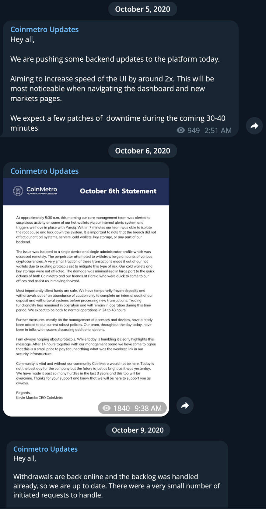

# CoinMetro

Date:: October 6th, 2020

Amount Stolen:: $740k? 

### Ethereum

- 0xa270f3ad1a7a82e6a3157f12a900f1e25bc4fbfd - Victim

- 0x4cf2220105995f006813923019f02be1ccca8132 - Victim 

- 0x044bf69ae74fcd8d1fc11da28adbad82bbb42351 - Direct Theft

- 1GVjvbVEYPkjCYCwJkC29t5pBWAQQd1g32

- rKNuVwi3xjmc4opNjFcJTybBeLsUusEwjG

- 0x0eaf42160c1d347080dee0cc0ea7100c3885cd31

- 0x990924d51c6ea6e212cce6e811b380ffd44ac350 (Also shows up in L2 Theft)

- Laundry @ 0xbc8d089824461048a06d300dff88bb7357d88b3b (Connects Coinberry, Coinmetro, Fetch.ai, Unibright, LEAD, Nexus Mutual, EasyFi)

- Laundering: 1GVjvbVEYPkjCYCwJkC29t5pBWAQQd1g32

- Also goes to Huobi 1GVjvbVEYPkjCYCwJkC29t5pBWAQQd1g32 like [L2 Theft](./L2%20Theft.md) et al.

- https://t.me/coinmetroupdates/601

- https://medium.com/parsiq/transcript-the-crazy-story-behind-the-coinmetro-hack-72091b6f07b8

- 