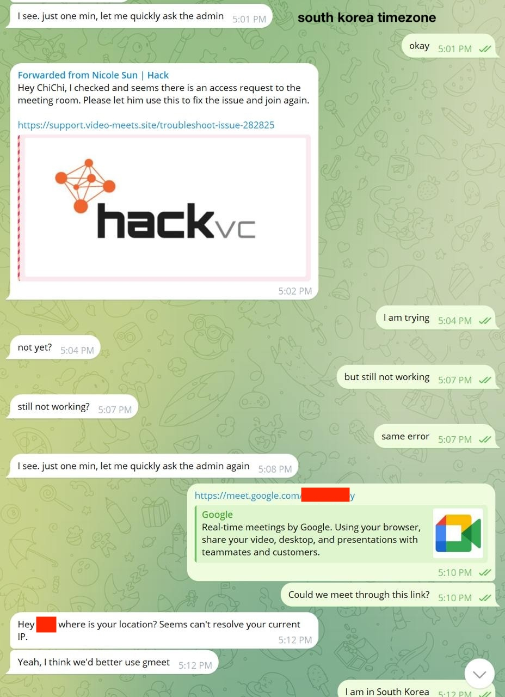
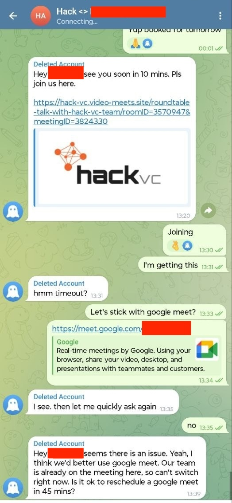
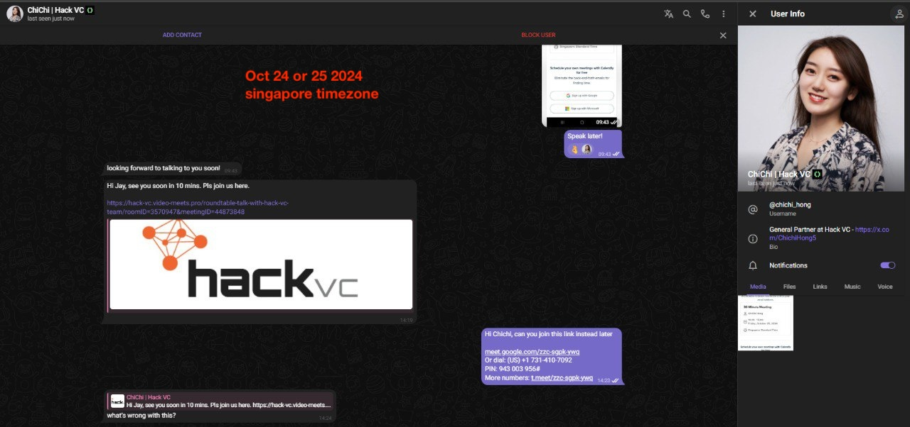

# Thefts via Hack VC Impersonations

Date:: October 17th, 2024

Time:: 00:16

Amount Stolen:: $77,000

---

## Known Targets - October 2024

- Oct 21 - B 
    - `hack-vc.video-meets.site/roundtable-talk-with-hack-vc-team/roomID=3570947&meetingID=0673660`
    - 

- Oct 21 - B 
    - `support.video-meets.site/troubleshoot-issue-282825`
    - 

- Oct 22 - A  
    - https://x.com/alexpiHQ/status/1848371521598693747

- Oct 22 - J 
    - `hack-vc.video-meets.xyz/roundtable-talk-with-hack-vc-team/roomID=3570947&meetingID=94474406`
    - 

- Oct 24 - Unknown 
    - `hack-vc.online-meets.xyz/roundtable-talk-with-hack-vc-team/roomID=3570947&meetingID=51095058`

- Oct 24 - Y 
    - unknown

- T 
    - `hack-vc.video-meets.site/roundtable-talk-with-hack-vc-team/roomID=3570947&meetingID=3824330`
    - 
    
- J2 
    - `hack-vc.video-meets.pro/roundtable-talk-with-hack-vc-team/roomID=3570947&meetingID=44873848`
    - 

## Known Targets - November 2024

- S
    - `foresight.online-meets.site` - possibly a longer subdomain like `foresight-ventures`
    - Fake Telegram: @Oxmin3 ID 7024096322

## Theft #1 - Onchain

- 0xf9e009a8d3c27432d485a0ae002656bd9a3a0841 Theft
- 0x25cee51c30bc4f705cd333648ee4a43f73d85f48 Theft
- 0xb8ab606ae55c338163e9a765a146776578da76f3 Theft
- 0x29594ab0f044df2283e10c43c1198ffc24c6d87c ChangeNOW
- 0xe934370676aab27efd9c61f0d7f4c16f8575d512 ChangeNOW
- 0x3014f54df18b6daece50536cfc0b0f41588ecb29 ChangeNOW
- 0x9eca38bd040e947a6943524cc018816714769b17 eXch
- 0x0e4d86e5213b4868dbda145c220614f22db36693 eXch
- bc1q2s80z6t7jvgqu4utczrnzxzwcpzpr6z4hul38k eXch Output
- bc1qls865f45h2ff6cu92f5ewyxapkcdq8zu2kvcqj eXch Output

- 2024-Oct-18 00:16 - Theft
- 2024-Oct-18 10:45 - One more theft
- 2024-Oct-19 07:31 - One more consolidation
- 2024-Nov-11 00:42 - to eXch

- 50.114.45.115
- Asia/Tokyo
- Mozilla/5.0 (Windows NT 10.0; Win64; x64) AppleWebKit/537.36 (KHTML, like Gecko) Chrome/129.0.0.0 Safari/537.36
- en-US,en;q=0.9,ko;q=0.8 

### Foresight Ventures

- 0x589761dbfc4cd374e7e4da72f2cbd08eca3141f7 - Theft (25 ETH)

- Fake Min (Foresight Ventures)
- Fake "Iris Lo" (Foresight Ventures)
- https://x.com/0xmin3/status/1857334233758658891
- https://x.com/0xmin3/status/1851101969189847075
- https://x.com/0xmin3/status/1856138297065746925
- https://x.com/ForesightVen/status/1851084770861846927

