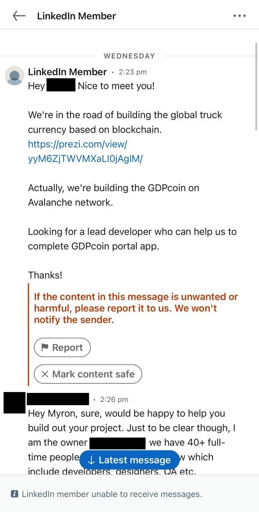
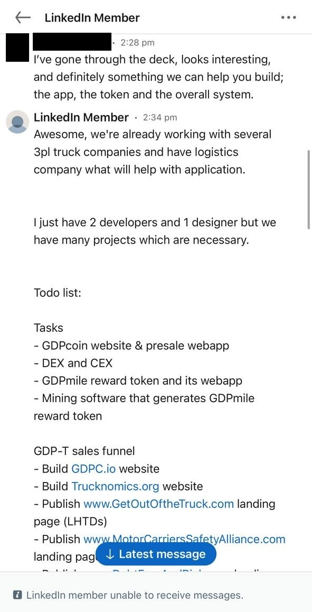
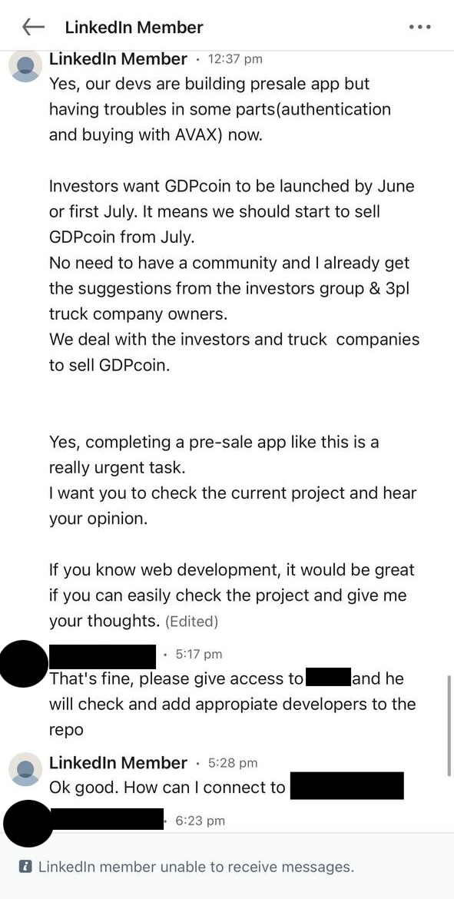

# Hyve

Date:: May 29, 2024

Tags: 🎙️ Contagious Interview

---

## Onchain

0xa30ba056a1fbf7656523b410b2f2bb318a37297a - Victim (Other Compromised Address)

0xa3d35e271565eaa721ba52bfd423004902a37b14 - Victim (Other Compromised Address)

0xbed2da439f750a4e302ba450809dcbdbde785aaa - Exploited staking contract

0x789b11ec06582b4445b13878f436a331865617af - Original Owner

0xfF75e75C7f2021273d2F635112bC607bFa8d4642 - New Malicious Owner

0xD8750B52c122a6544513854D1Ea1160FE1d7CcD2 - Receives Stolen Staked HYVE

0x00eC47a57511555C4824694d796eE76099F4839e - Receives Stolen Staked HYVE

0x5f6218c100218a3e450bc856b3a30bbbb1864797 - Theft

0xf69a0cbdc06c7eaa9768efc90ee9708deb5f1f52 - Theft

0xfef41fc344af7be902678e1627c2cccb01c42741 - Theft

0xc46bff183c661dc2fcaae82bbe12e1ec08623a0f - Theft

0xd38b47aec1a771f2622e54c45e28c4cd8f316666 - Theft

0xc5a1dd0fa4ed69eec350e42f2b9713cfeeed69ba - Laundry, also Exclusible Penthouse, to Stargate

0x8c492eaed78abd931361f292980abce20d5afc8f - Laundry

0x3ab17c73723bf0d62cb4841b0299a06f416da92d - Laundry, also Unknown Feb 19 Theft

0x5bd374985071403c0ad08acb4694bf3b0dd5114c - Dust

## URLs

https://twitter.com/anciliainc/status/1795888012720746588

## Details

"Myron Manuirirangi" - persona who initially reached out to team.

"Eduardo Morales Cortes" - https://github.com/eduales99/eduales99 - https://linkedin.com/in/eduardo-morales-cort%C3%A9s-3263761a2/ - also a member of the malicous github and a developer Myron wanted to introduce the team to.

Day 1: "Myron" contacted two technical members of the team via Linkedin separately to ask for development work to be done for him.

Day 2-4: Team members spoke with Myron about the project and issue. He blocked them all after the hack.

Day 5: "Myron" asked one of the team members to give him his Github username so that "Myron" could add said team member to the repo he needed assistance with. The team member directed him to the Technical Lead as the Technical Lead was better equipped to assist. "Myron" then talked with Technical Lead and gave the Technical Lead access to the (malicious) repo.

Day 6: The Technical Lead set up the repo and ran the program to look through it and see what kind of help he needed. He sent messages to "Myron" but "Myron" never responded. The hack happened that night.

The Technical Lead's device was compromised via this malicious github repo and various private keys were compromised. This allowed the attacker to upgrade one of the HYVE contracts and add a withdrawTokens() function. See https://unit42.paloaltonetworks.com/two-campaigns-by-north-korea-bad-actors-target-job-hunters/

❗ NOTE: /otrinsanity/ appears to be a legit person that the hacker was impersonating / had cloned the profile of. Screenshots shared by the team of the DM's show "Linkedin Member" with no profile photo, indicating that the exact profile used has been taken down. NO WITCHHUNTS OF LEGIT PEOPLE!!!!!!!!!!!!!!!!!!!!!!!!

## Conversations

