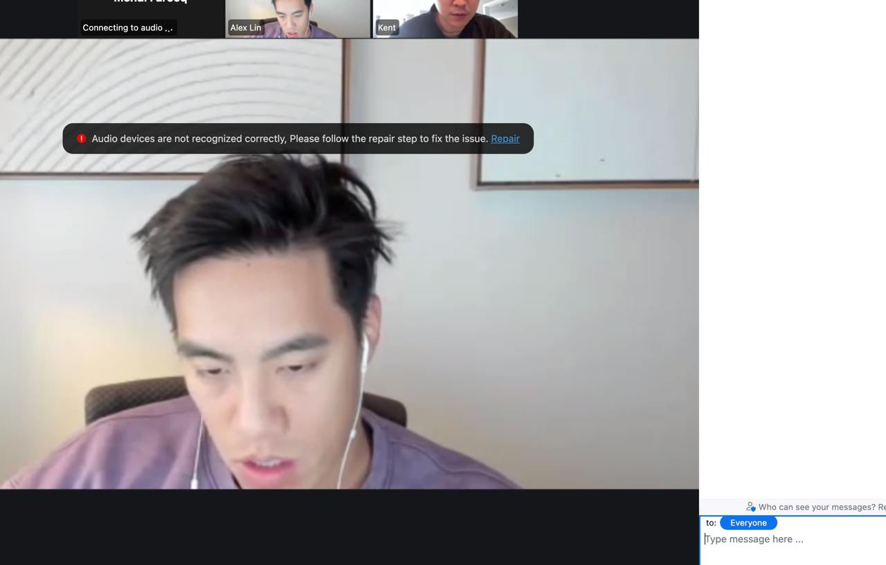

# Mehdi Theft

Amount Stolen:: $230,000

Date:: June 12, 2025

Tags:: 🔑

---

# Description

> One minute I was prepping for a Zoom call. Ten minutes later, large part of my life savings were gone.

> It started with a message on Telegram from Alex Lin — someone I knew. He wanted to catch up.

> I shared my Calendly link. He booked a slot for the next day.

> A few minutes before the call, he asked to switch to Zoom Business “for compliance reasons” — said one of his LPs would be joining - Kent (who I also knew)

> Given we were doing a lot of treasury deals and there was genuine LP interest, it didn’t seem out of the ordinary.

> I joined the Zoom. No audio.

> But I could see both of them. They messaged in the chat: “Can you hear us?”

> They told me to update Zoom to fix the audio issue.

> That’s when it happened when I update. 

> Six wallets drained (my fault for not keeping things more buttoned up) 

> My laptop compromised completely.

> Years of savings - gone in minutes.

> I found out later that Alex’s account had been hacked.

> And the worst part?While my wallet was being emptied, the hacker kept chatting on Telegram like nothing was wrong.

> He even joked: “Let’s catch up at SG” 

> It was surreal and completely Violating. But in the darkest moment, whitehat hackers stepped up — complete strangers offering help when I was at my lowest 

> Turns out I was compromised by DPRK affiliated threat know as dangrouspassword

> Attaching the video moment with the hacker (which was fake)

—[Source](https://x.com/MehdiFarooq2/status/1935502598221533185)

Persona: Alex Lin 

- Seems to have had their Telegram taken over May 29, 2025

- https://x.com/linfluence/status/1928111789180395720

- https://x.com/linfluence/status/1930679676705390648

A similar zoom link was received by a different almost-victim on June 10, 2025

- Display URL: `https://reforge[.]zoom[.]us/j/6971685660?pwd=fHMSBxCNLnMDPuIYNtQ2kE87gvSxz7[.]1`

- Actual URL: `https://reforge[.]web02zoom[.]us/j/6971685660?pwd=fHMSBxCNLnMDPuIYNtQ2kE87gvSxz7[.]1`

## Onchain

- 8iHCqskFTt5C55uRfR4poEQoS1Pw8tLKVrmezaQvEjVe - Victim

- D1TWxvkVKnoV9QdcBWRepiCsXnWZt6eVMgb1athsQQYv - Victim

- F3X4yGunj4GQbpgpG8EfiyNaTCZkbvhMtJjKxufU22Mo - Victim

- BbyF2Pya6e5uqLCBoArHfBLqoM9frRGadhLTdFfNqYYR - Victim

- AarPPRX49n6xtgrv9kbG3tSpkfn7iHDnsnLTLmFdjAcJ - Theft

- 0x4612d5ef84979a8ea3ddea7dd49c9df75dda9ac4 - Theft
