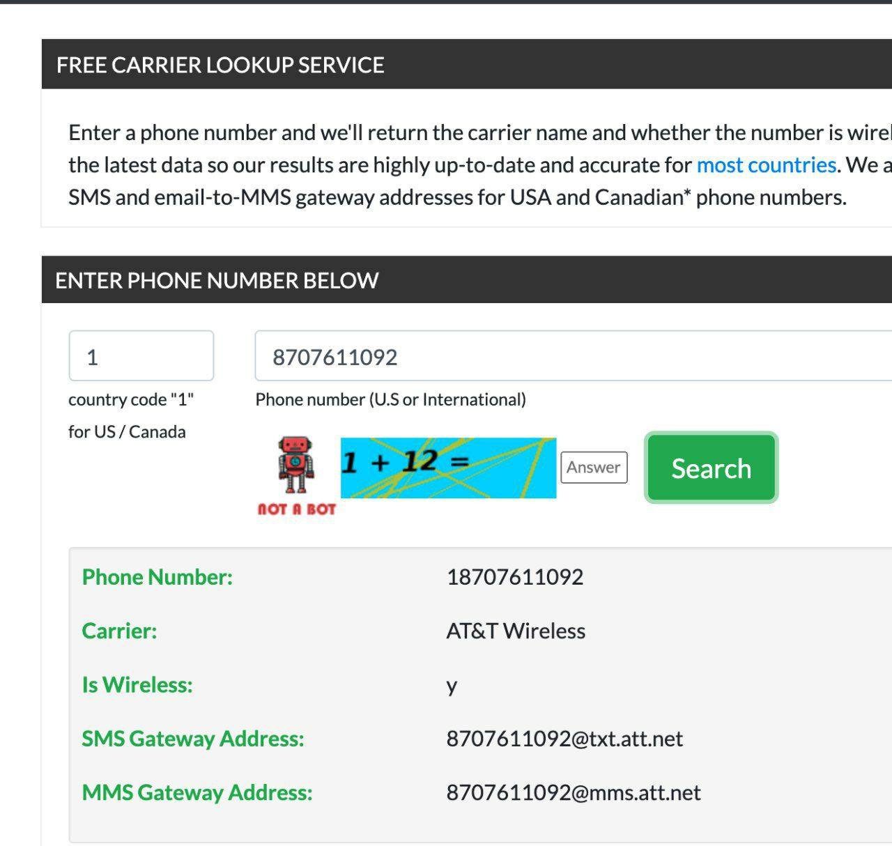
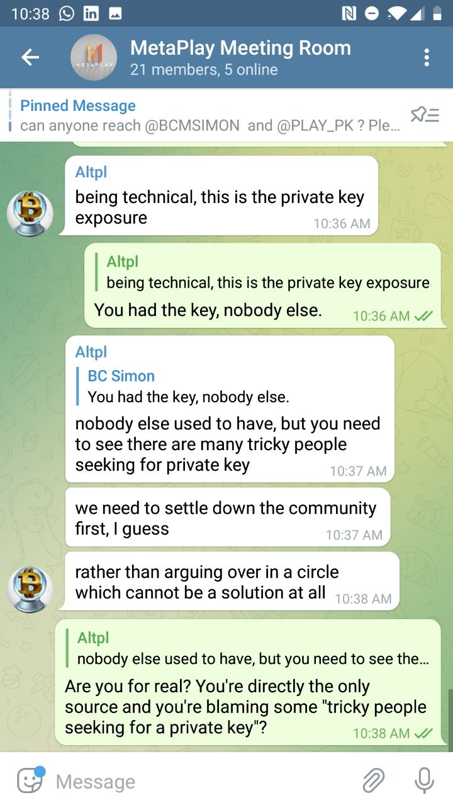
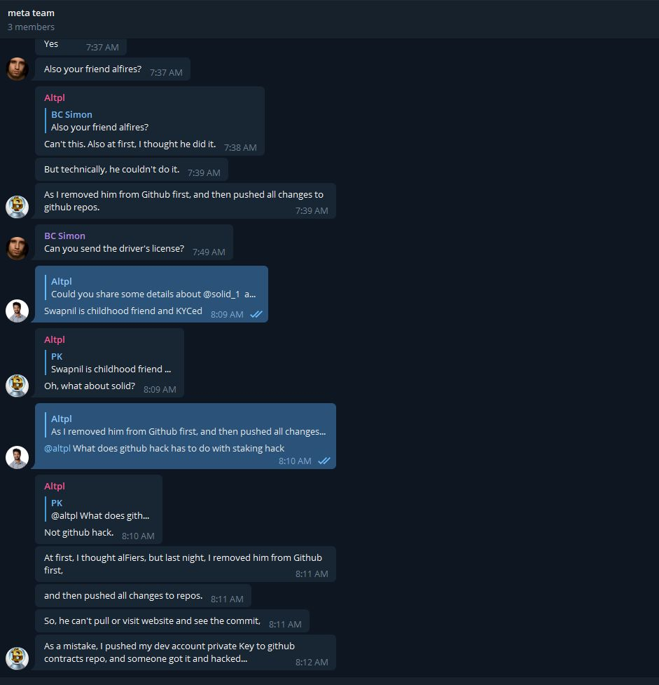
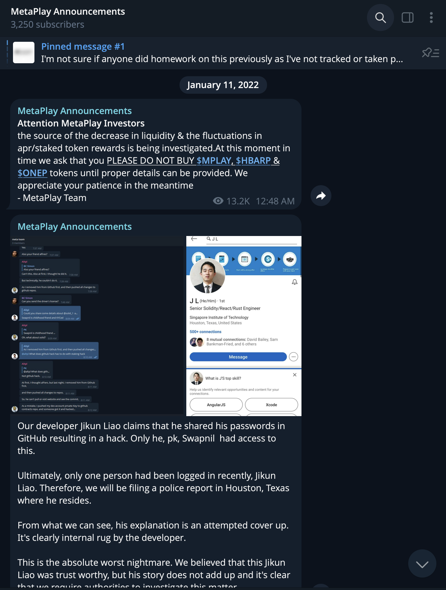
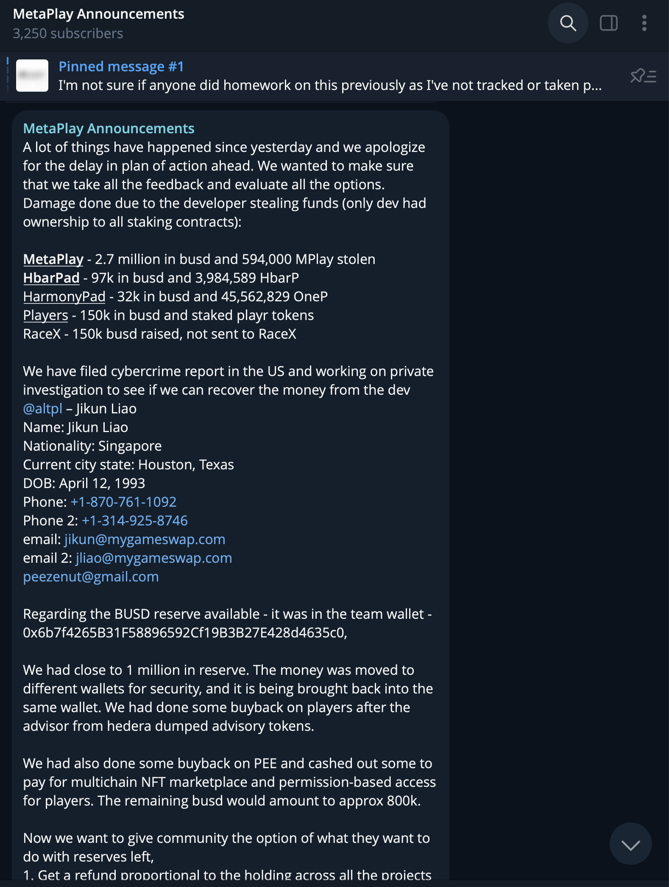
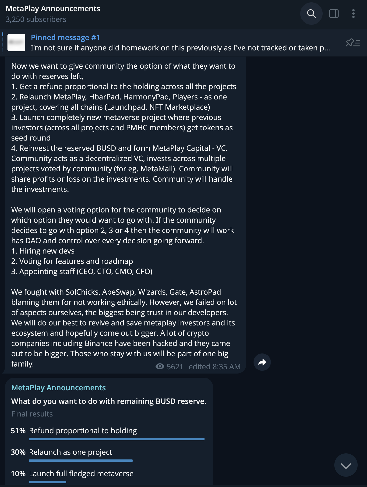
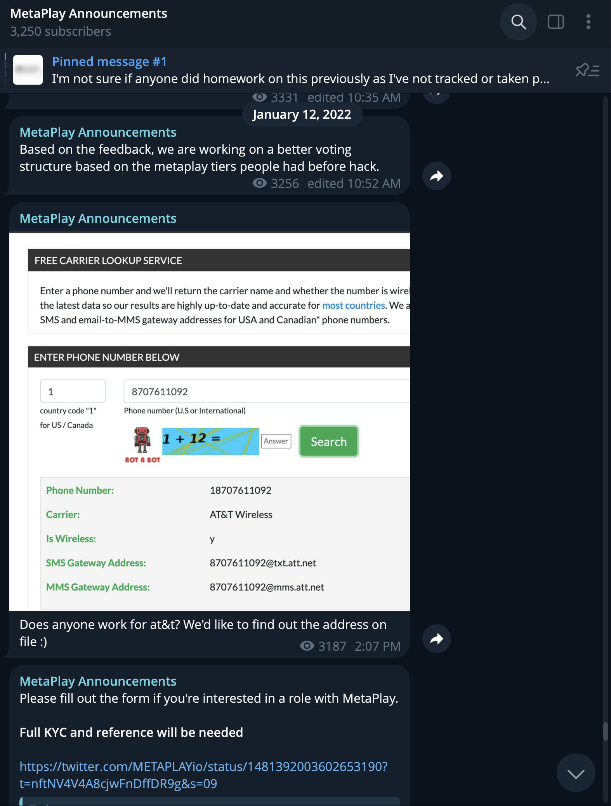
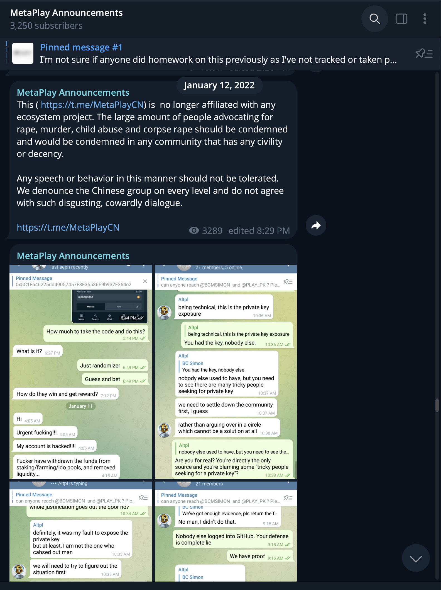

# Metaplay - Incident #2

Date:: 2022-01-11

Amount Stolen: $2,700,000

Tags:: 💼 DPRK IT

---

## IT Worker

- Jikun Liao

- Worked at MetaPlay (Jan 11, 2022), Gameswap, Obytes, Iotex.io

- altpl

- jikun

- jliao

- peezenut

- jikun@mygameswap.com

- jliao@mygameswap.com

- peezenut@gmail.com 

- t.me/altpl

- linkedin.com/in/jikun-liao-794b61162/

- linkedin.com/in/ak-cy-794b61162

- https://vk.com/id578519076 [Archive](https://archive.ph/SWt2n)

- https://rocketreach.co/jikun-liao-email_233286867

- https://www.outsourcely.com/profile/373848

## Onchain

- 0xC43B1f4E7E47bE5D5663C3B26E4FB3fE7e217f90

- https://bscscan.com/address/0xC43B1f4E7E47bE5D5663C3B26E4FB3fE7e217f90

## Details

MetaPlay Announcements, [2022-01-11 08:48 UTC] 
https://t.me/MetaPlayAnn/1495

> Attention MetaPlay Investors
> the source of the decrease in liquidity & the fluctuations in apr/staked token rewards is being investigated.At this moment in time we ask that you PLEASE DO NOT BUY $MPLAY, $HBARP & $ONEP tokens until proper details can be provided. We appreciate your patience in the meantime
> - MetaPlay Team

MetaPlay Announcements, [2022-01-11 13:40 UTC]
https://t.me/MetaPlayAnn/1496 ([Archive](https://archive.ph/pjmcO))

> Our developer Jikun Liao claims that he shared his passwords in GitHub resulting in a hack. Only he, pk, Swapnil  had access to this. 
> Ultimately, only one person had been logged in recently, Jikun Liao. Therefore, we will be filing a police report in Houston, Texas where he resides. 
> From what we can see, his explanation is an attempted cover up. It's clearly internal rug by the developer. 
> This is the absolute worst nightmare. We believed that this Jikun Liao was trust worthy, but his story does not add up and it's clear that we require authorities to investigate this matter.

MetaPlay Announcements, [2022-01-11 14:10 UTC]
https://t.me/MetaPlayAnn/1498 ([Archive](https://archive.ph/CySJC))

> Only one person had the code/password to enter our app, we will be filing police report. 
> Upon review nobody else has logged into the GitHub except Jikun Liao in the past weeks, nevermind the past day. 
> We will provide a police report number for the community soon as it's made.

MetaPlay Announcements, [2022-01-11 14:21 UTC]
https://t.me/MetaPlayAnn/1499

> Are any investors in Texas? Please message us immediately.

MetaPlay Announcements, [2022-01-11 14:23 UTC]
https://t.me/MetaPlayAnn/1500

> https://rocketreach.co/jikun-liao-email_233286867

MetaPlay Announcements, [2022-01-11 16:01 UTC]
https://t.me/MetaPlayAnn/1502 ([Archive](https://archive.ph/79NGD))

MetaPlay Announcements, [2022-01-11 16:07 UTC]
https://t.me/MetaPlayAnn/1507 ([Archive](https://archive.ph/jbwoq))

> Does anyone have contacts to these projects?

MetaPlay Announcements, [2022-01-11 17:44 UTC]
https://t.me/MetaPlayAnn/1508 ([Archive](https://archive.ph/bAafd))

> We put our blood and sweat into this 16-20 hours a day, and in a single moment Jikun Liao ended everything. Over the past few days we expressed warnings to Jikun about his performance. His friend, alfires was hired to build players and left the project two days prior. 
> Today, PK and I woke up to solid telling us that we have likely been rugged by our developer as he was the only person with keys. 
> Not only did he know exactly where all funds and wallets were stored, he did the transactions within 30 minutes. 
> When we approached Jikun Liao he blamed the web designer, pk and solid as Jikun claims to have accidently shared a key in the GitHub with four members in it. He claims to have deleted the key 10 minutes later. 
> Unfortunately for Jikun Liao, nobody but Jikun Liao had logged into the GitHub the past day. Jikun was the sole person in charge of those keys and password. He controls the staking, LP rewards contracts. 
> After his heist, he tried to demand we take ownership, in which we do not feel comfortable as that would reinforce his actions in which he was a lone actor and facilitator of this evil and horrible act. 
> PK and BC worked tirelessly on this project, and are heartbroken over the current circumstance. 
> Ayoken and MetaMall will still be completed via those teams and their bulksend as they still have the wallets addresses to process and complete distribution. 
> We have filed cyber report, police reports and will look to hire a PI to investigate Jikun Liao, from Houston, Texas/Singapore. 
> We will also report his name to the Singapore authorities with the suspicion that he is a Singaporean national, with a passport. 
> It would be irrisponsible for PK and BC to continue in crypto on any level at this point as Jikun Liao has singlehandedly ended everything built. 
> We will still be here to speak with you, meet up in person or share any details you wish to know because we genuinely feel worse than you guys about what has happened. Unfortunately what Jikun Liao has done, has completely ended and dismantled everything that we've done and accomplished. We have failed you and failed ourselves. 
> We will do our best to hold Jikun Liao responsible for his actions as nobody deserves what he has done. 
> MetaPlay Team

MetaPlay Announcements, [2022-01-11 21:55 UTC]
https://t.me/MetaPlayAnn/1509 ([Archive](https://archive.ph/qt9th))

> Regarding ownership of  contracts, initially PK had ownership
> However, after HarmnonyPad and PolyPlay were initially hacked, @altpl - was able to save the polyplay LP, so we could do a successful launch. 
> He had gained the trust of the team by saving PolyPlay LP because of which we were able to do a successful relaunch of metaplay. 
> After the relaunch, @altpl was handling multiple staking contracts (30,90 days and LP and other projects) while also changing rewards and APR, At the this point, he was integral part of the team, doxxed and had worked on multiple successful projects like GameSwap, Iotex, Obyte along with MetaPlay. 
> He was being paid 150k a year salary along with supply on MetaPlay, HbarPad, OnePad and Players. He was given supply because of the responsibilities along with securely managing the contracts. That was the reason he had ownership of the contracts, to manage them without needing PK.

MetaPlay Announcements, [2022-01-11 22:11 UTC]
https://t.me/MetaPlayAnn/1510 ([Archive](https://archive.ph/ScNT1))

> The Turkish Admins - are not part of the core team, they were just helping with operations please do not abuse or send death threats to them. 
> We have already filed a cyber crime report in the US at 10.00 am EST today. We  talking to multiple authorities to be able to recover the funds, please have patience while we deal with the situation and announce the plan going forward.

MetaPlay Announcements, [2022-01-11 23:08 UTC]
https://t.me/MetaPlayAnn/1511 ([Archive](https://archive.ph/wJ7xr))

> If anyone would like to take over MetaPlay, onep, hbparp, MicroPee and playr they can contact us as they will need to try and contact @altpl to gain access the Staking and LP. 
> The developer was being compensated very well 500k yr to control those from the start and we will not broker the exchange of details, but we can sign over ownership of MetaPlay contract to someone interested.
 > Major buybacks bolstered our projects, advisors, staff bonuses and developers(ironically) were paid as you saw recently, along with 400k outstanding funds owed by KoiStarter, Bsclauncher, bclpad and yaan. We will provide you all the information needed to be up to date and to competently perform your duties. 
> The remaining 300k we have on hand, busd would be available for development disbursed in 50k monthly payments. You must be able to reach and have @altpl transfer those staking and LP key access to you before we send the first 50k busd. 
> If you can get those 4 pads to pay, you'll have a running budget of 700k.
> Due to the circumstances, we are no longer in a position to be trusted and running these projects. We hope that someone can convince or manage contact with @altpl to get the access and all contracts back. PK can give you info on all of the wallets and the total supply details. 
> Please comment below to apply and the community can pick the new leadership of the MetaPlay ecosystem.

MetaPlay Announcements, [2022-01-12 14:23 UTC]
https://t.me/MetaPlayAnn/1512 ([Archive](https://archive.ph/YsLYb))

> We will have a detailed plan of a relaunch and roadmap for metaplay investors today based on the all feedback from community. Please wait for the announcement today.

MetaPlay Announcements, [2022-01-12 16:05 UTC]
https://t.me/MetaPlayAnn/1513 ([Archive](https://archive.ph/gFk2U))

> Name: Jikun Liao
> Nationality: Singapore 
> Current city state: Houston, Texas
> Phone: +1-870-761-1092
> Phone 2: +1-314-925-8746
> email: jikun@mygameswap.com
> email 2: jliao@mygameswap.com
> peezenut@gmail.com
> Other links: 
> https://www.outsourcely.com/profile/373848
> https://rocketreach.co/jikun-liao-email_233286867
> https://www.linkedin.com/in/jikun-liao-794b61162/
> https://www.linkedin.com/in/ak-cy-794b61162

MetaPlay Announcements, [2022-01-12 16:35 UTC]
https://t.me/MetaPlayAnn/1514 ([Archive](https://archive.ph/z2Hn6))

> A lot of things have happened since yesterday and we apologize for the delay in plan of action ahead. We wanted to make sure that we take all the feedback and evaluate all the options.
> Damage done due to the developer stealing funds (only dev had ownership to all staking contracts):
> MetaPlay - 2.7 million in busd and 594,000 MPlay stolen
> HbarPad - 97k in busd and 3,984,589 HbarP
> HarmonyPad - 32k in busd and 45,562,829 OneP
> Players - 150k in busd and staked playr tokens
> RaceX - 150k busd raised, not sent to RaceX
> We have filed cybercrime report in the US and working on private investigation to see if we can recover the money from the dev @altpl – Jikun Liao
> Name: Jikun Liao
> Nationality: Singapore 
> Current city state: Houston, Texas
> DOB: April 12, 1993
> Phone: +1-870-761-1092
> Phone 2: +1-314-925-8746
> email: jikun@mygameswap.com
> email 2: jliao@mygameswap.com
> peezenut@gmail.com
> Regarding the BUSD reserve available - it was in the team wallet - 0x6b7f4265B31F58896592Cf19B3B27E428d4635c0,
> We had close to 1 million in reserve. The money was moved to different wallets for security, and it is being brought back into the same wallet. We had done some buyback on players after the advisor from hedera dumped advisory tokens. 
> We had also done some buyback on PEE and cashed out some to pay for multichain NFT marketplace and permission-based access for players. The remaining busd would amount to approx 800k. 
> Now we want to give community the option of what they want to do with reserves left,
> 1. Get a refund proportional to the holding across all the projects 
> 2. Relaunch MetaPlay, HbarPad, HarmonyPad, Players - as one project, covering all chains (Launchpad, NFT Marketplace)
> 3. Launch completely new metaverse project where previous investors (across all projects and PMHC members) get tokens as seed round
> 4. Reinvest the reserved BUSD and form MetaPlay Capital - VC. Community acts as a decentralized VC, invests across multiple projects voted by community (for eg. MetaMall). Community will share profits or loss on the investments. Community will handle the investments.
> We will open a voting option for the community to decide on which option they would want to go with. If the community decides to go with option 2, 3 or 4 then the community will work has DAO and control over every decision going forward.
> 1. Hiring new devs
> 2. Voting for features and roadmap
> 3. Appointing staff (CEO, CTO, CMO, CFO)  
> We fought with SolChicks, ApeSwap, Wizards, Gate, AstroPad blaming them for not working ethically. However, we failed on lot of aspects ourselves, the biggest being trust in our developers. We will do our best to revive and save metaplay investors and its ecosystem and hopefully come out bigger. A lot of crypto companies including Binance have been hacked and they came out to be bigger. Those who stay with us will be part of one big family.

MetaPlay Announcements, [2022-01-12 18:02 UTC]
https://t.me/MetaPlayAnn/1521 ([Archive](https://archive.ph/2Dp0X))

> The dev who is MIA after rugging us 
> https://twitter.com/METAPLAYio/status/1481325605463465999?t=csg5ETlBgh849KdwShKGfw&s=09

MetaPlay Announcements, [2022-01-12 18:35 UTC]
https://t.me/MetaPlayAnn/1522 ([Archive](https://archive.ph/hxpe1))

> Let's see what those projects say 
> https://twitter.com/METAPLAYio/status/1481333882687524866?t=A5yE87iVGYvaDQUrM-DMvg&s=09

MetaPlay Announcements, [2022-01-12 18:52 UTC]
https://t.me/MetaPlayAnn/1523

> Based on the feedback, we are working on a better voting structure based on the metaplay tiers people had before hack.

MetaPlay Announcements, [2022-01-12 22:07 UTC]
https://t.me/MetaPlayAnn/1525 ([Archive](https://archive.ph/W7nS8))

> Does anyone work for at&t? We'd like to find out the address on file :)

MetaPlay Announcements, [2022-01-12 22:26 UTC]
https://t.me/MetaPlayAnn/1526 

> Please fill out the form if you're interested in a role with MetaPlay. 
> Full KYC and reference will be needed
> https://twitter.com/METAPLAYio/status/1481392003602653190?t=nftNV4V4A8cjwFnDffDR9g&s=09

MetaPlay Announcements, [2022-01-13 04:29 UTC]
https://t.me/MetaPlayAnn/1527

> This ( https://t.me/MetaPlayCN) is  no longer affiliated with any ecosystem project. The large amount of people advocating for rape, murder, child abuse and corpse rape should be condemned and would be condemned in any community that has any civility or decency. 
> Any speech or behavior in this manner should not be tolerated. We denounce the Chinese group on every level and do not agree with such disgusting, cowardly dialogue. 
> https://t.me/MetaPlayCN

MetaPlay Announcements, [2022-01-13 06:26 UTC]
https://t.me/MetaPlayAnn/1528 ([Archive](https://archive.ph/heGaF))

### Reference URLs 

- https://t.me/MetaPlayAnn/1495

- https://t.me/MetaPlayAnn/1496 ([Archive](https://archive.ph/pjmcO))

- https://t.me/MetaPlayAnn/1498 ([Archive](https://archive.ph/CySJC))

- https://t.me/MetaPlayAnn/1499

- https://t.me/MetaPlayAnn/1500

- https://t.me/MetaPlayAnn/1502 ([Archive](https://archive.ph/79NGD))

- https://t.me/MetaPlayAnn/1507 ([Archive](https://archive.ph/jbwoq))

- https://t.me/MetaPlayAnn/1508 ([Archive](https://archive.ph/bAafd))

- https://t.me/MetaPlayAnn/1509 ([Archive](https://archive.ph/qt9th))

- https://t.me/MetaPlayAnn/1510 ([Archive](https://archive.ph/ScNT1))

- https://t.me/MetaPlayAnn/1511 ([Archive](https://archive.ph/wJ7xr))

- https://t.me/MetaPlayAnn/1512 ([Archive](https://archive.ph/YsLYb))

- https://t.me/MetaPlayAnn/1513 ([Archive](https://archive.ph/gFk2U))

- https://t.me/MetaPlayAnn/1514 ([Archive](https://archive.ph/z2Hn6))

- https://t.me/MetaPlayAnn/1521 ([Archive](https://archive.ph/2Dp0X))

- https://t.me/MetaPlayAnn/1522 ([Archive](https://archive.ph/hxpe1))

- https://t.me/MetaPlayAnn/1523

- https://t.me/MetaPlayAnn/1525 ([Archive](https://archive.ph/W7nS8))

- https://t.me/MetaPlayAnn/1526 

- https://t.me/MetaPlayAnn/1527

- https://t.me/MetaPlayAnn/1528 ([Archive](https://archive.ph/heGaF))

- https://twitter.com/METAPLAYio/status/1481333882687524866

- https://twitter.com/METAPLAYio/status/1481392003602653190

- https://twitter.com/METAPLAYio/status/1481325605463465999

- https://twitter.com/peckshieldalert/status/1481088699593261056

- https://twitter.com/RugDocIO/status/1481107278841270274

## Reference Images

- 

- 

- 

- 

- 

- 

- 

- 

- 

- 

- 

- 

- 

- 

- 

- 

- 

- 

- 

- 

- 

- 

- 

- 

- 

- 

- 

- 

- 

- 

- 

- 

- 

- 
