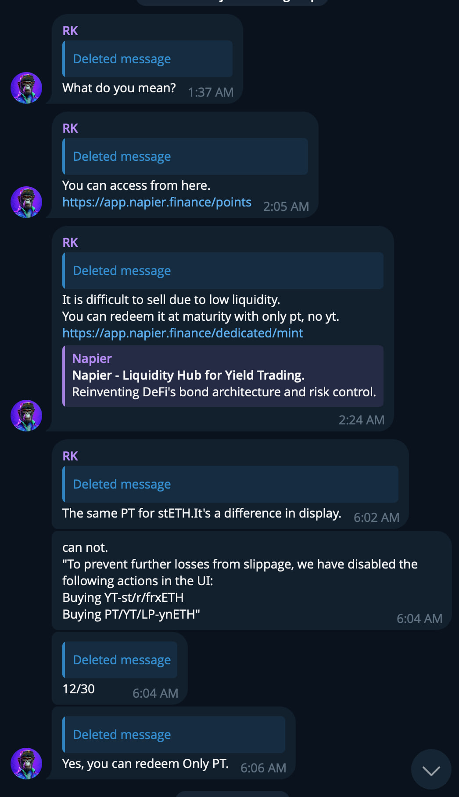

# Napier

Amount Stolen:: $500,000

Date:: December 30th, 2024

Tags:: 🔑

---

## Details

Found onchain because I'm insane and wanted to know when SQSQ first started fucking around with PT/YT and instead found a SQSQ theft. Whoops.

#### DPRK IT Worker connection

The most interesting thing about this theft is I already had bakuchi.eth labeled on a DPRK IT Worker graph from when we were doing all the August 2024 notifications.

When cleaning up my ITW notes I realized that one of the developers that was working for [Truflation](./truflation.md) had also been hired by Napier:

> A new member joins the Napier team!

> We are excited to announce @0xchamel has joined Napier as our new Smart Contract Engineer

> Welcome, Zhchamel 💜

> https://x.com/NapierFinance/status/1691754768383750308 [Archive](https://archive.ph/H24TI)

This is obviously interesting as Truflation was another company that had ITW's on payroll but the founder ended up being exploited by SQSQ.

Even more intersting is his resume also lists ANKR as a prior employer. LOLRIP.

### Information from Truflation Notification:

- Mauro Liu

- mauroliu77

- 0xchamel

- t.me/chamel92 (ID: 6635242888)

- x.com/0xchamel

- github.com/0xchamel

- linkedin.com/in/lmauro77

- github.com/zhChameleon

- https://www.studocu.com/in/document/indian-institute-of-technology-banaras-hindu-university-varanasi/introduction-to-computer-programming/resume-mauro-liu-0523/69508678

- 

- 

- Truflation Payroll: 0xc9b46489567684aafbe85e8a783bb9bfb822807f

- Napier Payroll: 0x147ed0f4d0cc9f0cf4eff223aa79b2f837532d62

- Another Payoll: 0x39143cc85d4cf0e31849987aa9f68c621282820c (catanet.eth)

### Payroll Dates

- 2023-Aug-30 - $4,072
- 2023-Sep-30 - $4,204
- 2023-Oct-31 - $6,204
- 2023-Nov-30 - $7,039
- 2023-Dec-28 - $6,982
- 2024-Jan-31 - $7,049
- 2024-Feb-29 - $7,030
- 2024-Mar-31 - $6,976
- 2024-Apr-30 - $5,033
- 2024-May-31 - $1,991
- 2024-May-31 - $4,978
- 2024-Jul-01 - $6,970
- 2024-Jul-31 - $7,029

- Access was gained by October 4th, 2024

- Hack was executed December 30th, 2024 (when positions were ready)

---

## Onchain

- 0x4d4da4ad60b35d1baa44951db99f3900ea008a73 - Theft

- 0x1d2066b07c3160a486e6a58c4b2eeaf6db016333 - ChangeNOW

- 0xaf23f023f9f78c2a29809beef890251eca25343b - ChangeNOW

- 0xc52373851cc78ade9d65d9c3316dd9eacaedcdff - ChangeNOW

- 0xa8e7ee1584a3e440f283e413f4a817ff75a9cc55 - ChangeNOW

- 0x2db43843bc812c18a8c8d89178804fe5ad582e8c - ChangeNOW

- 0xa0d01b799621a067ed1c6ecbb28f7579bda3d3e4 - ChangeNOW

- 0x7028f8a74e525e333c1d6228e80505f7b967c3f7 - ChangeNOW

- 0x24295938c49a757e6dabd5a743268625e93bd025 - ChangeNOW

- 0x1451853779a073c6d7b678d3932ef529c41d8bf7 - ChangeNOW

