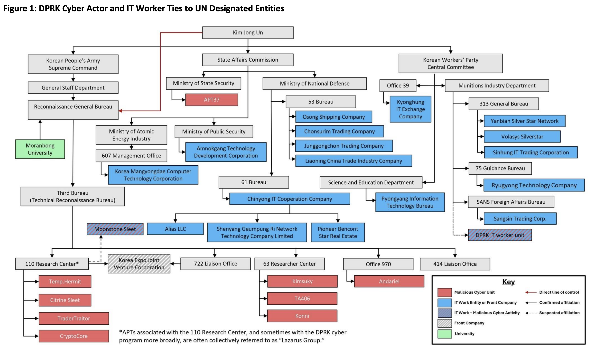
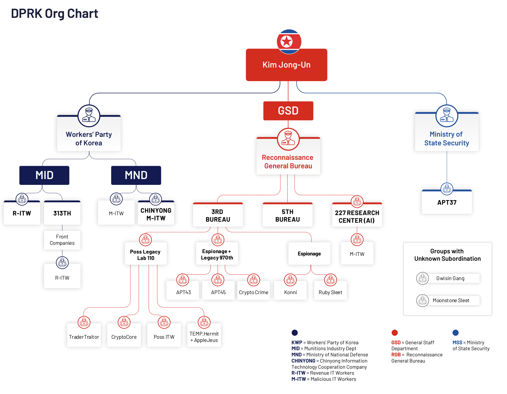

# The Sprawling Shitshow of Ever-Evolving DPRK Threat Groups (and their names)

### MSMT 2025 Org Chart

- [MSMT: The DPRK’s Violation and Evasion of UN Sanctions through Cyber and Information Technology Worker Activities](./pdfs/2025-10-22_MSMT-Report.pdf)

### DTEX 2025 Org Chart

- [Exposing DPRK's Cyber Syndicate and Hidden IT Workforce](./pdfs/2025-05-14_DTEX-Exposing-DPRK-Cyber-Syndicate-and-Hidden-IT-Workforce.pdf)

- https://reports.dtexsystems.com/DTEX-Exposing+DPRK+Cyber+Syndicate+and+Hidden+IT+Workforce.pdf

### Mandiant Org Chart

- [Organizational Map of DPRK Cyber Operations (2022)](https://mandiant.com/resources/mapping-dprk-groups-to-government)
- [Update to the Organizational Map of DPRK Cyber Operations (2023)](https://cloud.google.com/blog/topics/threat-intelligence/north-korea-cyber-structure-alignment-2023)
- [Update to the Organizational Map of DPRK Cyber Operations (2024)](https://cloud.google.com/blog/topics/threat-intelligence/apt45-north-korea-digital-military-machine)

### JPCERT Classification

- [Tempted to Classifying APT Actors: Practical Challenges of Attribution in the Case of Lazarus’s Subgroup](https://blogs.jpcert.or.jp/en/2025/03/classifying-lazaruss-subgroup.html)

### Unit42 Classifications

- [Threat Assessment: North Korean Threat Groups](https://unit42.paloaltonetworks.com/threat-assessment-north-korean-threat-groups-2024/)
- These groups have been reportedly [active as early as 2007 [PDF]](https://www.usna.edu/CyberCenter/_files/documents/Operation-Blockbuster-Report.pdf). Activity under the RGB can be categorized into at least six threat groups:
- Alluring Pisces (aka [APT38 [PDF]](https://services.google.com/fh/files/misc/apt38-un-usual-suspects.pdf), [Bluenoroff](https://apt.securelist.com/apt/bluenoroff), [Sapphire Sleet](https://x.com/MsftSecIntel/status/1722316021841764414)): This group has targeted financial institutions, cryptocurrency businesses and ATMs. It has also conducted significant cyber heists.
- Gleaming Pisces (aka [Citrine Sleet](https://www.microsoft.com/en-us/security/blog/2022/12/06/dev-0139-launches-targeted-attacks-against-the-cryptocurrency-industry/)): This group performed attacks targeting the cryptocurrency industry and is known for its association with the [AppleJeus](https://www.cisa.gov/news-events/analysis-reports/ar21-048e) campaign.
- Jumpy Pisces (aka [Andariel](https://www.justice.gov/opa/pr/north-korean-government-hacker-charged-involvement-ransomware-attacks-targeting-us-hospitals), [Hidden Cobra](https://www.justice.gov/opa/pr/three-north-korean-military-hackers-indicted-wide-ranging-scheme-commit-cyberattacks-and), [Onyx Sleet](https://www.microsoft.com/en-us/security/blog/2024/07/25/onyx-sleet-uses-array-of-malware-to-gather-intelligence-for-north-korea/)): This group has primarily conducted cyberespionage, but it has also conducted ransomware activity.
- Selective Pisces (aka [Diamond Sleet](https://www.microsoft.com/en-us/security/security-insider/diamond-sleet), [TEMP.Hermit [PDF]](https://www.mandiant.com/sites/default/files/2021-09/rpt-apt38-2018-web_v5-1.pdf), [ZINC](https://www.microsoft.com/en-us/security/blog/2022/09/29/zinc-weaponizing-open-source-software/)): This group has targeted media, defense and IT organizations. It focuses on espionage, financial gain and network destruction.
- Slow Pisces (aka [Jade Sleet](https://github.blog/security/vulnerability-research/security-alert-social-engineering-campaign-targets-technology-industry-employees/), [UNC4899](https://cloud.google.com/blog/topics/threat-intelligence/north-korea-supply-chain/)): This group has targeted blockchain and cryptocurrency companies. It was also involved in a supply chain attack targeting a U.S.-based software platform and is known for distributing a series of malicious applications called [TraderTraitor](https://www.cisa.gov/news-events/cybersecurity-advisories/aa22-108a).
- Sparkling Pisces (aka [APT43 [PDF]](https://services.google.com/fh/files/misc/apt43-report-en.pdf), [Emerald Sleet](https://www.microsoft.com/en-us/security/security-insider/intelligence-reports/digital-threats-from-east-asia-increase-in-breadth-and-effectiveness), [Kimsuky](https://thehackernews.com/2024/03/n-korea-linked-kimsuky-shifts-to.html), [THALLIUM](https://blogs.microsoft.com/on-the-issues/2019/12/30/microsoft-court-action-against-nation-state-cybercrime/)): This group conducts intelligence collection and has used cybercrime to fund espionage.

---

# Clusters

## 🔑 Fake VC Shit: SquidSquad / DPRK-SQ / SQSQ / Bluenoroff / Sapphire Sleet / DangerousPassword 

- CryptoCore, APT38, Bluenoroff, Alluring Pisces, Leery Turtle, SnatchCrypto, CryptoMimic, UNC1069, Black Alicanto, CageyChameleon
- VC impersonating, Telegram messagers, fake video meet calls, Fake Google Drive links, RustBucket, Mac malware, Applescript, malicious PDFs, "Fast changes to stablecoin risk.pdf"
- Tornado Cash, eXch, Noones, Paxful, Instaswappers, Renbridge, Chipmixer, Dust Collectors!
- Express VPN, occasional leak Ryugyong-dong IPs
- RustBucket, SwiftBucket, AppleScripts
- Today: VC impersonating, Telegram messagers, fake video meet calls, Fake Google Drive links, RustBucket, Mac malware, Applescript. Tornado Cash, eXch, Noones, Paxful, Instaswappers.
- Before: Google Drive phishing, malicious PDFs, "Fast changes to stablecoin risk.pdf", `Password.txt.lnk`, Tornado Cash, Renbridge, Chipmixer, Noones, Paxful. Dust Collectors!
- This group has targeted financial institutions, cryptocurrency businesses and ATMs. It has also conducted significant cyber heists.
- Revenue generation priority, like its overarching APT38 subunits, however on a much smaller financial scale.
- May include individuals or units previously tracked as APT38. Has minor overlaps with APT43 but operates distinctly
- UNC1069 has targeted a variety of financial services firms and cryptocurrency exchanges, commonly employing spear-phishing techniques that result in LONEJOGGER (and other) malware infections
- [2026 | Lots of screenshots and links to victim reports](./images/readme.md)
- [Dec 2025 | 🚨 WARNING (AGAIN) - DPRK threat actors are still rekting way too many of you via their fake Zoom / fake Teams meets.](https://x.com/tayvano_/status/1999942459368104073)
- [Oct 2025 | BlueNoroff’s ghost mirage of funding and jobs](https://securelist.com/bluenoroff-apt-campaigns-ghostcall-and-ghosthire/117842/)
- [Oct 2025 | "CryptoCore"](https://msmt.info/Publications/detail/MSMT%20Report/4221)
- [Jul 2025 | macOS NimDoor: Targetting Web3 and Crypto Platforms with Nim-Based Malware](https://www.sentinelone.com/labs/macos-nimdoor-dprk-threat-actors-target-web3-and-crypto-platforms-with-nim-based-malware/)
- [Jun 2025 | Feeling Blue(Noroff): Inside a Sophisticated DPRK Web3 Intrusion](https://www.huntress.com/blog/inside-bluenoroff-web3-intrusion-analysis)
- [Apr 2025 | Latest Personas](https://x.com/tayvano_/status/1906900686694146289)
- [Mar 2025 | Latest Fake Call Iteration](https://x.com/GiulioXdotEth/status/1899704410416230556)
- [Mar 2025 | Another Fake Call Example](https://x.com/dazhengzhang/status/1899776299725680975)
- [Feb 2025 | Latest Fake Call Iteration](https://x.com/bax1337/status/1899471318178771129)
- [Oct 2024 | Examples of Fake Call Frontends](https://x.com/tayvano_/status/1848785112101691511)
- [Apr 2024 | How Lazarus Group laundered $200M from 25+ crypto hacks to fiat from 2020–2023](https://zachxbt.mirror.xyz/B0-UJtxN41cJhpPtKv0v2LZ8u-0PwZ4ecMPEdX4l8vE)
- [Feb 2024 | Phishing by Appointment: Suspected North Korean Hackers Target Blockchain Community Via Telegram](https://hunt.io/blog/suspected-north-korean-hackers-target-blockchain-community-via-telegram)
- [Dec 2023 | Alex Masmej's Near Miss Story](https://x.com/AlexMasmej/status/1731446788136292833)
- [Dec 2023 | Analysis of North Korean Hackers’ Targeted Phishing Scams on Telegram](https://slowmist.medium.com/analysis-of-north-korean-hackers-targeted-phishing-scams-on-telegram-872db3f7392b)
- [Nov 2023 | Sapphire Sleet, which overlaps with threat actors tracked by other researchers as BlueNoroff, CageyChameleon, and CryptoCore, is a nation-state sponsored threat actor based in North Korea and has targeted organizations in the cryptocurrency sector.](https://x.com/MsftSecIntel/status/1722316021841764414)
- [Nov 2023 | jamf: BlueNoroff strikes again with new macOS malware](https://jamf.com/blog/bluenoroff-strikes-again-with-new-macos-malware/)
- [May 2023 | Attack Trends Related to DangerousPassword](https://blogs.jpcert.or.jp/en/2023/05/dangerouspassword.html)
- [Apr 2023 | BlueNoroff APT group targets macOS with ‘RustBucket’ Malware](https://jamf.com/blog/bluenoroff-apt-targets-macos-rustbucket-malware/)
- [Dec 2022 | BlueNoroff introduces new methods bypassing MoTW](https://securelist.com/bluenoroff-methods-bypass-motw/108383/)
- [Jan 2022 | The BlueNoroff cryptocurrency hunt is still on](https://securelist.com/the-bluenoroff-cryptocurrency-hunt-is-still-on/105488/)
- [Jan 2022 | VBA Downloads, Bypassing MOTW, Bumblebee](https://proofpoint.com/us/blog/threat-insight/how-threat-actors-are-adapting-post-macro-world)
- [May 2021 | Attributing CryptoCore Attacks Against Crypto Exchanges to Lazarus / North Korea (PDF)](https://clearskysec.com/wp-content/uploads/2021/05/CryptoCore-Lazarus-Clearsky.pdf)
- [Oct 2020 | Unveiling The Cryptomimic](https://vblocalhost.com/uploads/VB2020-Takai-etal.pdf)
- [Jun 2020 | CryptoCore: A Threat Actor Targetting Crypto Exchanges](https://clearskysec.com/wp-content/uploads/2020/06/CryptoCore_Group.pdf)
- [Jun 2019 | JPCert: VBScript, `Password.txt.lnk`](https://blogs.jpcert.or.jp/en/2019/07/spear-phishing-against-cryptocurrency-businesses.html)
- [Jan 2018 | Proofpoint: Analyzing CHM Files, Malicious LNKs, VBScript Macros, Microsoft Office Docs, PowerShell implants, Gh0st RAT](https://proofpoint.com/sites/default/files/pfpt-us-wp-north-korea-bitten-by-bitcoin-bug-180129.pdf)
- 🔑 🔐 💼 [Dust Collector ae69 (0xae69012d15d6b1a3b2412aadef712f06f9286e0e)](./hacks-and-thefts/dp-it-dust-collector-ae69.md)
- 🔑 [Dust Collector 9a5 (0x9a5fc00f9aaa07817725fd38d7e73252f9f49e27)](./hacks-and-thefts/sqsq-dust-collector-9a5.md)
- 🔑 [Dust Collector b5d (0xb5d70f00608c77724b5cb73b93da89df1ae9f6e8)](./hacks-and-thefts/sqsq-dust-collector-b5d.md)
- 🔑 [Dust Collector fda (0xfda946270a6f452e0a134e22b493f4e7e8bdbc50)](./hacks-and-thefts/sqsq-dust-collector-fda.md)
- 🔑 [Dust Collector a54 (0xa547c81b67ec09072b21baa8e107816d39cbd969)](./hacks-and-thefts/sqsq-dust-collector-a54.md)
- 🔑 [Dust Collector 7ec (0x7ec567ce97ec28e19ce7e2d4bcbb7943eb90ede0)](./hacks-and-thefts/sqsq-dust-collector-7ec.md)
- 🔑 [Dust Collector 314 (0x31499e03303dd75851a1738e88972cd998337403)](./hacks-and-thefts/sqsq-dust-collector-314.md)
- 🔑 [Dust Collector 2d7 (0x2d7554062664050294640891a122019a68ac5a2b)](./hacks-and-thefts/sqsq-dust-collector-2d7.md)
- 🔑 [Dust Collector 997 (0x99739fa525c0a98384430235d278fd08938997f9)](./hacks-and-thefts/sqsq-dust-collector-997.md)
- 🔑 [Dust Collector c0b (0xc0b635fb9dc28dea84db150b89d4578ff9859877)](./hacks-and-thefts/sqsq-dust-collector-c0b.md)

## 🔐 Other Job Shit: CryptoCore / DangerousPassword

- Apparently also like the DangerousPassword shit above but is completely separate onchain so we keep it off to the side a bit.
- Does leak Ryugyong-dong IPs though lol
- Astrill, Mullvad. Tornado Cash to Wormhole or eXch. Gets lost in Tornado with all the other DPRK shit.
- KANDYKORN, Python script, `Python_Skill_Assessment.zip` and `Python_Skill_Test.zip`
- Altered pyperclip and pyrebase modules
- [Sep 2024 | Fake recruiter coding tests target devs with malicious Python packages](https://www.reversinglabs.com/blog/fake-recruiter-coding-tests-target-devs-with-malicious-python-packages)
- [Sep 2024 | Is Rookery Capital a scam?](https://www.reddit.com/r/Scams/comments/1f30stp/is_rookery_capital_limited_a_scam/)
- [Aug 2024 | VMConnect: Malicious PyPI packages imitate popular open source modules](https://www.reversinglabs.com/blog/vmconnect-malicious-pypi-packages-imitate-popular-open-source-modules)

## 👛 The Big Boys: TraderTraitor / DPRK-TR / TRTR / Jade Sleet / Slow Pisces / UNC4899

- The big boys, the insane on-chain laundry sessions. Targets technical / backend guys with fake job offers or requests for help.
- Targets blockchain companies through spear-phishing messages, fake job offers
- It was also involved in a supply chain attack targeting a U.S.-based software platform and is known for distributing a series of malicious applications called TraderTraitor.
- Messages employees, particularly those in system administration or software development roles, on various communication platforms, intended to gain access to these start-up and high-tech companies
- Today: Job offers and/or skills tests in python, sql, etc. Github, malicious npm packages are utilized. Personas on Linkedin usually white and impersonating/cloned legit profile. Github repos may be private. Conversation style usually more casual, conversational, adaptable? 
- Before: Same except ultimately deliverered malicious electron trading apps
- More time passes between compromise and theft (at times 6+ months) making it especially hard to identify intiial social engineering that led to compromise.
- May be the work of operators previously responsible for broader APT38 activity
- On-chain Observations: Express VPN, occasional leak of Ryugyong-dong IPs
- Example applications (all designed to appear as legitimate cryptocurrency trading or portfolio management tools): TokenAIS, CryptAIS, CreAI Deck, AlticGO, and Esilet
- Past Attacks: Bybit/Safe, Phemex, XT, Indodax, WazriX, DMM Bitcoin, Poloniex, HTX/Heco, Stake, Coinex, Alphapo, Coinspaid, Atomic Wallet, JumpCloud, 3CX, Harmony, Ronin
- [Feb 2025 | Cryptocurrency APT Intelligence: Unveiling Lazarus Group’s Intrusion Techniques](https://slowmist.medium.com/cryptocurrency-apt-intelligence-unveiling-lazarus-groups-intrusion-techniques-a1a6efda7d34)
- [Jul 2024 | Recent Social Engineering - Raw Convos, Takeaways](https://twitter-thread.com/t/1810455262320570416)
- [Jun 2024 | North Korean Government-Backed Groups Targeting Brazil](https://cloud.google.com/blog/topics/threat-intelligence/cyber-threats-targeting-brazil#:~:text=In%20early%202024%2C%20PUKCHONG%20(UNC4899)%20targeted%20cryptocurrency%20professionals%20in%20multiple%20regions)
- [Jul 2023 | Social engineering campaign targets technology industry employees](https://github.blog/2023-07-18-security-alert-social-engineering-campaign-targets-technology-industry-employees/)
- [Jul 2023 | The CoinsPaid Hack Explained: We Know Exactly How Attackers Stole and Laundered $37M USD](https://coinspaid.com/company-updates/the-coinspaid-hack-explained/#:~:text=Fake%20Linkedin%20recruiting%2C%20bribing%20and%20manipulating%20employees)
- [Jul 2023 | North Korea Leverages SaaS Provider in a Targeted Supply Chain Attack](https://cloud.google.com/blog/topics/threat-intelligence/north-korea-supply-chain/)
- [Jun 2023 | Phylum Discovers Sophisticated Ongoing Attack on NPM](https://blog.phylum.io/sophisticated-ongoing-attack-discovered-on-npm/)
- [Apr 2022 | TraderTraitor: North Korean State-Sponsored APT Targets Blockchain Companies (PDF)](https://cisa.gov/sites/default/files/publications/AA22-108A-TraderTraitor-North_Korea_APT_Targets_Blockchain_Companies.pdf)
- [Apr 2022 | TraderTraitor: North Korean State-Sponsored APT Targets Blockchain Companies (Web)](https://cisa.gov/news-events/cybersecurity-advisories/aa22-108a)

## 🍎 Applejeus / DPRK-AJ / AJ / Citrine Sleet / Gleaming Pisces / UNC4736

- aka: Gleaming Pisces, Labyrinth Chollima, Hidden Cobra, DEV-0139
- Has been active since at least 2018. Today they aren't seen hacking as much. They seem to sometimes have a relationship with ITW or Contagious Interview guys? They also have shitcoin farms but we don't talk about that.
- The weirdest/worst launderers since...always. Used to be responsible for a lot of the CEX hacks. Today it's all TRTR.
- This group performed attacks targeting the cryptocurrency industry and is known for its association with the AppleJeus campaign.
- Primarily targets: financial institutions, particularly organizations and individuals managing cryptocurrency, for financial gain.
- The FudModule rootkit described in [this blog](https://microsoft.com/en-us/security/blog/2024/08/30/north-korean-threat-actor-citrine-sleet-exploiting-chromium-zero-day/) has now been tied to Citrine Sleet as shared tooling with Diamond Sleet.
- Has conducted extensive reconnaissance of the cryptocurrency industry and individuals associated with it
- Creates fake websites masquerading as legitimate cryptocurrency trading platforms and uses them to distribute fake job applications or lure targets into downloading a weaponized cryptocurrency wallet or trading application based on legitimate applications
- Most commonly infects targets with the unique trojan malware it developed, AppleJeus, which collects information necessary to seize control of the targets’ cryptocurrency assets
- Like TraderTraitor, this crypto-focused group appeared to emerge after the notoriety that came with the Bangladesh heist and issues with stealing and laundering traditional currency. 
- This group’s tools overlap with TEMP.Hermit, but is not focused on the same targeting profiles, potentially indicating shared resources.
> "One of the most successful fake personas used by the Lazarus Group was Waliy Darwish—a man who supposedly worked for a cryptocurrency company, based in Michigan, called Celas L.L.C." 
— [Source: The Incredible Rise of North Korea’s Hacking Army](https://newyorker.com/magazine/2021/04/26/the-incredible-rise-of-north-koreas-hacking-army)
- [Mar 2025 | Nick Franklin attempts to hit 1inch Team Member](https://hackmd.io/@pcaversaccio/1inch-analysis-app-a-dprk-trojan-horse)
- [Dec 2024 | Radiant Hacker uses Hyperliquid](https://x.com/tayvano_/status/1870960207842701358)
- [Sep 2024 | Gleaming Pisces Poisoned Python Packages Campaign Delivers PondRAT Linux and MacOS Backdoors](https://unit42.paloaltonetworks.com/gleaming-pisces-applejeus-poolrat-and-pondrat/)
- [Aug 2024 | CVE-2024-7971: North Korean threat actor Citrine Sleet exploiting Chromium zero-day](https://microsoft.com/en-us/security/blog/2024/08/30/north-korean-threat-actor-citrine-sleet-exploiting-chromium-zero-day/)
- [Mar 2022 | CVE-2022-1096: Chrome Update Released - type confusion V8](https://thehackernews.com/2022/12/google-rolls-out-new-chrome-browser.html)
- [Apr 2023 | Linux malware strengthens links between Lazarus and the 3CX supply-chain attack](https://www.welivesecurity.com/2023/04/20/linux-malware-strengthens-links-lazarus-3cx-supply-chain-attack/)
- [Dec 2022 | DEV-0139 launches targeted attacks against the cryptocurrency industry](https://microsoft.com/en-us/security/blog/2022/12/06/dev-0139-launches-targeted-attacks-against-the-cryptocurrency-industry/)
- [Dec 2022 | ₿uyer ₿eware: Fake Cryptocurrency Applications Serving as Front for AppleJeus Malware](https://volexity.com/blog/2022/12/01/buyer-beware-fake-cryptocurrency-applications-serving-as-front-for-applejeus-malware/)
- [Mar 2022 | Countering threats from North Korea](https://blog.google/threat-analysis-group/countering-threats-north-korea/)
- [Oct 2021 | Multi-Universe Of Adversary: Multiple Campaigns Of Lazarus Group](https://vblocalhost.com/uploads/VB2021-Park.pdf)
- [Apr 2021 | AppleJeus](https://cisa.gov/news-events/cybersecurity-advisories/aa21-048a)
- [Feb 2021 | CISA: AppleJeus: Celas Trade Pro](https://cisa.gov/news-events/analysis-reports/ar21-048a)
- [Feb 2021 | AppleJeus – Celas Trade Pro](https://us-cert.gov/ncas/analysis-reports/ar21-048a)
- [Feb 2021 | AppleJeus – JMT Trading](https://us-cert.gov/ncas/analysis-reports/ar21-048b)
- [Feb 2021 | AppleJeus – Union Crypto](https://us-cert.gov/ncas/analysis-reports/ar21-048c)
- [Feb 2021 | AppleJeus – Kupay Wallet](https://us-cert.gov/ncas/analysis-reports/ar21-048d)
- [Feb 2021 | AppleJeus – CoinGoTrade](https://us-cert.gov/ncas/analysis-reports/ar21-048e)
- [Feb 2021 | AppleJeus – Dorusio](https://us-cert.gov/ncas/analysis-reports/ar21-048f)
- [Feb 2021 | AppleJeus – Ants2Whale](https://us-cert.gov/ncas/analysis-reports/ar21-048g)
- [Jan 2021 | New campaign targeting security researchers](https://blog.google/threat-analysis-group/new-campaign-targeting-security-researchers/)
- [Aug 2020 | Operation Dream Job](https://www.clearskysec.com/wp-content/uploads/2020/08/Dream-Job-Campaign.pdf)
- [Jan 2020 | Operation AppleJeus Sequel](https://securelist.com/operation-applejeus-sequel/95596/)
- [Oct 2019 | AppleJeus - JMT Trading](https://www.bleepingcomputer.com/news/security/attackers-create-elaborate-crypto-trading-scheme-to-install-malware/)
- [Aug 2018 | Operation AppleJeus: Lazarus hits cryptocurrency exchange with fake installer and macOS malware](https://securelist.com/operation-applejeus/87553/)

## 💼 DPRK IT Workers / DPRK-IT / ITW

- Overlaps with Contagious Interview a lot. IT Workers Have resumes. Get hired. Get paid payroll that goes to DPRK.
- Primarily fall under the KWP’s Munitions Industry Department
- Made up of thousands of highly skilled IT workers from North Korea
- Deployed both domestically and abroad to generate revenue and finance the country's weapons of mass destruction and ballistic missile programs
- Acquire freelance contracts from clients around the world and sometimes pretend to be based in the US or other countries to secure employment.
- Mainly engage in legitimate IT work, they have misused their access to enable malicious cyber intrusions.
- [Nov 2025 | DPRK IT Workers Team Page](https://www.lazarus.group/team)
- [Oct 2025 | Interview with the Chollima III](https://quetzal.bitso.com/p/interview-with-the-chollima-iii)
- [Jun 2025 | US v. Joshua Palmer, Bryan Cho, Bong Chee, Peter Xiao](./pdfs/2025-06-30_DPRK-IT_jin_et_al_indictment.pdf)
- [Jun 2025 | DPRK IT Workers 101 Video](https://www.youtube.com/watch?v=Y7x0gvfFa0Q)
- [May 2025 | Exposing DPRK's Cyber Syndicate and Hidden IT Workforce](https://reports.dtexsystems.com/DTEX-Exposing+DPRK+Cyber+Syndicate+and+Hidden+IT+Workforce.pdf)
- [Apr 2025 | Video Example](https://x.com/blackbigswan/status/1912647965505736753)
- [Apr 2025 | DPRK IT Workers Expanding in Scope and Scale](https://cloud.google.com/blog/topics/threat-intelligence/dprk-it-workers-expanding-scope-scale)
- [Feb 2025 | Chollima Group's Tracking of the Laos -> Vladivostok Guys](https://chollima-group.io/posts/tracking-a-north-korean-it-worker-cell/)
- [Dec 2024 | Fourteen North Korean Nationals Indicted for Carrying Out Multi-Year Fraudulent Information Technology Worker Scheme and Related Extortions](https://www.justice.gov/archives/opa/pr/fourteen-north-korean-nationals-indicted-carrying-out-multi-year-fraudulent-information)
- [Sep 2024 | UNC5267 - Staying a Step Ahead: Mitigating the DPRK IT Worker Threat](https://cloud.google.com/blog/topics/threat-intelligence/mitigating-dprk-it-worker-threat)
- [Sep 2024 | Dozens of Fortune 100 companies have unwittingly hired North Korean IT workers, according to report](https://therecord.media/major-us-companies-unwittingly-hire-north-korean-remote-it-workers)
- [Aug 2025 | Zach Thread on IT Workers](https://x.com/zachxbt/status/1824047425822310580)
- [Jul 2024 | How a North Korean IT Worker Tried to Infiltrate Us]((https://blog.knowbe4.com/how-a-north-korean-fake-it-worker-tried-to-infiltrate-us))
- [May 2024 | Charges and Seizures Brought in Fraud Scheme Aimed at Denying Revenue for Workers Associated with North Korea](https://justice.gov/usao-dc/pr/charges-and-seizures-brought-fraud-scheme-aimed-denying-revenue-workers-associated-north)
- [Mar 2024 | re: DPRK IT Workers I](https://x.com/tayvano_/status/1777911893224808911)
- [Mar 2024 | re: DPRK IT Workers II](https://x.com/tayvano_/status/1777911896508887178)
- [Mar 2024 | re: DPRK IT Workers III](https://x.com/tayvano_/status/1777911898845159775)
- [Nov 2023 | North Koreans use fake names, scripts to land remote IT work for cash](https://reuters.com/technology/north-koreans-use-fake-names-scripts-land-remote-it-work-cash-2023-11-21/)
- [Oct 2023 | Zero Day: How North Korean Workers Tricked U.S. Companies into Hiring Them and Secretly Funneled Their Earnings into Weapons Programs](https://zetter-zeroday.com/p/how-north-korean-workers-tricked)
- [Oct 2023 | U.S. DOJ: Justice Department Announces Court-Authorized Action to Disrupt Illicit Revenue Generation Efforts of DPRK IT Workers](https://justice.gov/opa/pr/justice-department-announces-court-authorized-action-disrupt-illicit-revenue-generation)
- [Oct 2023 | U.S. Treasury: Additonal Guidance on the DPRK IT Workers](https://ic3.gov/Media/Y2023/PSA231018)
- [Apr 2023 | U.S. DOJ: North Korean Foreign Trade Bank Representative Charged in Crypto Laundering Conspiracies](https://justice.gov/opa/pr/north-korean-foreign-trade-bank-representative-charged-crypto-laundering-conspiracies)
- [May 2022 | U.S. Treasury: Guidance on the DPRK IT Workers](https://ofac.treasury.gov/media/923126/download?inline)

## 🎙️ Contagious Interview / DPRK-CI

- UNC5342, BEAVERTAIL, INVISIBLEFERRET, OTTERCOOKIE, 
- "Willo" Job Campaigns, Bybit assessment, trevorgreer
- New onchain cluster / laundry patterns first observed early 2023, fully baked out by late 2023
- On-chain they certainly Dust Collect like Hugh Karp / EasyFi / etc. and they certainly love to compromise private keys and pivot to taking over protocols but most everything else is different.
- UnoReDAO, OKX Dex, ConcentricFi, Serenity Shield, Wilder World, Hyve, on and on and on and on and on. Also the Upwork/Braintrust/Linkedin Job Scams. Flickthebean, etc.
- Connects cases onchain. Is a real fucking mess. Stargate / Defiway / RhinoFi / Railgun / Dust Collectors. 
- In the cases of protocol exploits, the private keys that have critical access are compromised and used to upgrade the protocol in order to mint an infinite amount of new tokens or drain the protocol of any locked assets. Lots of `transferOwnerships`.
- On the social engineering side: Developers often reach out to the attacker in response to a job or freelance post. The attacker asks them to complete a job interview, skills test, or fix some issues in an existing codebase. Details about the test or code issues are often provided via Google Docs or similar text document. They have much more information and provide actual requirements, as opposed to some of the conversations seen used in TraderTraitor. The code is typically provided via Github, Bitbucket, or a zip file hosted on Google Drive. They are Javascript / Node JS projects and use npm install / run / build. Often the personal addresses that are active and in unlocked browser extensions or desktop wallets are drained of all assets nearly immediately. Shortly thereafter, these private keys, or additional private keys stored on the developers machine, are further drained of assets and/or used to exploit smart contracts or protocols.
- There are also cases where the attacker reaches out to a developer or dev shop or asking to hire / contract them to help finish a project. They then grant the dev shop access to a private (malicious) repo. The lead of the dev shop will then run the repo to see what the issue is, what work is required, and provide a quote. That tech lead's device is thus compromised, alongside their own wallets/projects or previous clients.
- Public reporting and first-hand victim reports often make these incidents sound like a malicious employee or insider or new hire is responsible and thus leads to them being tagged as DPRK IT Workers. However, more often it is simply that an employee’s device was compromised and their access was used. The key difference in victim reports is whether they actually hired and paid. For IT Workers, often the team will have and mention resumes, payroll, etc.
- 2024 Linkedins from the on-chain cluster of activity include: “Lucas Sousa Santos” “Maria Mercedes Gonzalez” “Juan D Suareza” “Eduardo Morales Cortés”
- Astrill, Russia TTK observed.
- [Jan 2026 | VS Code Tasks Abuse by Contagious Interview](https://radar.securityalliance.org/vs-code-tasks-abuse-by-contagious-interview-dprk/)
- [Jan 2026 | Hunting Lazarus: Inside the Contagious Interview C2 Infrastructure](https://redasgard.com/blog/hunting-lazarus-contagious-interview-c2-infrastructure)
- [Jan 2026 | The finest (and largest?) collection of malicious npm packages attributed to North Korea on the internet](https://dprk-research.kmsec.uk/)
- [Nov 2025 | Inside the GitHub Infrastructure Powering North Korea’s Contagious Interview npm Attacks](https://socket.dev/blog/north-korea-contagious-interview-npm-attacks)
- [Oct 2025 | [DPRK Adopts EtherHiding: Nation-State Malware Hiding on Blockchains](https://cloud.google.com/blog/topics/threat-intelligence/dprk-adopts-etherhiding)
- [Dec 2024 | Willo Campaign](https://x.com/tayvano_/status/1872980013542457802)
- [Aug 2024 | North Korea Still Attacking Developers via npm](https://blog.phylum.io/north-korea-still-attacking-developers-via-npm/)
- [Jul 2024 | Decipher: New Version Of Beavertail Macos Malware Identified](https://duo.com/decipher/new-version-of-beavertail-macos-malware-identified)
- [Jul 2024 | Patrick Wardle: This Meeting Should Have Been an Email - A DPRK stealer, dubbed BeaverTail, targets users via a trojanized meeting app](https://objective-see.org/blog/blog_0x7A.html)
- [Jul 2024 | Heads Up: Critical Alert for Blockchain Developers on LinkedIn!](https://linkedin.com/posts/abhisheksinghsoni_blockchainsecurity-cryptoscamalert-defijobs-activity-7127542067001475073-71xU/)
- [May 2024 | 针对区块链从业者的招聘陷阱：疑似Lazarus（APT-Q-1）窃密行动分析](https://mp.weixin.qq.com/s/84lUaNSGo4lhQlpnCVUHfQ)
- [May 2024 | From Opportunity to Threat: My Encounter with a Blockchain Job Scam](https://medium.com/@mahitman1/from-opportunity-to-threat-my-encounter-with-a-blockchain-job-scam-9e0457754298)
- [Apr 2024 | Python Malware](https://github.com/0x50D4/0x50d4.github.io/blob/main/_posts/2024-04-03-python-malware.md)
- [Apr 2024 | The Lazarus group appears to be currently reaching out to targets via LinkedIn and spreading malware](https://x.com/asdasd13asbz/status/1782951380568936481)
- [Apr 2024 | Githubs, indicators, hashes, test_interview](https://x.com/dimitribest/status/1782609281897902426)
- [Apr 2024 | SlowMist's im23pds: "Lazarus group appears to be currently reaching out to targets via LinkedIn and steal employee privileges or assets through malware"](https://x.com/im23pds/status/1782984061369405878)
- [Mar 2024 | ZachXBT: "Same group just hacked another project one hour ago for $278K"](https://t.me/investigations/97)
- [Feb 2024 | Fake Developer Jobs Laced With Malware](https://blog.phylum.io/smuggling-malware-in-test-code/)
- [Dec 2023 | Seongsu Park: "The actor continues with familiar tactics, incorporating a cleverly obfuscated BeaverTail script. The endgame remains the InvisibleFerret script, with the C2 using IP addresses previously employed by the actor: 147.124.212.89:1244"](https://x.com/unpacker/status/1737993034934169855)
- [Dec 2023 | /r/hacking: Obfuscated code a "recruiter" sent me](https://reddit.com/r/hacking/comments/18npzcl/comment/kecsptt/)
- [Dec 2023 | Blockchain dev's wallet emptied in "job interview" using npm package](https://bleepingcomputer.com/news/security/blockchain-devs-wallet-emptied-in-job-interview-using-npm-package/)
- [Nov 2023 | Palo Alto: Hacking Employers and Seeking Employment: Two Job-Related Campaigns Bear Hallmarks of North Korean Threat Actors](https://unit42.paloaltonetworks.com/two-campaigns-by-north-korea-bad-actors-target-job-hunters/)

### Onchain Connections for Various Contagious Interview Hacks

| Chain   | From Label                           | From Address                               |            | To Label                             | To Address                                 | Txn Hash                                                           |
| ------- | ------------------------------------ | ------------------------------------------ | ---------- | ------------------------------------ | ------------------------------------------ | ------------------------------------------------------------------ |
| ETH     | GNUS Hacker                          | 0x1db4d664d818d4c710d0aeb2d7d6b3ad885a8f19 | SENDS TO   | Murall, CloudAI, Wilder World Hacker | 0xee2e4fbe10a437e1b1561687d4e5133dd397ab96 | 0x5050716351458db5b1a90d820a345ff8f0654e044ce7c18d8f975f5c8e6ff187 |
| ETH     | GNUS Hacker                          | 0x1db4d664d818d4c710d0aeb2d7d6b3ad885a8f19 | SENDS TO   | Murall, CloudAI, Wilder World Hacker | 0xee2e4fbe10a437e1b1561687d4e5133dd397ab96 | 0xbaac7fb8a0095c68d3a5627c1c0df8ba3cec54744465d8216527cbf625f82b4d |
| ETH     | GNUS Hacker                          | 0x1db4d664d818d4c710d0aeb2d7d6b3ad885a8f19 | SENDS TO   | Murall Hacker 2                      | 0xfa715532c453163bdc8611c15d196b2527e689b2 | 0xb61fe770807a5345c2d609004927afdae8869799dd27c305be4a3103976abf9d |
| ETH     | GNUS Hacker                          | 0x1db4d664d818d4c710d0aeb2d7d6b3ad885a8f19 | SENDS TO   | Murall Hacker 1                      | 0x01720163e9385e832ffe3387ba7098be4df303e0 | 0x482cd1e25b03a5946bd1f9f5a4752726b288212d72b8a703b35bfa7c6a3c8252 |
| ETH     | GNUS Hacker                          | 0x1db4d664d818d4c710d0aeb2d7d6b3ad885a8f19 | SENDS TO   | Serenity Shield Hacker               | 0x93a8b27c8dc2089bb071c22491a715dcb381f554 | 0x01fd8832829f605048991bfc332e62bcb4d1f1ffaeb52c86082b0c362a823fc6 |
| BSC     | GNUS Hacker                          | 0x1db4d664d818d4c710d0aeb2d7d6b3ad885a8f19 | SENDS TO   | OKX DEX Hacker                       | 0xfd681a9aa555391ef772c53144db8404aec76030 | 0xe200c4b52f9e3f9eff1456379a13bcb34cfc484af713e112f62e9dc2f417fd6d |
| ETH     | Murall Hacker 4                      | 0x5e440f184aace9e6e85a182c9bb0e134f0a18fb9 | SENDS TO   | GNUS Hacker                          | 0x1db4d664d818d4c710d0aeb2d7d6b3ad885a8f19 | 0x4d49639166a05bb28f876016afa721931cb449a2c5d11a269fa37a9ff1c0c31d |
| ETH     | OKX Dex Hacker 3                     | 0x0519eFACB73A1f10b8198871E58D68864e78B8A5 | SENDS TO   | GNUS Hacker                          | 0x1db4d664d818d4c710d0aeb2d7d6b3ad885a8f19 | 0x4b3282cacea399e4fb7dda332d5f8e6116c944dc81862e0bbc8bd4048bfaeb43 |
| ETH     | OKX Dex Hacker 1                     | 0xFacf375Af906f55453537ca31fFA99053A010239 | SENDS TO   | GNUS Hacker                          | 0x1db4d664d818d4c710d0aeb2d7d6b3ad885a8f19 | 0x1189e018ba672b46f21f992520a984d72bf215616d59a6d5d34bc24a42593018 |
| AVAX    | OKX Team Member (Compromised)        | 0xc82ea2afe1fd1d61c4a12f5ceb3d7000f564f5c6 | SENDS TO   | GNUS Hacker                          | 0x1db4d664d818d4c710d0aeb2d7d6b3ad885a8f19 | 0xa7e3fa2707ab632ba61e9cbd998e33614ce23a46da7921785c473fdedd72a20e |
| ETH     | OKX Team Member (Compromised)        | 0xc82ea2afe1fd1d61c4a12f5ceb3d7000f564f5c6 | SENDS TO   | GNUS Hacker                          | 0x1db4d664d818d4c710d0aeb2d7d6b3ad885a8f19 | 0x303213f79454700cac5b6aece0f3b72dc4a30028739d3412beaa0206b0025ee5 |
| AVAX    | UnoReDAO Hacker 1                    | 0x86d49a933d1f6aa1218dfa91250733d9818e36fa | SENDS TO   | GNUS Hacker                          | 0x1db4d664d818d4c710d0aeb2d7d6b3ad885a8f19 | 0x7e4a30d9aa9591980156b0029d5e279b7292654cca8841e9b20cd6206b763508 |
| BSC     | OKX Dex Hacker                       | 0xb2a722870178e92ba681236c77609214265d25d1 | SENDS TO   | Serenity Shield Hacker               | 0x93a8b27c8dc2089bb071c22491a715dcb381f554 | 0xe2c3fee5d623e0e932bf22752c8d70b18910574a6e6536b869df48f7276b83bd |
| ETH     | OKX Dex Hacker 2                     | 0x1f14e38666cdd8e8975f9acc09e24e9a28fbc42d | SENDS TO   | OKX DEX Hacker                       | 0xfd681a9aa555391ef772c53144db8404aec76030 | 0xacd1ba5bf5df47f713546a35afb94221d28665661e8be8598641eb05f68428f6 |
| ETH ARB | OKX Dex Hacker 2                     | 0x1f14e38666cdd8e8975f9acc09e24e9a28fbc42d | ETH vs ARB | ConcentricFi Hacker                  | 0x1f14e38666cdd8e8975f9acc09e24e9a28fbc42d | is same address silly                                              |
| BSC     | OKX Dex Hacker                       | 0x0d1712a7d4eaf64c134701acd672f4904784033b | SENDS TO   | ConcentricFi Hacker                  | 0x232b1f770e7637f2656ce08ed42ec6fb4c84590e | 0xadb78d8923743d180d1a94951b006d80a7c22f362952cf956561c2a33d29b1bd |
| ETH     | Serenity Shield Hacker               | 0x93a8b27c8dc2089bb071c22491a715dcb381f554 | SENDS TO   | Murall Hacker                        | 0x01720163e9385e832ffe3387ba7098be4df303e0 | 0x0520195f57c3a5fe886aa95778dafe684854b78c252d20f29cbe0c9c4c4bbddd |
| ETH     | Murall, CloudAI, Wilder World Hacker | 0xee2e4fbe10a437e1b1561687d4e5133dd397ab96 | SENDS TO   | Serenity Shield Hacker               | 0x93a8b27c8dc2089bb071c22491a715dcb381f554 | 0x75202ac6ac2a403122feb07ed147947d5d74c6f9a03e70682bfc05ad53217631 |
| ETH     | Murall Hacker 4                      | 0x5e440f184aace9e6e85a182c9bb0e134f0a18fb9 | SENDS TO   | CloudAI Hacker                       | 0x3c685ad9e63872259b2c3563378a1d92defad517 | 0xb1b02f0a713d60ed752edbca6ba23c58c63d3b2e7f785f4465bcfb700614344e |
| ETH     | GNUS Hacker                          | 0x1db4d664d818d4c710d0aeb2d7d6b3ad885a8f19 | SENDS TO   | Upwork Crypto Developer Job Scam     | 0x89dc4eabade33dcf6b0a1166348802dc24ee16f7 | 0xd8c5b55bd0280929368f2949520c162b233f3dad27032240cad65dda1d05ac95 |
| BSC     | Spoock Theft / Waygate               | 0x55066e19abdb8cb38f6a98a96186c0b657ce3295 | SENDS TO   | UnoReDAO                             | 0x86d49a933d1f6aa1218dfa91250733d9818e36fa | 0x5098ca1dcf9232058dd2e2a394000a57e460870d1efcbc6aaf5dfcac3f2c4627 |
| ETH     | UnoReDAO Hacker 2                    | 0x9ada20b835aa178813a8c174f1f93b1dc1bfa775 | SENDS TO   | OKX DEX Exploiter                    | 0xfacf375af906f55453537ca31ffa99053a010239 | 0x372fdb551de2ec82337bf696b05690dc5919fde084e81e710637791475ed34c9 |
| ETH     | Spoock Theft / Waygate               | 0x55066e19abdb8cb38f6a98a96186c0b657ce3295 | SENDS TO   | UnoReDAO                             | 0x2618eb69b40e6db8ca732ddb2df5416a4d36e7ae | 0x36cb3a9832284a098d711702960f7592a949fefc15ba0a017a927debb81a15d9 |
| FTM BSC | UnoReDAO Hacker 1                    | 0x86d49a933d1f6aa1218dfa91250733d9818e36fa | BRIDGES TO | CloudAI Hacker                       | 0x3c685ad9e63872259b2c3563378a1d92defad517 | 0x397a14ca24aa1964a6227ca23452ae36500d2a1a56725f5e1dad38ad927ab0e6 |
| ETH     | Masa Hacker                          | 0x2d872468323513ad779a7a7927d52c02bf09f1a2 | SENDS TO   | NiiFi Hacker                         | 0x042469a11d763b8a91f5322fa9b4bad7ee72a204 | 0x397462fbd7d4987b4db0596999cef36853c18b99d6ca7dbc863679c4bfbe8053 | 

## 🌚 Moonstone Sleet

- [Mar 2025 | Moonstone Sleet](https://blogs.jpcert.or.jp/en/2025/03/classifying-lazaruss-subgroup.html)
- [May 2024 | Microsoft: Moonstone Sleet emerges as new North Korean threat actor with new bag of tricks](https://microsoft.com/en-us/security/blog/2024/05/28/moonstone-sleet-emerges-as-new-north-korean-threat-actor-with-new-bag-of-tricks/)
- [May 2024 | North Korea’s ‘Moonstone Sleet’ using fake tank game, custom ransomware in attacks](https://therecord.media/north-korea-moonstone-sleet-ransomware-deception)
- [Feb 2024 | New Malicious PyPI Packages used by Lazarus](https://blogs.jpcert.or.jp/en/2024/02/lazarus_pypi.html)
- [Dec 2023 | Analysis of Suspected Lazarus (APT-Q-1) Attack Sample Targeting npm Package Supply Chain](https://ti.qianxin.com/blog/articles/Analysis-of-Suspected-Lazarus-APT-Q-1-Attack-Sample-Targeting-npm-Package-Supply-Chain-EN/)
- [May 2024 | Microsoft Uncovers 'Moonstone Sleet' — New North Korean Hacker Group](https://thehackernews.com/2024/05/microsoft-uncovers-moonstone-sleet-new.html)

---

## Andariel / APT45 / Onyx Sleet

- aka: UNC614, Jumpy Pisces, UNC4131, UNC4369
- This group has primarily conducted cyberespionage, but it has also conducted ransomware activity.
- Known for its broader scope of operations, Andariel targets both government and private sector entities, including financial services and cryptocurrency companies.
- Their methods include exploiting vulnerabilities in widely used software, such as the Log4j vulnerability, to deploy bespoke malware and gain unauthorized access to sensitive systems
- This actor targets foreign businesses, government agencies, financial services infrastructure, private corporations, and the defense industry. UNC614 also engages in cyber crime as an extra source of income to fund their operations, including the [ransoming of hospitals](https://advantage.mandiant.com/reports/22-00021780), using their own ransomware malware dubbed [MAUI](https://advantage.mandiant.com/reports/22-00019069). However, their primary focus is on targeting military and government personnel. 
- This cyber group stands apart from the other DPRK aligned groups and typically does not fall into the blending and targeting that the others may do. Some groups have espionage and financial focuses, but Andariel is tasked to acquire information to “build” the weapons of mass destruction or research and development programs in other targeted fields, like pharmaceuticals. 
- The targeting trends, such as nuclear, aerospace, high heat molds, etc. and overall successful compromises of this actor make it quite possibly the scariest of all the DPRK affiliated groups.
- Primary targeting: Defense, Aerospace, Healthcare (when self-funding operations), Nuclear
- [Jul 2025 | Sanctioning Malicious North Korean Cyber Actors - Song Kum Hyok](https://www.state.gov/releases/office-of-the-spokesperson/2025/07/sanctioning-malicious-north-korean-cyber-actors/)
- [Jul 2024 | North Korean Government Hacker Charged for Involvement in Ransomware Attacks Targeting U.S. Hospitals and Health Care Providers](https://justice.gov/opa/pr/north-korean-government-hacker-charged-involvement-ransomware-attacks-targeting-us-hospitals)
- [2024 | APT45: North Korea’s Digital Military Machine](https://cloud.google.com/blog/topics/threat-intelligence/apt45-north-korea-digital-military-machine)
- https://global.ahnlab.com/global/upload/download/techreport/%5BAhnLab%5DAndariel_a_Subgroup_of_Lazarus%20\(3\).pdf
- [Jun 2023 | Andariel’s silly mistakes and a new malware family](https://securelist.com/lazarus-andariel-mistakes-and-easyrat/110119/)
- [Jul 2018 | New Andariel Reconnaissance Tactics Uncovered](https://www.trendmicro.com/en_us/research/18/g/new-andariel-reconnaissance-tactics-hint-at-next-targets.html)

## TEMP.Hermit / Diamond Sleet / UNC2970

- aka: UNC2970, Selective Pisces, ZINC, Labyrinth Chollima, UNC1758, UNC4034, UNC577, UNC785, UNC786
- This group has targeted media, defense and IT organizations
- Prioritizes espionage, data theft, financial gain, and network destruction
- Mandiant said the threat cluster shares "multiple overlaps" with a long-running operation dubbed "Dream Job" that employs job recruitment lures in email messages to trigger the infection sequence.
- TEMP.Hermit, is an actor that has been active since at least 2013. Their operations since that time are representative of Pyongyang's efforts to collect strategic intelligence to benefit North Korean interests. This actor targets government, defense, telecommunications, and financial institutions worldwide and the term “Lazarus Group” refers most often to this cluster of activities. AppleJeus maintains overlap with this organization, but TEMP.Hermit’s targeting continues to focus on espionage related activities and not cryptocurrency as its primary focus.
- ZINC is a highly operational, destructive, and sophisticated nation-state activity group. Active since 2009, the activity group gained further public notoriety in 2014 following their successful attack against Sony Pictures Entertainment. ZINC is known to use a variety of custom remote access tools (RATs) as part of their arsenal, including those detected by Microsoft as FoggyBrass and PhantomStar.  
- Applejeus/Citrine Sleet's tools overlap with TEMP.Hermit, but is not focused on the same targeting profiles, potentially indicating shared resources.
- The actor that Microsoft tracks as Diamond Sleet (formerly ZINC) is a North Korea-based activity group known to target media, defense, and IT industries globally. Diamond Sleet focuses on espionage, theft of personal and corporate data, financial gain, and corporate network destruction.
- Diamond Sleet is known to use a variety of custom malware that is exclusive to the group. Recent Diamond Sleet malware is described in Microsoft’s reporting of the group’s weaponization of open source software and exploitation of N-day vulnerabilities. Diamond Sleet overlaps with activity tracked by other security companies as Temp.Hermit and Labyrinth Chollima.
- Primary targeting: Government, Defense, Telecommunications
- Mandiant Managed Defense has reported similar activity in 2022 attributed to UNC4034, which later got merged into UNC2970.
- [Sep 2024 | An Offer You Can Refuse: UNC2970 Backdoor Deployment Using Trojanized PDF Reader](https://cloud.google.com/blog/topics/threat-intelligence/unc2970-backdoor-trojanized-pdf-reader/)
- [Nov 2023 | Diamond Sleet supply chain compromise distributes a modified CyberLink installer](https://microsoft.com/en-us/security/blog/2023/11/22/diamond-sleet-supply-chain-compromise-distributes-a-modified-cyberlink-installer/)
- [Mar 2023 | Stealing the LIGHTSHOW (Part One) — North Korea's UNC2970](https://cloud.google.com/blog/topics/threat-intelligence/lightshow-north-korea-unc2970)
- [Mar 2023 | North Korean UNC2970 Hackers Expands Operations with New Malware Families)(https://thehackernews.com/2023/03/north-korean-unc2970-hackers-expands.html)
- [Mar 2023 | Mandiant: Stealing the LIGHTSHOW (Part Two) — LIGHTSHIFT and LIGHTSHOW](https://cloud.google.com/blog/topics/threat-intelligence/lightshift-and-lightshow/)
- [Sep 2022 | North Korean Hackers Spreading Trojanized Versions of PuTTY Client Application](https://thehackernews.com/2022/09/north-korean-hackers-spreading.html)
- [Sep 2022 | ZINC weaponizing open-source software](https://www.microsoft.com/en-us/security/blog/2022/09/29/zinc-weaponizing-open-source-software/)
- [Jan 2021 | Microsoft: Diamond Sleet (prev:ZINC) attacks against security researchers](https://microsoft.com/en-us/security/blog/2021/01/28/zinc-attacks-against-security-researchers/)

## UNC3782 - NFT Phishing

- Kevin Rose Theft - memes6529[.]xyz
- [Mar 2022 | Prevailion: What Wicked Webs We Un-weave](https://web.archive.org/web/20220315141217/https://prevailion.com/what-wicked-webs-we-unweave/)
- [Dec 2022 | SlowMist: Investigation of North Korean APT’s Large-Scale Phishing Attack on NFT Users](https://slowmist.medium.com/slowmist-our-in-depth-investigation-of-north-korean-apts-large-scale-phishing-attack-on-nft-users-362117600519)
- [Sep 2022 | PhantomX: North Korean APT group responsible for crypto and NFT phishing campaign spanning over 190 domains](https://x.com/PhantomXSec/status/1566219671057371136)
- [Sep 2022 | PhantomX: Attribution Time](https://x.com/PhantomXSec/status/1566219713600196608)

## Operation Dream Job

- https://clearskysec.com/operation-dream-job/
- https://clearskysec.com/wp-content/uploads/2020/08/Dream-Job-Campaign.pdf
- https://blog.google/threat-analysis-group/countering-threats-north-korea/
- https://sentinelone.com/blog/lazarus-operation-interception-targets-macos-users-dreaming-of-jobs-in-crypto/
- https://finbold.com/lazarus-hackers-target-macos-users-luring-them-with-crypto-dream-job-offers/

## APT37, ScarCruft
- Group123, InkySquid, Moldy Pisces, Operation Daybreak, Operation Erebus, TEMP.Reaper, Reaper, Reaper Group, Red Eyes, Ricochet Chollima, Venus 121
- APT37 has likely been active since at least 2012 and focuses on targeting the public and private sectors primarily in South Korea. In 2017, APT37 expanded its targeting beyond the Korean peninsula to include Japan, Vietnam and the Middle East, and to a wider range of industry verticals, including chemicals, electronics, manufacturing, aerospace, automotive and healthcare entities
- APT37's assessed primary mission is covert intelligence gathering in support of DPRK's strategic military, political, and economic interests. The group has been observed targeting a wide range of industries, primarily in South Korea. This organization is most closely aligned with the efforts of the MSS and its overarching cyber activities highlight the monitoring of defectors abroad and foreign elements interacting with DPRK.
- Primary targeting: Defectors, Governments
- https://mandiant.com/resources/blog/apt37-overlooked-north-korean-actor
- https://zscaler.com/blogs/security-research/unintentional-leak-glimpse-attack-vectors-apt37
- https://blog.sekoia.io/peeking-at-reaper-surveillance-operations-against-north-korea-defectors/
- https://blog.sekoia.io/the-dprk-delicate-sound-of-cyber/

## PyPi, NPM, Targetting Security Researchers

- [Feb 2024 | New Malicious PyPI Packages used by Lazarus](https://blog.phylum.io/crypto-themed-npm-packages-found-delivering-stealthy-malware/)
- [Nov 2023 | Phylum: Crypto-Themed npm Packages Found Delivering Stealthy Malware](https://blog.phylum.io/crypto-themed-npm-packages-found-delivering-stealthy-malware/)
- [Jan 2021 | Google: New campaign targeting security researchers](https://blog.google/threat-analysis-group/new-campaign-targeting-security-researchers/)
- NPM / PyPi: puma-com erc20-testenv blockledger cryptotransact chainflow 
- C2: angeldonationblog[.]com codevexillium[.]org investbooking[.]de krakenfolio[.]com opsonew3org[.]sg transferwiser[.]io transplugin[.]io
- Twitter: br0vvnn BrownSec3Labs dev0exp djokovic808 henya290  james0x40 m5t0r mvp4p3r tjrim91 z0x55g
- Linkedin: billy-brown-a6678b1b8 guo-zhang-b152721bb hyungwoo-lee-6985501b9 linshuang-li-aa696391bb rimmer-trajan-2806b21bb

## APT38 / TA444 / Bluenoroff

- APT38 is a financially motivated group, known for significant financial compromises and its use of destructive malware against financial institutions. The group has been attributed to sophisticated compromises targeting [Interbank Fund Transfer Systems](https://mandiant.com/resources/blog/apt38-details-on-new-north-korean-regime-backed-threat-group) to steal millions of dollars at a time across multiple countries worldwide. 
- Current activity from this group is conducted by associated subgroups. Mandiant identified a long hiatus of activity attributed to APT38, which may be indicative of modifications and regrouping of APT38 operators to other units aligned with new priorities and needs.
- APT38 is characterized by long planning, extended periods of access to compromised victim environments preceding any attempts to steal money, fluency across mixed operating system environments, the use of custom developed tools, and a constant effort to thwart investigations capped with a willingness to completely destroy compromised machines afterwards.
- Primary targeting: Financials
- [Aug 2023 | APT38: Un-usual Suspects](https://mandiant.com/resources/reports/apt38-un-usual-suspects)
- [Oct 2018 | APT38: Details on New North Korean Regime-Backed Threat Group](https://mandiant.com/resources/blog/apt38-details-on-new-north-korean-regime-backed-threat-group)
- https://urlscan.io/result/284a064b-63bc-4e6e-aa06-21cf86b7f6fe
- https://x.com/jaydinbas/status/1598660262751604738
- https://youtube.com/watch?v=BOZecjABjSk&t=1343s
- https://x.com/h2jazi/status/1570501870954905600
- https://i.blackhat.com/USA-22/Thursday/US-22-Wikoff-Talent-Need-Not-Apply.pdf
- https://cisa.gov/uscert/ncas/analysis-reports/ar20-045c
- https://content.fireeye.com/apt/rpt-apt38
- [APT38: Un-usual Suspects](https://services.google.com/fh/files/misc/apt38-un-usual-suspects.pdf)
- https://welivesecurity.com/wp-content/uploads/2022/03/eset_wsliknkvm.pdf
- https://welivesecurity.com/2022/03/28/under-hood-wslink-multilayered-virtual-machine/
- https://apt.securelist.com/apt/bluenoroff

## APT43 / Emerald Sleet / Kimsuky

- Kimsuky, THALLIUM, Sparkling Pisces, Emerald Sleet, UNC1873, UNC1130, UNC3782, UNC4469
- This group conducts intelligence collection and has used cybercrime to fund espionage.
- APT43 is a prolific cyber operator that directly supports intelligence gathering interests of the North Korean regime. The group combines moderately sophisticated technical capabilities with aggressive social engineering tactics, especially against South Korean and US-based government organizations, academics, and think tanks focused on Korean peninsula geopolitical issues. 
- This organization acts as an intelligence arm and seeming embassy replacement for the RGB and DPRK leadership writ large.
- Primary targeting: Governments, Nuclear, Foreign Relations
- Attribution: Mandiant has tracked this group since 2018, and APT43’s collection priorities align with the mission of the Reconnaissance General Bureau (RGB, North Korea's main foreign intelligence service.
- Activity: APT43 steals and launders enough cryptocurrency to buy operational infrastructure in a manner aligned with North Korea’s juche state ideology of self-reliance, therefore reducing fiscal strain on the central government.
- Tactics: The group creates numerous spoofed and fraudulent (but convincing personas for use in social engineering
- Procedures: APT43 buys hash rental and cloud mining services to provide hash power, which is used to mine cryptocurrency to a wallet selected by the buyer without any blockchain-based association to the buyer’s original payments—in other words, they use stolen crypto to mine for clean crypto.
- https://mandiant.widen.net/s/zvmfw5fnjs/apt43-report
- https://mandiant.com/resources/blog/apt43-north-korea-cybercrime-espionage
- https://blog.google/threat-analysis-group/how-were-protecting-users-from-government-backed-attacks-from-north-korea/
- https://blog.virustotal.com/2023/04/apt43-investigation-into-north-korean.html
- https://reuters.com/article/us-nuclear-southkorea-northkorea-idUSKBN0MD0GR20150317/
- https://netscout.com/blog/asert/stolen-pencil-campaign-targets-academia
- https://global.ahnlab.com/global/upload/download/techreport/%5BAnalysis_Report%5DOperation%20Kabar%20Cobra.pdf
- https://blog.alyac.co.kr/2243
- https://asec.ahnlab.com/en/37396/
- https://cfr.org/blog/north-koreas-cryptocurrency-craze-and-its-impact-us-policy
- https://asec.ahnlab.com/en/49295/
- https://asec.ahnlab.com/en/50303/
- https://asec.ahnlab.com/en/50621/
- https://asec.ahnlab.com/en/52970/
- https://sentinelone.com/labs/kimsuky-new-social-engineering-campaign-aims-to-steal-credentials-and-gather-strategic-intelligence/
- https://asec.ahnlab.com/ko/55646/
- https://medium.com/s2wblog/fastviewer-variant-merged-with-fastspy-and-disguised-as-a-legitimate-mobile-application-f3004588f95c
- https://asec.ahnlab.com/ko/58231/
- https://bleepingcomputer.com/news/security/us-govt-sanctions-north-koreas-kimsuky-hacking-group/
- https://thehackernews.com/2023/12/kimsuky-hackers-deploying-appleseed.html
- https://services.google.com/fh/files/misc/apt43-report-en.pdf
- https://www.microsoft.com/en-us/security/security-insider/intelligence-reports/digital-threats-from-east-asia-increase-in-breadth-and-effectiveness
- https://thehackernews.com/2024/03/n-korea-linked-kimsuky-shifts-to.html
- https://blogs.microsoft.com/on-the-issues/2019/12/30/microsoft-court-action-against-nation-state-cybercrime/

## Hybrid Operations & UNC2226

- Mandiant has observed operations that include tactics and tools from multiple groups, which suggests that in certain cases, operations may be undertaken by multiple groups that fluidly perform ad hoc tasks in support of another group, or due to temporary tasking. This is consistent with public reporting that identified a [group](https://dailynk.com/english/kim-jong-un-directly-handling-results-new-covid-19-hacking-organization-work/) that aligns with an alleged RGB Bureau, designated ‘325’, which was publicly announced in January 2021, when the structure of the RGB likely shifted in response to the COVID-19 pandemic.
- Mandiant assesses that UNC2226 is one of the collections of activity supporting the aforementioned mission. UNC2226, like other seemingly ad hoc created efforts, appears to have changed or even expanded targeting to fulfill intelligence gathering efforts. Other clusters, such as UNC3782, have a similar composition and are focused on cryptocurrency theft among other seemingly ad hoc tasks.
- The operations initially appeared to focus almost exclusively on intelligence gathering operations against COVID-19 research and vaccine development/manufacturing organizations. Over time, Mandiant perceived these operations shift from strictly COVID-19 efforts to the targeting of defectors, defense and governments, bloggers, media, cryptocurrency services, and financial institutions. 

## RokRAT

- https://volexity.com/blog/2021/08/24/north-korean-bluelight-special-inkysquid-deploys-rokrat/
- https://medium.com/s2wlab/matryoshka-variant-of-rokrat-apt37-scarcruft-69774ea7bf48.
- https://malpedia.caad.fkie.fraunhofer.de/details/win.rokrat
- https://attack.mitre.org/software/S0213/
- https://research.checkpoint.com/2023/chain-reaction-rokrats-missing-link/
- https://blog.talosintelligence.com/introducing-rokrat/
- https://welivesecurity.com/2022/07/19/i-see-what-you-did-there-look-cloudmensis-macos-spyware/
- https://interlab.or.kr/archives/2567
- https://medium.com/s2wblog/scarcruft-bolsters-arsenal-for-targeting-individual-android-devices-97d2bcef4ab
- https://mp.weixin.qq.com/s/RjvwKH6UBETzUVtXje_bIA

## More RATs

- https://group-ib.com/blog/lazarus/
- https://blog.talosintelligence.com/2018/05/navrat.html
- https://researchcenter.paloaltonetworks.com/2018/10/unit42-nokki-almost-ties-the-knot-with-dogcall-reaper-group-uses-new-malware-to-deploy-rat/
- https://blog.talosintelligence.com/lazarus-three-rats/
- https://github.com/JPCERTCC/Lazarus-research/
- https://blogs.jpcert.or.jp/en/2021/03/Lazarus_malware3.html and YamaBot
- https://blogs.jpcert.or.jp/en/2022/07/yamabot.html
- https://blog.talosintelligence.com/lazarus-magicrat/
- https://blog.talosintelligence.com/lazarus-collectionrat/
- https://blog.talosintelligence.com/lazarus-quiterat/
- https://blog.talosintelligence.com/lazarus_new_rats_dlang_and_telegram/

## Kaspersky

- https://securelist.com/lazarus-under-the-hood/77908/
- https://securelist.com/cryptocurrency-businesses-still-being-targeted-by-lazarus/90019/
- https://securelist.com/operation-daybreak/75100/
- https://securelist.com/scarcruft-continues-to-evolve-introduces-bluetooth-harvester/90729/
- https://securelist.com/lazarus-on-the-hunt-for-big-game/97757/
- https://securelist.com/lazarus-trojanized-defi-app/106195/
- https://securelist.com/the-lazarus-group-deathnote-campaign/109490/
- https://securelist.com/gopuram-backdoor-deployed-through-3cx-supply-chain-attack/109344/
- https://securelist.com/operation-applejeus-sequel/95596/
- https://securelist.com/andariel-deploys-dtrack-and-maui-ransomware/107063/

## Rustbucket

- MacOS Malware
- Malware type: Backdoor
- Group: SquidSquad / Sapphire Sleet
- First seen: 2023
- RustBucket is macOS malware first reported in 2023. Since then, multiple variants of the malware have been observed in the wild. Most RustBucket infections are composed of three stages.
- The first stage usually is an AppleScript file contained inside an application or inside a ZIP archive masquerading as a legitimate file. This AppleScript file is responsible for retrieving the second stage downloader.
- The second stage downloader masquerades as a PDF viewer application. Some variants of this second stage downloader are written in Swift, while others are written in Objective-C.
- The third stage is the final payload retrieved by the second stage downloader. Figure 2 shows an alert from Cortex XDR that blocks a RustBucket sample from downloading the next stage of malware.
- The third stage payloads are Mach-O binaries written in Rust, hence the name RustBucket. Later variants of stage three employ persistence via a LaunchAgent, a feature that did not exist in older variants. 
- Stage three has two main commands: Download and execute a file and self-terminate the malware
- https://unit42.paloaltonetworks.com/threat-assessment-north-korean-threat-groups-2024/
- [Apr 2023 | BlueNoroff APT group targets macOS with ‘RustBucket’ Malware](https://jamf.com/blog/bluenoroff-apt-targets-macos-rustbucket-malware/)

## Kandykorn
- macOS
- Malware type: Backdoor
- Group: SquidSquad / Sapphire Sleet
- First seen: 2023
- First discovered in 2023, KANDYKORN is the payload of a five-stage infection chain targeting macOS systems. Known infections of KANDYKORN start with social engineering, tricking the victim into downloading a malicious ZIP archive containing a malicious Python script. If the victim executes the Python file, it downloads stage two of the infection, which is a second Python script that is saved into a folder named _log.
- The second stage of the infection involves two additional Python scripts. The first Python script saved to the _log directory downloads another script saved to the /Users/Shared/ directory, which in turn downloads a stage three file, saving it as /Users/shared/.sld.
- Stage three of the infection is a downloader and loader dubbed SUGARLOADER. For persistence, SUGARLOADER saves itself as /Users/shared/.log.
- Upon execution, SUGARLOADER checks for the existence of a configuration file at /Library/Caches/com.apple.safari.ck. If that configuration file is missing, SUGARLOADER downloads it using a default IP address provided in the command line.
- The configuration file at /Library/Caches/com.apple.safari.ck contains the location to download the next stage from. In Figure 3, we see part of a Cortex XDR alert that reveals the installation of this configuration file.

## SmoothOperator
- macOs
- Malware type: Backdoor
- Group: Undetermined, under RGB
- First seen: 2023
- In the beginning of 2023, multiple vendors discovered Trojanized macOS installers for the legitimate 3CX client application known as [3CXDesktopApp](https://3cx.com/user-manual/installation-windows/). These Trojanized installers contained multi-staged malware called [SmoothOperator](https://sentinelone.com/blog/smoothoperator-ongoing-campaign-trojanizes-3cx-software-in-software-supply-chain-attack/).
- SmoothOperator can execute payloads and extract data related to 3CX from infected hosts. It is written in Objective-C and targets 64-bit Intel-based macOS users.
- The Trojanized component of SmoothOperator inside the 3CXDesktopApp application is a module called libffmpeg.dylib, which is a legitimate dependency that appears to have been altered or tampered with by the threat actors. The main purpose of this tampered libffmpeg.dylib file is to collect the infected device’s environment information and to deliver additional payloads.
- When downloading an additional payload, the module writes the payload into a file named UpdateAgent and executes it. Below, Figure 7 shows disassembled code from a tampered libffmpeg.dylib file related to saving the follow-up payload as UpdateAgent.
- UpdateAgent collects the victim's 3CX account information, then it removes itself. The relatively limited capabilities of UpdateAgent likely prevent it from deploying a wide variety of payloads, and we have only noted SmoothOperator as the final payload from this infection chain. Figure 8 shows a Cortex XDR alert detecting a 3CX desktop app for SmoothOperator.

## ObjCShellz
- Malware type: Backdoor
- Group: SquidSquad / Sapphire Sleet
- First seen: 2023
- OS type: macOS
- ObjCShellz is a relatively simple backdoor [Jamf Threat Labs discovered and named in November 2023](https://jamf.com/blog/bluenoroff-strikes-again-with-new-macos-malware/). It serves as a remote shell and allows an attacker to execute arbitrary commands. Attackers reportedly deliver ObjCShellz as a second stage payload to an already compromised system.
- Like other macOS malware, ObjCShellz is written in Objective-C. Jamf Threat Labs reported attackers using it as a part of the RustBucket campaign. Figure 9 below shows a Cortex XDR alert detecting a sample of ObjCShellz.
- [Nov 2023 | jamf: BlueNoroff strikes again with new macOS malware](https://jamf.com/blog/bluenoroff-strikes-again-with-new-macos-malware/)

