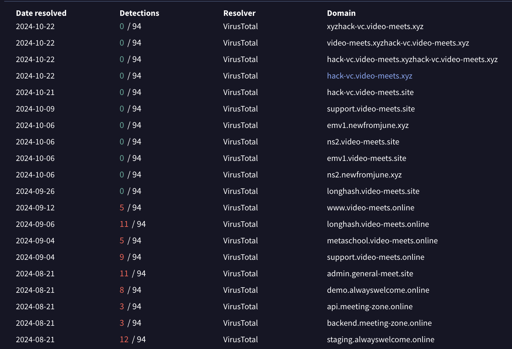
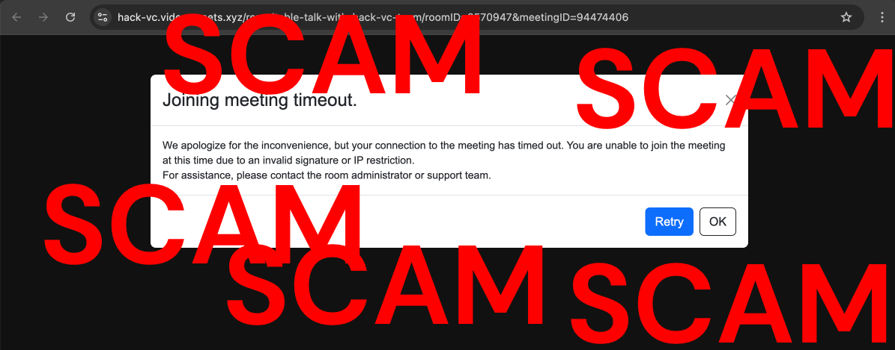

# Fake Hack VC Related thefts

Date:: October 18th, 2024

Tags: Dangerous Password

Various individuals were approached by various Hack VC impersonators on Telegram.

URL 1: `https://hack-vc.video-meets.site/roundtable-talk-with-hack-vc-team/roomID=3570947&meetingID=0673660`

URL 2: `https://hack-vc.video-meets.xyz/roundtable-talk-with-hack-vc-team/roomID=3570947&meetingID=94474406`

URL 3: `https://hack-vc.video-meets.pro/roundtable-talk-with-hack-vc-team/roomID=3570947&meetinglD=44873848`

## Hunting

- https://www.validin.com/blog/hunting-lazarus-dns-history-host-responses/

### Virus Totals

- [VT: 104.168.157.45](https://www.virustotal.com/gui/ip-address/104.168.157.45)
- [VT: 104.168.165.165](https://www.virustotal.com/gui/ip-address/104.168.165.165)
- [VT: 104.168.203.161](https://www.virustotal.com/gui/ip-address/104.168.203.161)
- [VT: 104.168.165.203](https://www.virustotal.com/gui/ip-address/104.168.165.203)
- [VT: 104.168.165.173](https://www.virustotal.com/gui/ip-address/104.168.165.173)

- https://www.virustotal.com/gui/domain/hack-vc.video-meets.pro/relations

### URL Scans

- [urlscan for castleisland sky-meeting com](https://urlscan.io/result/93f573b0-6729-4234-a6b6-a711602f3048/)

- [urlscan for hack-vc video-meets xyz](https://urlscan.io/result/94e05b13-536c-48b1-8b71-3e654efc43ef/)

- [urlscan for dragonfly pdf](https://urlscan.io/result/88ed33a4-bdf3-4dfe-91ea-65c36e92f2f6/)

- [urlscan for hashkey with script on website](https://urlscan.io/result/2526e2f4-ef06-47af-8bb4-eec4303d8128/)

## MetaMask Blocks so far

/block
xyzhack-vc[.]video-meets[.]xyz
video-meets[.]xyzhack-vc[.]video-meets[.]xyz
hack-vc[.]video-meets[.]xyzhack-vc[.]video-meets[.]xyz
hack-vc[.]video-meets[.]xyz
hack-vc[.]video-meets[.]site
video-meets[.]xyz
video-meets[.]site
castleisland[.]sky-meeting[.]com
castleisland[.]team-meeting[.]net
sky-meeting[.]com
team-meeting[.]net

## Onchain Indicators

Theft #1 ($77k)

- 0xf9e009a8d3c27432d485a0ae002656bd9a3a0841

- 0x25cee51c30bc4f705cd333648ee4a43f73d85f48

Theft #2 ($212,182)

- 0x48a7f10ced9a1ac6626823fe291f1a391999222e

- 0x4df3d996e884150417b43558a5ab6404a654ed89

- 0x0b9c0ec673a8e4fdba08f1272060b846a8c7d83e

(Goes to eXch)

userIp : 50.114.45.115
timeZone : Asia/Tokyo (GMT+0900)
userAgent : Mozilla/5.0 (Windows NT 10.0; Win64; x64) AppleWebKit/537.36 (KHTML, like Gecko) Chrome/129.0.0.0 Safari/537.36
acceptLanguage : en-US,en;q=0.9,ko;q=0.8 

# Malware 

Here’s my initial analysis of the CoreKitAgent binary - which is a new backdoor. 

When executed, CoreKitAgent performs the following tasks

- Collects basic system information

- Executes a AppleScript payload by:

    - Decrypts it from within itself

    - Saving it to /Users/<user>/Library/CoreKit/.ses 

    - Executing using osascript

- This AppleScript payload is pretty much the same as malware_script_3.scpt namely that it will poll the C2 server bots.autoupdate[.]online and if it receives a response execute it using run script. 

    - This payload has also been seen in other intrusions by this adversary

- The code also deletes a file located at /private/var/tmp/cfg which based on the filename could be a config of some sort? Unclear without access to more info. 

Since this binary essentially duplicates an earlier stage of the infection chain, my hypothesis is that it serves as a persistent backdoor the that the adversary can use to maintain remote control of the system and possibly drop additional payloads for more specific tasks (since it’s unlikely the adversary would act on their objectives using such a simple backdoor).

This would also mean that it likely needs some persistence mechanism, though this sample does not deploy any, so I’d recommend the IR team to review for signs of new LaunchAgents/Login Items/crontabs etc.

🚨🚨🚨🚨🚨🚨🚨🚨🚨🚨🚨🚨🚨🚨🚨

[malicious zip of the shit](./SQ_MALICIOUS_dangerous-password_20241023.zip)

🚨🚨🚨🚨🚨🚨🚨🚨🚨🚨🚨🚨🚨🚨🚨🚨