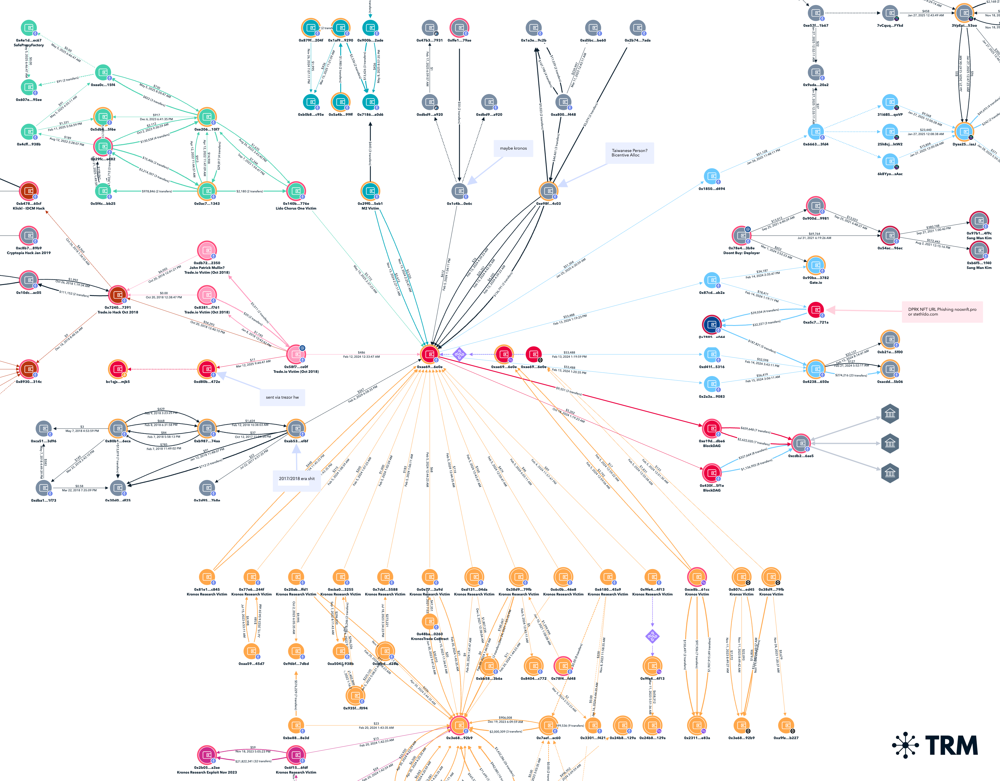

# Dust Colletor 0xae69

## 0xae69012d15d6b1a3b2412aadef712f06f9286e0e

1. Trade.io hack (connects to cryptopia and coinbene)

2. M2 (same style attack as Rain and Ripio which both had the 175.45.xxx logins)

3. Kronos Research (which was never determined how to happened)

4. Sang Man Kim on the laundry side

5. A couple shitcoin farms 

6. A couple 2021 era ITWs

7. A couple NFT URL phishing campaigns that Mandiant previously attributed as DPRK

8. The only thing "not DPRK" is "Blockdag" which seems to be a ICO scam (?) and has 9 figs of flows going it (and might obvs be DPRK lmao)

## Receives From:

- 0xce8bfa6d1084b09d1765342974539cbaf0d761cc - Kronos Victim

- 0x807cb3caebd88497a63ef8987740969cbc06ed45 - Kronos Victim

- 0x38d981c3c42b2ec8e9572f560552407d0f1279fb - Kronos Victim

- 0x6c0b942146f1518de0a461f5be6855c4d52346e8 - Kronos Victim

- 0x9fe45936dda88c8d4c07090fc43dadc6de644f13 - Kronos Victim

- 0x61808d3a6898f9a2d02ddecd7e646ab4568145a9 - Kronos Victim

- 0xd131c82b58114250a2ea966dd1b6ce15647e04da - Kronos Victim

- 0x0e77329ebf9abbfe4e9e0e237a9163b7d32f3a9d - Kronos Victim

- 0x7cbfea7ed0a35bdde7a206fd442d8d0a223e5588 - Kronos Victim

- 0xcba034484f8a5b4d60b7fd53b361a38d2fdd3255 - Kronos Victim

- 0x77e6187a10be9b38b334c89a72f7936219a6244f - Kronos Victim

- 0x20ab075bca643ff2044f5d20140f826e2ef6ffd1 - Kronos Victim

- 0x81e1c8dad99a000b73eed07e57e19af88a1ac845 - Kronos Victim

- 0x1c4b4cf645738d7b6d6604b66d6162c01ecf0e6c - Maybe Kronos?

- 0xab5370e044428d775ad286b0dd928a52d232ef6f - 2017/2018 Coinbase User

- 0x58f75ddacffb183a30f69fe58a67a0d0985fce0f - Trade.io Victim (Oct 20 2018)

- 0x140bd8fbdc884f48da7cb1c09be8a2fadfea776e - Lido Chorus One Victim

- 0x29f05c1e8ffcf7ae931d2390addb02d92ed35eb1 - M2 Victim

- 0xe98fd6ed60b9451ee41b4f49793da81ce2664c03 - Taiwanese person, Bicentive Allocation

## Sends To:

- 0x87cd331d17f0d574b035a24c34d999bea94eab2a

- - sends to 0xa5c70632662591d64de642cefefa2281b2b5721a which is DPRK NFT URL Phishing nooxnft.pro or stethldo.com

- 0x18509223dce632b9e3e88d2a5c9e90ee401ad494

- 0xd41f55f857c6b780c4e59c61b154f09ce5dd5316

- 0x2a3a7cca7a847c157a88f2b9d818cb934f729083

- 0xe19d644e7b535c45e009382f40ee35628899dbe6 (BlockDAG)

- 0x430f4919d679b02dca4572579caabb7676d65f1e (BlockDAG)

## Gate Deposit Address

- 0x87cd331d17f0d574b035a24c34d999bea94eab2a

- 0x78e4a0c307fc2c979fa65dcf8bf4d376f30c3b8e - DOONT BUY Deployer

- 0xb41d7de2af854c17965c277feb5b55ecc596ccd8 - Kuma INU Related, known DPRK IT Workers - See [2025 Complaint](./pdf/2025-06-05-DPRK-IT_complaint_25cv1769_0.pdf)

- 0x22f20e51d3492fd4483d2c8ce9db64da2902c43a - Kuma INU Inu Admin EOA #2

- 0x5530ee4550e28def091f568d2ee2194be83f4429 - Kuma INU Related

- 0x2be46f6c48cd192be71e44e24687fd1bd60bc041 - Kuma INU Related

- 0x7b8bbc4c677863e4742451272631b6636fac440b - Kuma INU Related

- 0xb44a883686cc947d9f39d44e12534c88cccc4b69 - Kuma INU Related

- 0xe1b5278287e25b265c016ad52d38c0f9faf16eb7 - Kuma INU Related

- 0x139b51bb9089196485f3fa101aafaa406764b805 - Kuma INU Related

- 0x351c811b97e37bf18be72d58d53d234b8a4a260e - Kuma INU Related

- 0xa73bc4847cdd7e727efda5c6470f2c9c01b0ff06 - From StripCoin (STRIP)

- 0x1ef6af310c126865288ca0918558a90ad90b2ede - Tellor?

- 0x191b6c07fb0c7b1a2e23e8b6467cc7bb37a0572c - Tellor?

- 0x9df8c5f47527b6e20d55d03d35c17fc44155c9bc - Tellor?

- 0xcc6693e6aa32e1c3fdf573112b3adf682fb5c969 - Tellor?

- 0xca9c9b1b74241eea724771762716f772f6470959 - Tellor?

- 0x0dcba752075da3521139a51021bc25b820b87ddc

- 0xaa3355dbf12b1117063d67f6987ff884cfd39bb1

- 0xf17a28a64223ed3f9d4c777f6f090fd6c44b449f

- 0x0a8eb043bf1e12b2f7ab072807de6ef4651a76b8 - WoofOracle: WFO Token

- 0xf186a9ccc6209ad023b583e6c17246fdd85d578f

- 0xfd40dbc86ba7da3f60538661b50c58cb087e978d -  Stone (0NE), CivFarm, SaniFarm??

## Yet another rainbow graph that honestly shouldn't exist and I apologize in advance

